### Big O Notation In detail
----

- This is the example for the performance that means how much time does it take to run the program. A small example below.


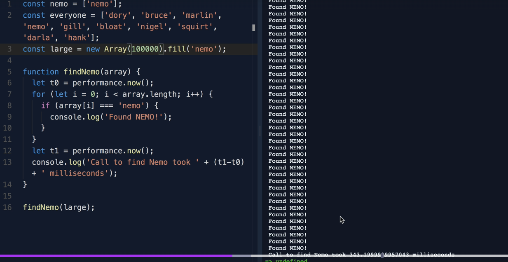

- From the above image we can see that , the code ran around 343 milli seconds. The above time will depend on machine to machine.

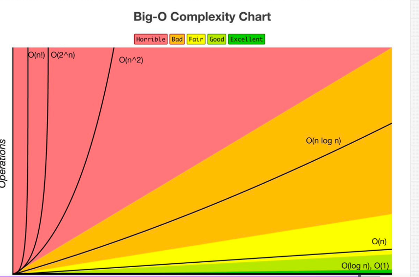

----

O(n)----> Time Complexity

- I removed both performace and console now will see the how this works

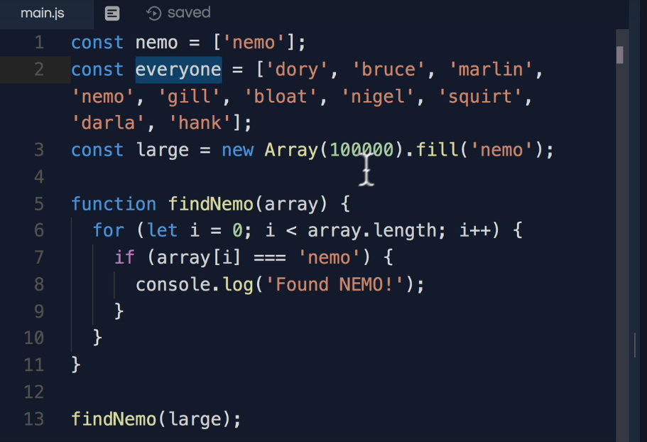

- The loop runs once for every element in the array.

- If the array has n elements, the function will do n operations → Hence: O(n) time complexity.

- As n grows, the number of operations grows linearly.

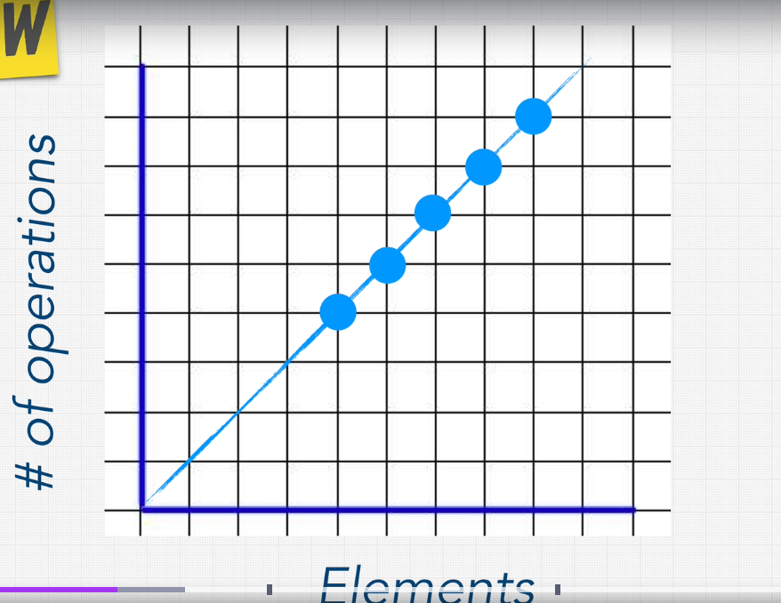

O(n) -->Linear Time

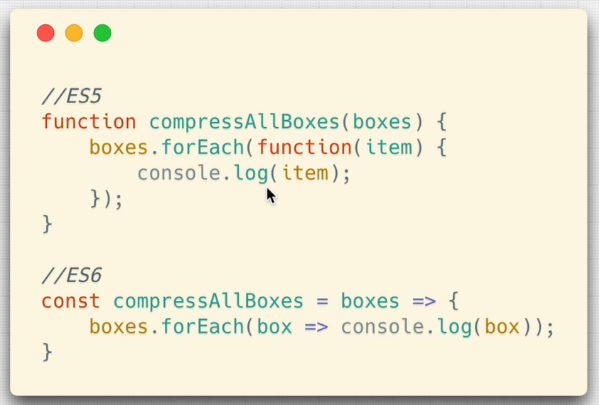

----

#### O(1)--> Constant time

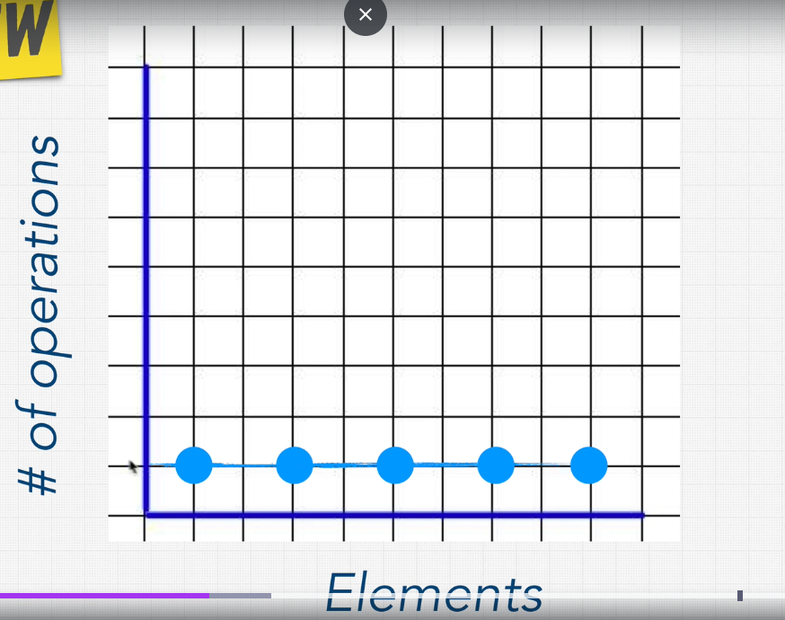

- An algorithm has O(1) time complexity when its execution time stays constant, regardless of the size of the input
- X-axis → Number of elements (input size).

- Y-axis → Number of operations.

- The horizontal line (flat) shows that the number of operations doesn’t increase with input.

```js
const getFirstElement = (array) => {
  return array[0];
};

getFirstElement([100, 200, 300, 400]);
// No matter if the array has 5 or 5 million items, this is just one operation.
```

-  It always takes the same amount of time to complete, no matter how big the input is.

- Ex 2:

```js
const boxes = [0, 1, 2, 3, 4, 5];

function logFirstTwoBoxes(boxes) {
  console.log(boxes[0]); // O(1)
  console.log(boxes[1]); // O(1)
}

logFirstTwoBoxes(boxes); // O(1 + 1) → O(2) ≈ O(1)
```

- You're not looping through the entire array.

- You're just accessing two specific indices directly.

- This is **extremely** efficient, and the runtime won’t change even if the array has 5 items or 5 million items.

- EX: 3

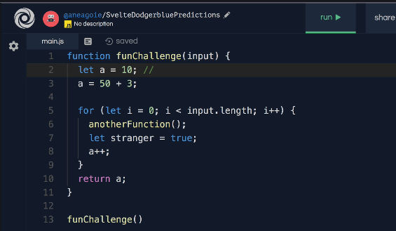

```js
function funChallenge(input) {
  let a = 10; // Constant time operation: O(1)
  a = 50 + 3; // Constant time operation: O(1)

  for (let i = 0; i < input.length; i++) {
    anotherFunction();         // O(n) — runs once per element
    let stranger = true;       // O(n) — runs once per element
    a++;                       // O(n) — runs once per element
  }

  return a; // Constant time: O(1)
}

funChallenge();
```

- At last O(n)


- Ex 4

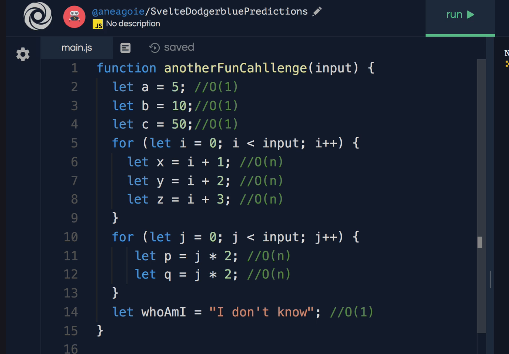

```js
function anotherFunCahllenge(input) {
  let a = 5;       // O(1)
  let b = 10;      // O(1)
  let c = 50;      // O(1)

  for (let i = 0; i < input.length; i++) {
    let x = i + 1; // O(n)
    let y = i + 2; // O(n)
    let z = i + 3; // O(n)
  }

  for (let j = 0; j < input.length; j++) {
    let p = j * 2; // O(n)
    let q = j * 2; // O(n)
  }

  let whoAmI = "I don't know"; // O(1)
}
```

✅ Final Time Complexity

\[
O(1 + 3n + 2n + 1) = O(5n + 2) \Rightarrow O(n)
\]

Only the highest order term matters, and constants are ignored in Big-O notation.

👉 Therefore, the overall time complexity is **O(n)** — linear time

----

**Simplifying the bigO and the rules**

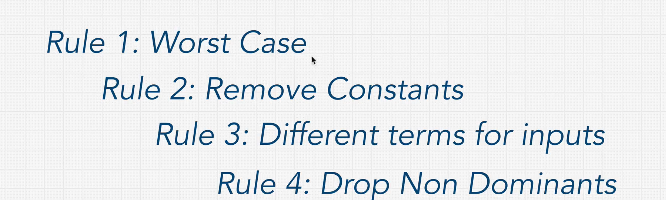

- Big O cares about the worst case mostly

- 1. Drop Constants
- Loops = O(n), Nested Loops = O(n²)
```js
for (let i = 0; i < n; i++) {
  console.log(i);        // O(n)
}

for (let i = 0; i < n; i++) {
  for (let j = 0; j < n; j++) {
    console.log(i, j);   // O(n²)
  }
}
```
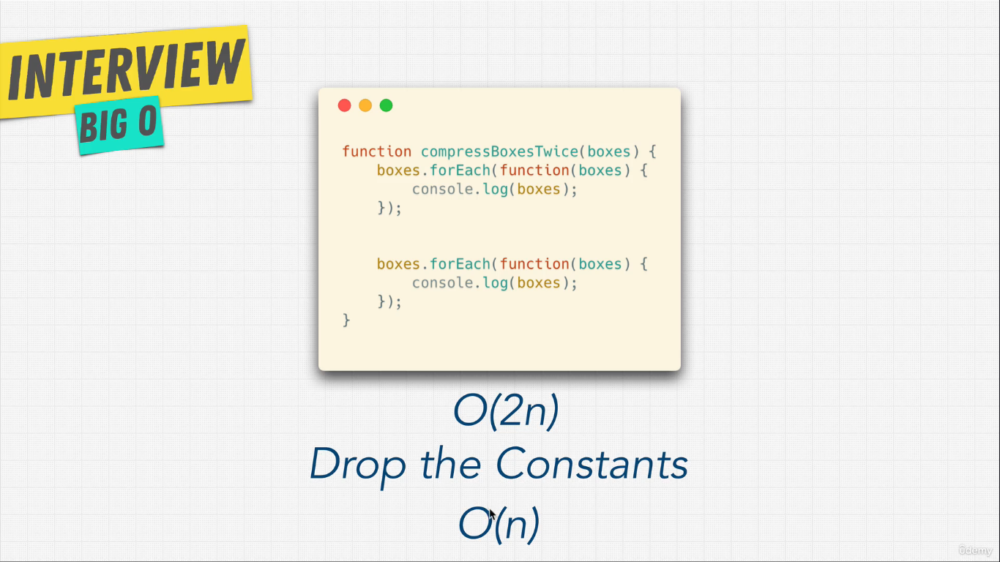

**RUlE 3: Different terms for inputs**

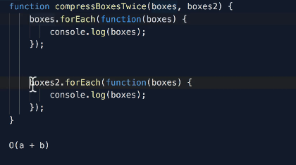

- from the above image

```js
boxes.forEach(...) runs a times if boxes.length = a

boxes2.forEach(...) runs b times if boxes2.length = b
```

- When you have two different inputs, you can’t combine them — they must be added, not multiplied, unless they are nested.

- Rule:
- For different inputs:
- O(n + m) → if iterating over two inputs sequentially
- O(n * m) → if iterating over two inputs nested
- If nested follow the below image

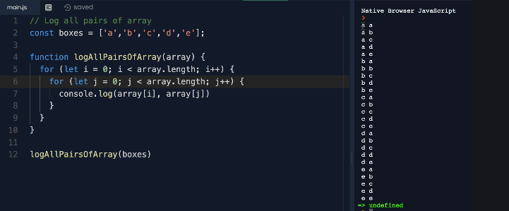

**Rule 4: Drop non dominant terms**

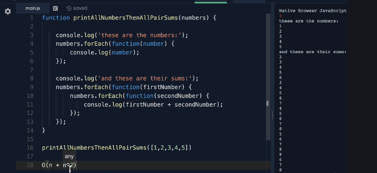


---
Now we can create the cheatsheet for BigO.


