# 🏛️ Micro Frontend Architecture (Module Federation) — Architect's Deep Dive

> **Audience:** Lead / Staff / Principal Frontend Architects
> **Goal:** Not just "how" — but **why**, **when**, **trade-offs**, and **production realities**.
> **Stack:** React 18 + Webpack 5 Module Federation (concepts apply to Vite/Rspack too).

---

## 📑 Table of Contents

1. [Why Micro Frontends Exist (The Real Reason)](#1-why-micro-frontends-exist-the-real-reason)
2. [When NOT to Use MFE (Architect's Decision Tree)](#2-when-not-to-use-mfe-architects-decision-tree)
3. [High-Level Architecture](#3-high-level-architecture)
4. [Folder Structure (Mono vs Poly Repo)](#4-folder-structure-mono-vs-poly-repo)
5. [Module Federation Setup — Line by Line](#5-module-federation-setup--line-by-line)
6. [How Module Federation Works Under the Hood](#6-how-module-federation-works-under-the-hood)
7. [Runtime Flow — Sequence Diagram](#7-runtime-flow--sequence-diagram)
8. [Shared Dependencies Deep Dive](#8-shared-dependencies-deep-dive)
9. [Build Time vs Runtime](#9-build-time-vs-runtime)
10. [Production-Grade Improvements](#10-production-grade-improvements)
11. [Deployment Architecture (CDN + CI/CD)](#11-deployment-architecture-cdn--cicd)
12. [State Sharing Patterns](#12-state-sharing-patterns)
13. [Error Handling & Resilience](#13-error-handling--resilience)
14. [Performance Considerations](#14-performance-considerations)
15. [Security Concerns](#15-security-concerns)
16. [Observability & Debugging](#16-observability--debugging)
17. [Team Topology (Conway's Law)](#17-team-topology-conways-law)
18. [Migration Strategy (Strangler Fig)](#18-migration-strategy-strangler-fig)
19. [Trade-offs vs Alternatives](#19-trade-offs-vs-alternatives)
20. [Real-World Challenges](#20-real-world-challenges)
21. [Interview-Ready Architect Answer](#21-interview-ready-architect-answer)
22. [Full Implementation From Scratch](#22-full-implementation-from-scratch)
23. [Next-Level Extensions](#23-next-level-extensions)

---

## 1. Why Micro Frontends Exist (The Real Reason)

Micro Frontends are **NOT a technical solution** — they are an **organizational solution** to a technical problem. The architect's first job is to understand this distinction.

### The Real Problems MFE Solves

| Problem                | Monolith Pain                       | MFE Solution                            |
| ---------------------- | ----------------------------------- | --------------------------------------- |
| **Team Coupling**      | 50 devs blocked by 1 PR queue       | Each team owns + ships independently    |
| **Release Cadence**    | Quarterly mega-releases             | Per-team continuous deployment          |
| **Tech Heterogeneity** | "React only" mandate                | Team A uses React 18, Team B uses Vue 3 |
| **Build Time**         | 15-min builds for 1-line change     | Each MFE builds in 30s                  |
| **Cognitive Load**     | New dev needs full codebase context | New dev only learns their MFE           |
| **Blast Radius**       | One bug breaks entire app           | Bug confined to one MFE                 |

### The Architect's Mental Shift

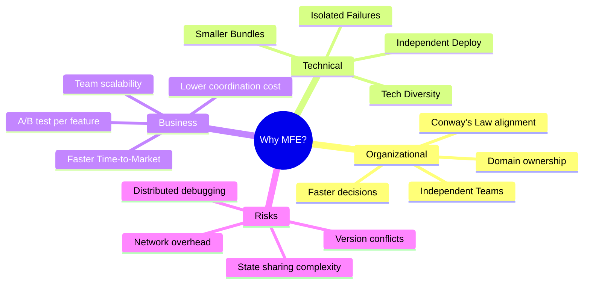

> **Architect's Rule:** If you have **1 team of 5 devs**, MFE is over-engineering. If you have **8+ teams across 3+ domains**, monolith is under-engineering.

---

## 2. When NOT to Use MFE (Architect's Decision Tree)

Most "MFE failures" come from premature adoption. Use this decision tree:

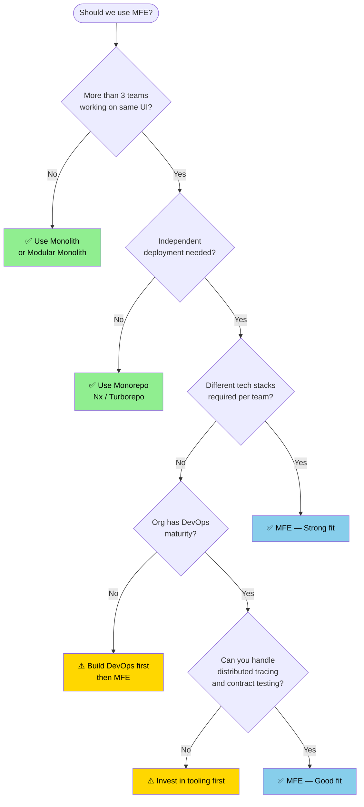

### Anti-Patterns (Smells of Bad MFE Adoption)

- **MFE per page** → Just use code-splitting + lazy loading.
- **MFE per component** → That's a component library, not MFE.
- **All MFEs deployed together** → You haven't gained independence; you have a distributed monolith.
- **Shared global state across MFEs via window object** → You're recreating a monolith with extra steps.

---

## 3. High-Level Architecture

### Real-World Setup

| Application            | Role                      | Port (dev) | Owner Team     |
| ---------------------- | ------------------------- | ---------- | -------------- |
| `shell-app` (MFE1)     | Host / Composition layer  | `:3000`    | Platform Team  |
| `dashboard-app` (MFE2) | Remote (Analytics domain) | `:3002`    | Analytics Team |
| `cart-app` (MFE3)      | Remote (Commerce domain)  | `:3003`    | Commerce Team  |

### Architecture Diagram

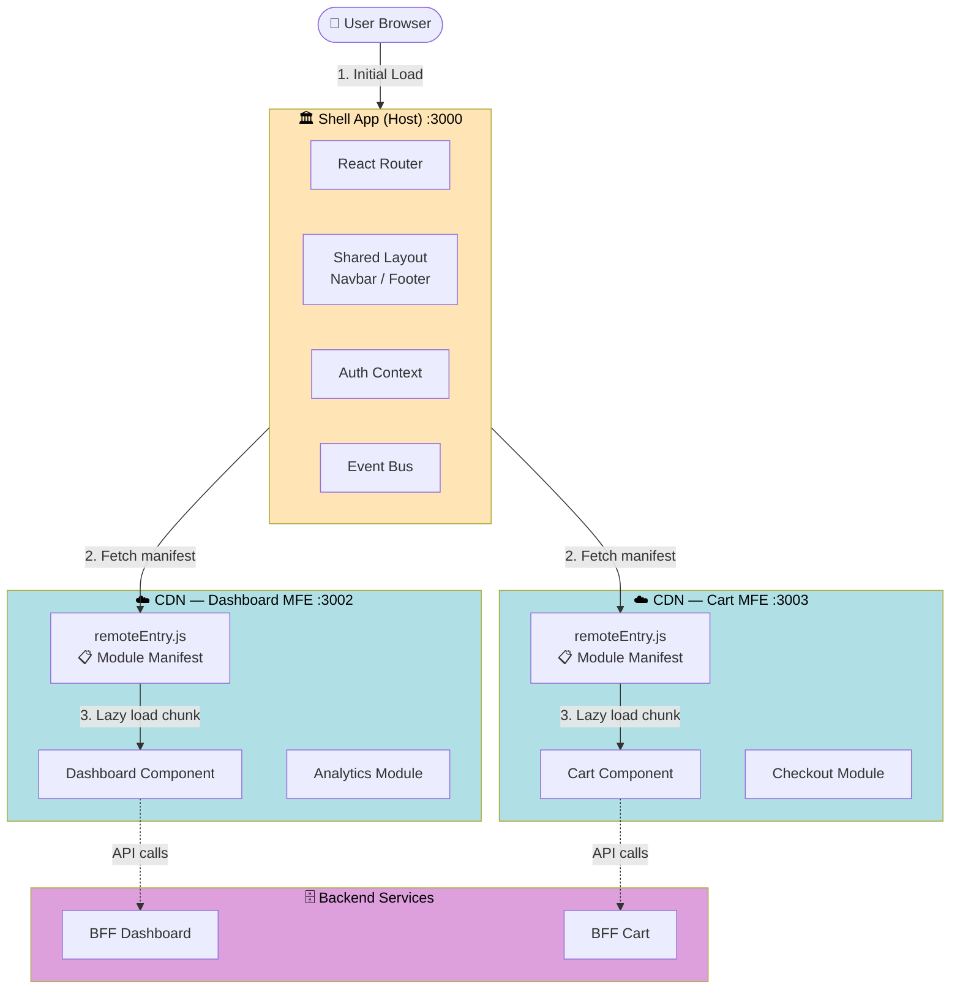

### Roles & Responsibilities

#### ✅ Shell (Host) — The Composition Layer

- **Single entry point** — owns `index.html`, root mount, hydration.
- **Cross-cutting concerns** — auth, theming, i18n, analytics, error boundaries.
- **Routing** — top-level routes; sub-routes delegated to MFEs.
- **Shared infrastructure** — design system bridge, event bus, feature flags.
- **What it does NOT do** — business logic of any specific domain.

#### ✅ Remotes (MFE2, MFE3) — Domain Owners

- **Bounded context** — one domain per MFE (DDD principle).
- **Independently deployable** — own CI/CD, own release cadence.
- **Self-contained** — can run standalone (critical for dev experience).
- **Expose contracts** — well-defined component APIs / props.

---

## 4. Folder Structure (Mono vs Poly Repo)

### Option A: Polyrepo (Each MFE in its own repo)

```
github.com/company/
├── shell-app/        ← own repo, own CI
├── dashboard-app/    ← own repo, own CI
├── cart-app/         ← own repo, own CI
└── design-system/    ← shared component library
```

✅ True independence • ❌ Harder cross-cutting changes

### Option B: Monorepo (All MFEs in one repo, e.g., Nx/Turborepo)

```
mfe-platform/
├── apps/
│   ├── shell-app/
│   ├── dashboard-app/
│   └── cart-app/
├── packages/
│   ├── design-system/
│   ├── shared-types/
│   └── event-bus/
├── nx.json
└── package.json
```

✅ Easy refactors • ❌ Risk of accidental coupling

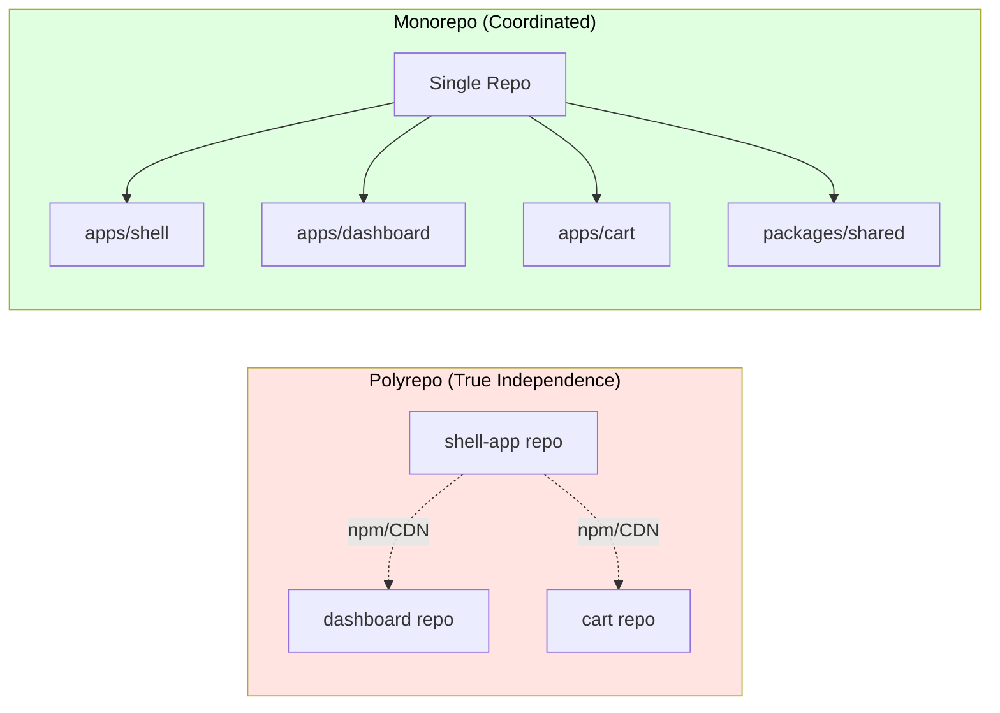

> **Architect's Choice:** Start with monorepo for shared tooling, but enforce **deployment independence** via separate CI pipelines per app.

---

## 5. Module Federation Setup — Line by Line

### 🔥 MFE2 (Dashboard Remote)

```js
// webpack.config.js
const ModuleFederationPlugin = require('webpack/lib/container/ModuleFederationPlugin');

module.exports = {
  devServer: {
    port: 3002, // Dev server port — unique per remote
  },

  plugins: [
    new ModuleFederationPlugin({
      // 🎯 'name' — the global identifier this MFE registers under window
      // After build, accessible as window.mfe2 in the browser.
      // MUST be unique across the entire ecosystem.
      name: 'mfe2',

      // 🎯 'filename' — the manifest file webpack generates.
      // Convention: 'remoteEntry.js'. This is the ONLY file the host
      // needs to know about — it's a tiny bootstrap that knows how
      // to load every exposed module.
      filename: 'remoteEntry.js',

      // 🎯 'exposes' — the public API of this MFE.
      // Key = path consumers will import (e.g., "mfe2/Dashboard")
      // Value = local file in this repo
      // Treat this like a npm package's `main` field — it's a CONTRACT.
      exposes: {
        './Dashboard': './src/Dashboard',
      },

      // 🎯 'shared' — dependencies that should be deduplicated.
      // singleton: true means "there must be ONLY ONE React in the page".
      // Without this, host React + remote React = broken hooks.
      shared: {
        react: {
          singleton: true,
          requiredVersion: '^18.0.0', // Strict version range
          eager: false, // Lazy-load React (faster first paint)
        },
        'react-dom': {
          singleton: true,
          requiredVersion: '^18.0.0',
        },
      },
    }),
  ],
};
```

### 🔥 MFE1 (Shell / Host)

```js
new ModuleFederationPlugin({
  name: "shell",

  // 🎯 'remotes' — declarative list of MFEs this host can consume.
  // Format: "<remoteName>@<URL-to-remoteEntry.js>"
  // The URL is fetched at RUNTIME — not bundled.
  // Hardcoding URLs here is a code smell; use env vars in production.
  remotes: {
    mfe2: "mfe2@http://localhost:3002/remoteEntry.js",
    mfe3: "mfe3@http://localhost:3003/remoteEntry.js",
  },

  // Same shared config as remotes — they MUST agree on shared deps.
  shared: {
    react: { singleton: true, requiredVersion: "^18.0.0" },
    "react-dom": { singleton: true, requiredVersion: "^18.0.0" },
  },
}),
```

### Consuming Remote in React

```jsx
import React, { Suspense } from 'react';

// 🎯 React.lazy() returns a Promise — webpack rewrites this import
// at build time to fetch the remote chunk at runtime.
// Path format: "<remoteName>/<exposedKey>"
const Dashboard = React.lazy(() => import('mfe2/Dashboard'));
const Cart = React.lazy(() => import('mfe3/Cart'));

function App() {
  return (
    // Suspense is MANDATORY — remote loading is async.
    // Without it, React throws "suspended while rendering".
    <Suspense fallback={<div>Loading...</div>}>
      <Dashboard />
      <Cart />
    </Suspense>
  );
}
```

---

## 6. How Module Federation Works Under the Hood

This is what separates a senior from a staff/principal engineer — knowing the **internals**.

### What Webpack Actually Does

When you write `import("mfe2/Dashboard")`, webpack does NOT bundle the dashboard code. Instead, it generates code roughly equivalent to:

```js
// Pseudo-code of what webpack generates for the host
async function loadRemoteModule() {
  // 1. Inject <script src="http://localhost:3002/remoteEntry.js">
  await loadScript('http://localhost:3002/remoteEntry.js');

  // 2. remoteEntry.js registers window.mfe2 = { get, init }
  const container = window.mfe2;

  // 3. Initialize the container with shared scope (deduplication)
  await container.init(__webpack_share_scopes__.default);

  // 4. Get the factory function for the requested module
  const factory = await container.get('./Dashboard');

  // 5. Execute factory to get the module
  const Module = factory();
  return Module;
}
```

### The Module Federation Container Protocol

Every remote exports a **container object** with two methods:

```ts
interface RemoteContainer {
  init(shareScope: ShareScope): Promise<void>;
  get(moduleName: string): Promise<() => Module>;
}
```

### Visual Internals

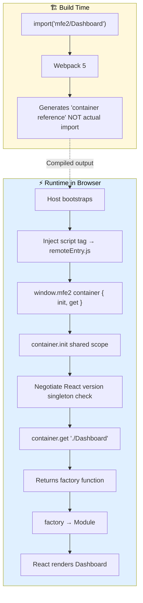

### The Shared Scope — How Singletons Work

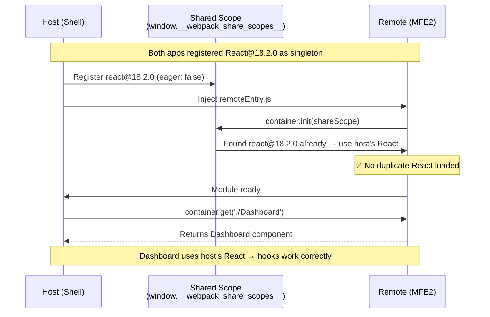

> **Why singleton matters:** React stores hook state in module-scoped variables. Two React instances = two separate state stores = `Invalid hook call` errors and broken context.

---

## 7. Runtime Flow — Sequence Diagram

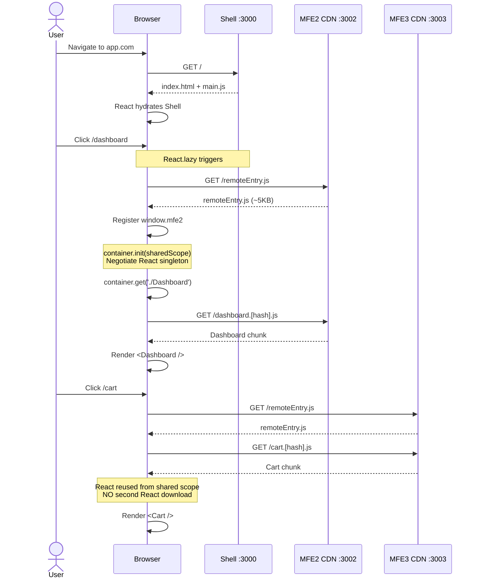

### Critical Path Analysis

| Phase                    | Cost           | Optimization                            |
| ------------------------ | -------------- | --------------------------------------- |
| Initial Shell load       | ~150KB gzipped | Server-render shell, cache aggressively |
| `remoteEntry.js` fetch   | ~5–10KB        | Preload `<link rel="preload">` on hover |
| MFE chunk fetch          | 50–200KB       | HTTP/2 multiplexing, code splitting     |
| Shared scope negotiation | <5ms           | Negligible — but matters at scale       |

---

## 8. Shared Dependencies Deep Dive

This is where most teams get burned. Understand it cold.

### Configuration Options

```js
shared: {
  react: {
    singleton: true,        // Force ONE instance globally
    requiredVersion: "^18.0.0",
    strictVersion: false,   // true = throw on mismatch; false = warn
    eager: false,           // true = bundle in initial chunk; false = lazy
    shareScope: "default",  // Multiple scopes possible (advanced)
  }
}
```

### Singleton Resolution Algorithm

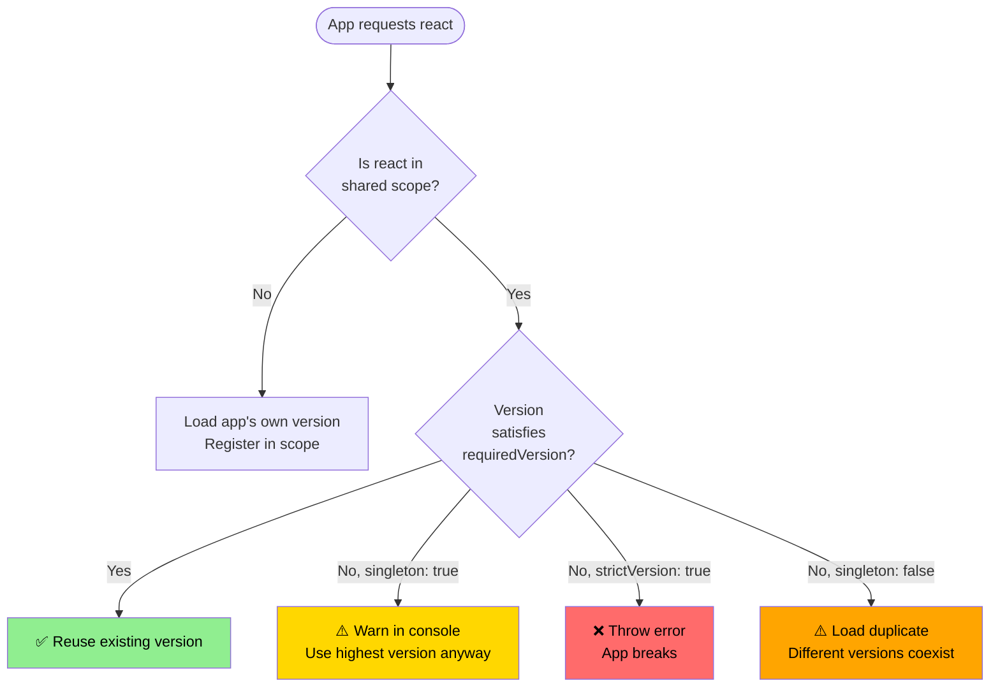

### Dependency Strategy by Type

| Dependency Type                   | Strategy                          | Reason                                      |
| --------------------------------- | --------------------------------- | ------------------------------------------- |
| `react`, `react-dom`              | `singleton: true`                 | Hooks, context, rendering — must be unified |
| State management (Redux, Zustand) | `singleton: true` if shared store | Otherwise duplicate stores                  |
| UI library (MUI, AntD)            | `singleton: true` for theming     | Separate themes = visual chaos              |
| Utilities (lodash, date-fns)      | `singleton: false`                | OK to have multiple versions                |
| Internal design system            | `singleton: true`                 | Brand consistency                           |

### Eager vs Lazy Loading

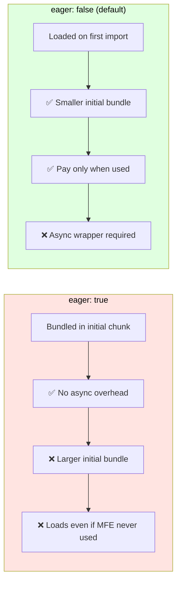

> **Rule of thumb:** Use `eager: true` for shell (always loaded). Use `eager: false` for remotes.

---

## 9. Build Time vs Runtime

The mental model that separates beginners from architects.

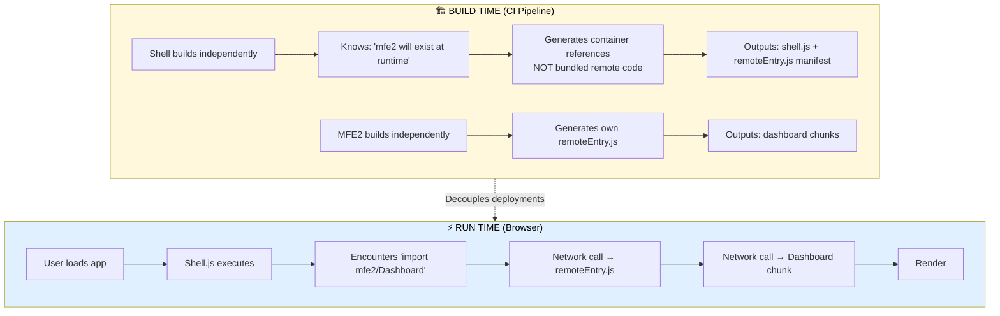

### Implication: Independent Deployment

| Property                   | Traditional Build        | Module Federation             |
| -------------------------- | ------------------------ | ----------------------------- |
| Cross-app changes          | Requires rebuild of both | Only the changed app rebuilds |
| Deployment                 | Atomic (all or nothing)  | Independent (per app)         |
| Rollback                   | Roll back entire app     | Roll back single MFE          |
| Version mismatch detection | Compile time             | **Runtime** ⚠️                |

> **The big trade-off:** You gain deployment independence but lose compile-time safety. **Contract tests + TypeScript shared types are NOT optional in production.**

---

## 10. Production-Grade Improvements

### 🔹 Dynamic Remote URLs (Environment-Based)

```js
// webpack.config.js
const remoteUrl = (name) =>
  `${name}@${process.env[`${name.toUpperCase()}_URL`]}/remoteEntry.js`;

new ModuleFederationPlugin({
  name: 'shell',
  remotes: {
    mfe2: remoteUrl('mfe2'), // mfe2@https://cdn.prod.com/dashboard/remoteEntry.js
    mfe3: remoteUrl('mfe3'),
  },
});
```

### 🔹 Truly Dynamic Remotes (Runtime URL Resolution)

When you don't know remote URLs at build time (multi-tenant, A/B tests):

```js
// Promise-based remote — resolved at runtime
const loadRemote = (scope, module, url) => {
  return new Promise((resolve, reject) => {
    const script = document.createElement('script');
    script.src = url;
    script.onload = async () => {
      await __webpack_init_sharing__('default');
      const container = window[scope];
      await container.init(__webpack_share_scopes__.default);
      const factory = await container.get(module);
      resolve(factory());
    };
    script.onerror = reject;
    document.head.appendChild(script);
  });
};

// Usage — fetch URLs from a config service first
const config = await fetch('/api/mfe-registry').then((r) => r.json());
const Dashboard = await loadRemote('mfe2', './Dashboard', config.dashboardUrl);
```

### 🔹 Route-Based Lazy Loading

```jsx
import { Routes, Route } from 'react-router-dom';

const Dashboard = React.lazy(() => import('mfe2/Dashboard'));
const Cart = React.lazy(() => import('mfe3/Cart'));

<Routes>
  <Route
    path='/dashboard/*'
    element={
      <Suspense fallback={<Skeleton />}>
        <ErrorBoundary fallback={<DashboardError />}>
          <Dashboard />
        </ErrorBoundary>
      </Suspense>
    }
  />
  <Route
    path='/cart/*'
    element={
      <Suspense fallback={<Skeleton />}>
        <ErrorBoundary fallback={<CartError />}>
          <Cart />
        </ErrorBoundary>
      </Suspense>
    }
  />
</Routes>;
```

### 🔹 Preload on Intent (UX Win)

```jsx
// Preload remote when user hovers over nav link — feels instant
<Link to='/dashboard' onMouseEnter={() => import('mfe2/Dashboard')}>
  Dashboard
</Link>
```

### 🔹 Versioned Manifest (Production Pattern)

```
https://cdn.company.com/dashboard/v1.4.2/remoteEntry.js  ← immutable
https://cdn.company.com/dashboard/latest/remoteEntry.js  ← pointer (rollback target)
```

---

## 11. Deployment Architecture (CDN + CI/CD)

### Production Deployment Topology

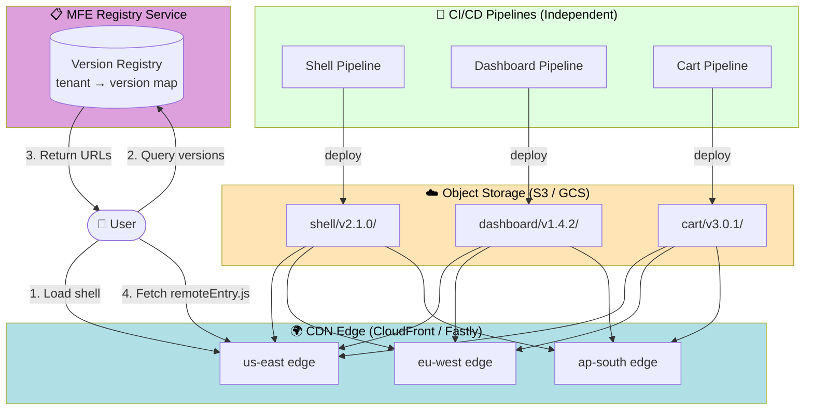

### CI/CD Pipeline per MFE

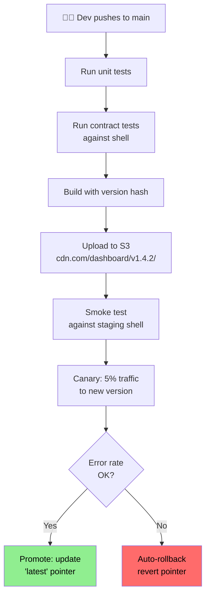

---

## 12. State Sharing Patterns

The hardest problem in MFE. Choose your weapon carefully.

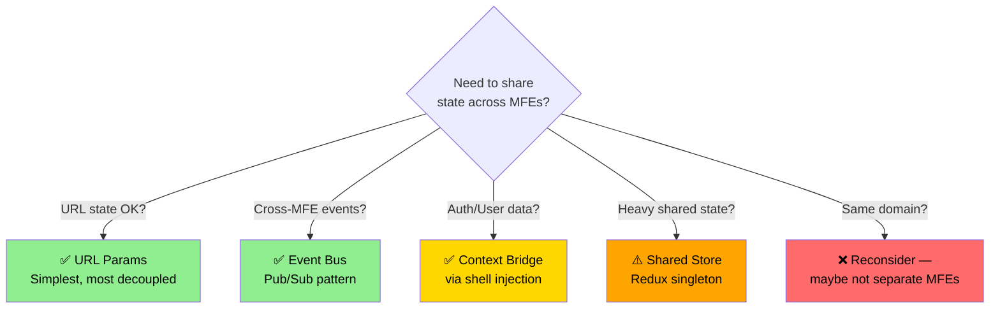

### Pattern 1: URL as State (Best — Most Decoupled)

```jsx
// Cart MFE writes to URL
navigate(`/checkout?items=${cart.length}`);

// Header MFE reads from URL
const items = new URLSearchParams(location.search).get('items');
```

✅ No coupling • ✅ Bookmarkable • ❌ Limited data size

### Pattern 2: Event Bus (Pub/Sub)

```js
// shared/event-bus.js — exposed by shell
class EventBus extends EventTarget {
  emit(event, detail) {
    this.dispatchEvent(new CustomEvent(event, { detail }));
  }
  on(event, handler) {
    this.addEventListener(event, (e) => handler(e.detail));
  }
}
window.__eventBus__ = new EventBus();

// Cart MFE
window.__eventBus__.emit('cart:updated', { count: 3 });

// Header MFE
window.__eventBus__.on('cart:updated', ({ count }) => {
  setCartBadge(count);
});
```

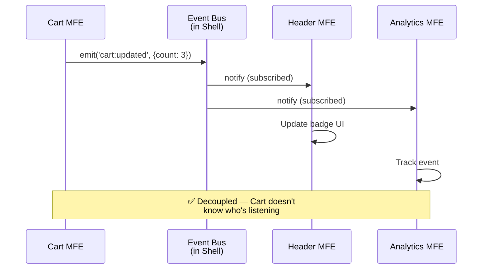

✅ Decoupled • ✅ Multi-listener • ❌ Hard to debug, no type safety (use TypeScript discriminated unions)

### Pattern 3: Context Bridge

```jsx
// Shell wraps remotes with shared context
<AuthContext.Provider value={authState}>
  <ThemeContext.Provider value={theme}>
    <Suspense fallback='...'>
      <RemoteDashboard /> {/* Inherits context — IF singleton React */}
    </Suspense>
  </ThemeContext.Provider>
</AuthContext.Provider>
```

⚠️ **Only works with `react: { singleton: true }`** — otherwise contexts are scoped to different React instances.

### Pattern 4: Shared Store (Use Sparingly)

```js
// Shell exposes store via Module Federation
// shell webpack.config.js
exposes: {
  "./store": "./src/store"
}

// MFE2 imports store
import { useAppStore } from "shell/store";
```

⚠️ **Coupling alert** — now MFE2 depends on Shell's internal store shape. If shell refactors, all MFEs break. Use only for cross-cutting concerns (auth user object, theme).

---

## 13. Error Handling & Resilience

A remote can fail to load: network error, 404, JS exception, version mismatch. **The shell must NEVER crash.**

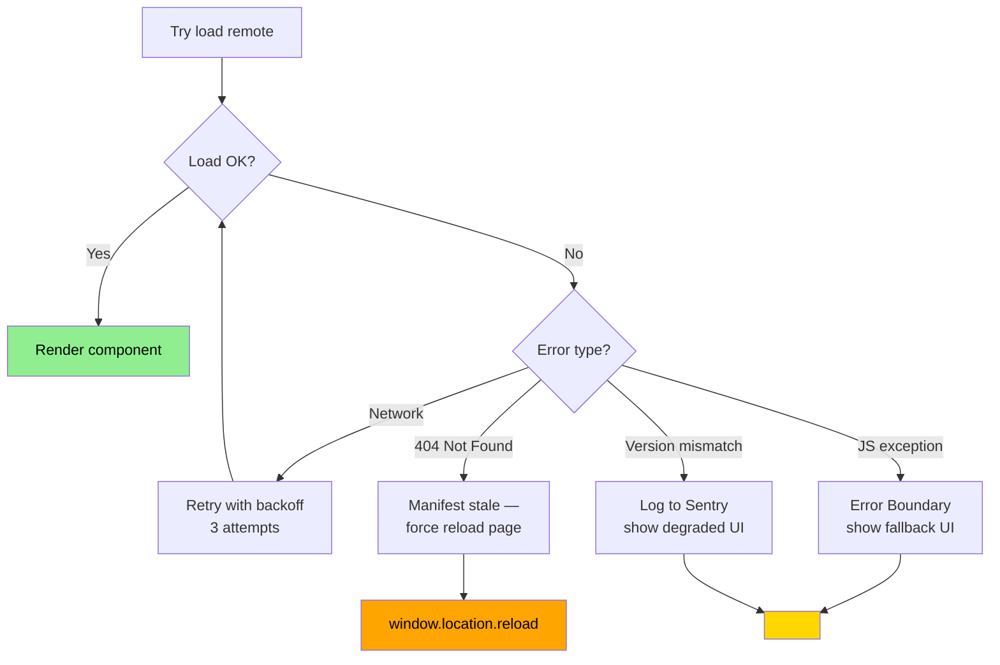

### Production-Grade Error Boundary

```jsx
class RemoteErrorBoundary extends React.Component {
  state = { hasError: false, retryCount: 0 };

  static getDerivedStateFromError() {
    return { hasError: true };
  }

  componentDidCatch(error, info) {
    // Send to monitoring with MFE context
    Sentry.captureException(error, {
      tags: {
        mfe: this.props.mfeName,
        type: 'remote-load-failure',
      },
      extra: info,
    });
  }

  retry = () => {
    this.setState((s) => ({
      hasError: false,
      retryCount: s.retryCount + 1,
    }));
  };

  render() {
    if (this.state.hasError) {
      return (
        <div className='mfe-error'>
          <p>{this.props.mfeName} is temporarily unavailable.</p>
          {this.state.retryCount < 3 && (
            <button onClick={this.retry}>Retry</button>
          )}
        </div>
      );
    }
    return this.props.children;
  }
}

// Usage
<RemoteErrorBoundary mfeName='dashboard'>
  <Suspense fallback={<Skeleton />}>
    <Dashboard />
  </Suspense>
</RemoteErrorBoundary>;
```

---

## 14. Performance Considerations

### Network Waterfall Analysis

```mermaid
gantt
    title Network Waterfall — Initial Page Load
    dateFormat X
    axisFormat %Lms

    section Critical Path
    HTML                     :h, 0, 100
    Shell main.js            :s, after h, 300
    Shell hydrate            :sh, after s, 100

    section Remote 1
    remoteEntry.js (mfe2)    :re2, after sh, 80
    Dashboard chunk          :d, after re2, 200
    Dashboard hydrate        :dh, after d, 80

    section Remote 2 (parallel)
    remoteEntry.js (mfe3)    :re3, after sh, 80
    Cart chunk               :c, after re3, 180
```

### Optimization Checklist

| Technique                         | Impact             | When                 |
| --------------------------------- | ------------------ | -------------------- |
| HTTP/2 multiplexing               | 🔥 High            | Always (CDN config)  |
| Preload `remoteEntry.js`          | 🔥 High            | Known critical paths |
| Prefetch on hover                 | High               | Navigation links     |
| Tree-shaking exposed modules      | High               | Always               |
| Aggressive `shared` deduplication | 🔥 High            | Always               |
| CDN with edge caching             | 🔥 High            | Production           |
| Brotli compression                | Medium             | Always               |
| Service Worker caching            | Medium             | PWA scenarios        |
| Skeleton screens                  | Medium (perceived) | Always               |
| Server-side composition           | High               | High-traffic apps    |

### Anti-Pattern: The Waterfall of Doom

```js
// ❌ BAD — sequential loading
const Dashboard = React.lazy(() => import('mfe2/Dashboard'));
const Widget = React.lazy(
  () => import('mfe2/Dashboard').then(() => import('mfe2/Widget')) // serial!
);

// ✅ GOOD — parallel loading
const [Dashboard, Widget] = await Promise.all([
  import('mfe2/Dashboard'),
  import('mfe2/Widget'),
]);
```

---

## 15. Security Concerns

MFEs introduce a **supply chain attack surface**. The shell is loading and executing JavaScript from URLs at runtime — treat this with the same rigor as third-party scripts.

### Threat Model

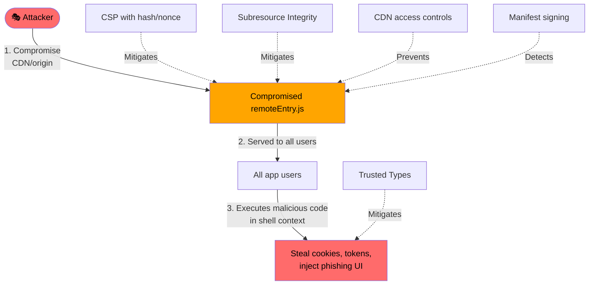

### Hardening Checklist

| Concern                         | Mitigation                                                           |
| ------------------------------- | -------------------------------------------------------------------- |
| **CSP**                         | `script-src 'self' https://cdn.company.com` (allowlist remotes only) |
| **CORS**                        | Remote CDN must set `Access-Control-Allow-Origin` correctly          |
| **SRI (Subresource Integrity)** | Hash `remoteEntry.js` in manifest; reject mismatches                 |
| **CDN access**                  | Signed URLs / IAM-restricted writes; no public write                 |
| **Dependency confusion**        | Lock `requiredVersion` strictly; audit shared deps                   |
| **XSS via remote**              | Trusted Types policy on shell                                        |
| **Token leakage**               | Never put auth tokens in `window`; use HttpOnly cookies              |

---

## 16. Observability & Debugging

Distributed systems need distributed tracing. MFE is no different.

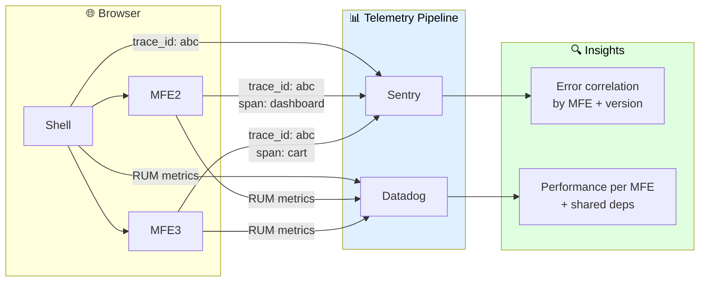

### Key Metrics per MFE

- **TTFB** for `remoteEntry.js`
- **Chunk size** trend over time (regression detector)
- **Error rate** per MFE per version
- **Hydration time** per MFE
- **Shared dep version drift** (alert if MFE2 wants react@18.1, host has 18.3)

### Debugging Tip — `__webpack_share_scopes__`

In Chrome DevTools console of the host:

```js
// See all shared modules and their resolved versions
console.log(__webpack_share_scopes__.default);
// Output:
// {
//   react: { '18.2.0': { from: 'shell', loaded: true, ... } },
//   'react-dom': { ... }
// }
```

---

## 17. Team Topology (Conway's Law)

> _"Any organization that designs a system will produce a design whose structure is a copy of the organization's communication structure."_ — Melvin Conway

MFE architecture is a direct expression of team topology. **Get this wrong and the architecture rots.**

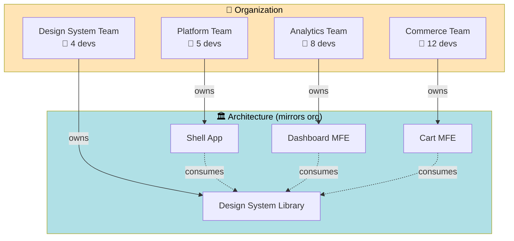

### Team Type Mapping (Team Topologies)

| MFE              | Team Type          | Cognitive Load       |
| ---------------- | ------------------ | -------------------- |
| Shell            | **Platform Team**  | Enabling other teams |
| Dashboard / Cart | **Stream-Aligned** | Domain-focused       |
| Design System    | **Enabling Team**  | Provides components  |
| MFE Tooling      | **Platform Team**  | CI/CD, registry      |

> **Architect's law:** If two teams are constantly stepping on each other in the same MFE, **split the MFE**. If two MFEs always deploy together, **merge them**.

---

## 18. Migration Strategy (Strangler Fig)

You don't rewrite. You **strangle**.

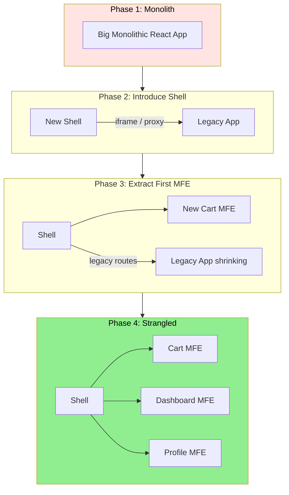

### Migration Playbook

1. **Stand up the shell** — empty container, owns auth + routing.
2. **Iframe the legacy app** initially — it's ugly but works.
3. **Extract one route at a time** — start with the lowest-risk feature.
4. **Replace iframe with MFE** when each feature migrates.
5. **Delete legacy app** when last route migrates.

> **Architect's tip:** Pick the **smallest, most-deployed** feature first. You learn the deployment pipeline with low risk.

---

## 19. Trade-offs vs Alternatives

```mermaid
flowchart TD
    classDef low fill:#d4f1f9,stroke:#333;
    classDef medium fill:#fff3cd,stroke:#333;
    classDef high fill:#f8d7da,stroke:#333;

    A["Monolith\nLow Complexity\nLow Independence"]:::low
    B["Modular Monolith\nMedium Complexity\nMedium Independence"]:::medium
    C["Monorepo + Code Split\nMedium Complexity\nMedium Independence"]:::medium
    D["iframe Composition\nMedium Complexity\nHigh Independence"]:::medium
    E["MFE Build-time\nMedium Complexity\nHigh Independence"]:::medium
    F["MFE Runtime (MF)\nHigh Complexity\nVery High Independence"]:::high
    G["Web Components MFE\nHigh Complexity\nVery High Independence"]:::high

    A --> B --> C --> D --> E --> F --> G
```

### Comparison Matrix

| Approach              | Complexity | Team Independence | Performance | Best For                          |
| --------------------- | ---------- | ----------------- | ----------- | --------------------------------- |
| Monolith              | 🟢 Low     | ❌ None           | 🟢 Best     | <10 devs, single domain           |
| Modular Monolith      | 🟢 Low     | ⚠️ Logical only   | 🟢 Best     | 10–30 devs, related domains       |
| Monorepo + Code Split | 🟡 Medium  | ⚠️ Code-level     | 🟢 Great    | Single deployable, multiple teams |
| iframe MFE            | 🟡 Medium  | ✅ Full           | 🔴 Poor     | Legacy integration                |
| Build-time MFE        | 🟡 Medium  | ⚠️ Partial        | 🟢 Great    | Coordinated deploys OK            |
| **Runtime MFE (MF)**  | 🔴 High    | ✅ Full           | 🟡 Good     | Many teams, independent deploys   |
| Web Components        | 🔴 High    | ✅ Full           | 🟡 Good     | Multi-framework requirement       |

---

## 20. Real-World Challenges

### ❌ Version Conflicts

**Symptom:** `Invalid hook call. Hooks can only be called inside the body of a function component.`

**Root cause:** Two React instances loaded.

**Fix:**

```js
shared: {
  react: { singleton: true, requiredVersion: "^18.0.0", strictVersion: false }
}
```

And audit with: `console.log(__webpack_share_scopes__.default)`.

### ❌ The "Works in Dev, Breaks in Prod" Trap

Dev = same domain (localhost). Prod = different CDNs. CORS bites.

**Fix:** Configure CDN with `Access-Control-Allow-Origin: https://app.company.com`.

### ❌ Shared CSS Collisions

MFE2 uses `.button { color: red }`. MFE3 uses `.button { color: blue }`. Last loaded wins.

**Fixes (in order of preference):**

1. CSS Modules (scoped class names) per MFE.
2. CSS-in-JS (Emotion/styled-components) with theme.
3. Shadow DOM (last resort).
4. CSS layers (`@layer mfe2 {...}`).

### ❌ Routing Conflicts

Shell uses React Router v6. MFE2 uses v5. Pain.

**Fix:** Standardize router version via `shared`. Sub-route ownership: shell owns `/dashboard/*`, dashboard MFE handles internal routing.

### ❌ Bundle Size Creep

Each MFE accidentally includes lodash. 300KB extra.

**Fix:** Audit with `webpack-bundle-analyzer` per MFE. Add to `shared` for common libs.

---

## 21. Interview-Ready Architect Answer

> _"At my previous role, we had 8 product teams blocked by a single monolithic React app — releases took 3 weeks because every team's code shipped together. We migrated to a Module Federation–based micro-frontend architecture with a shell host and 6 domain-aligned remotes deployed independently to a CDN._
>
> _The shell owns cross-cutting concerns — auth, routing, telemetry, and the design system bridge — while each remote exposes a stable component contract via `remoteEntry.js`. We share React, React DOM, and our design system as singletons to prevent duplication and context fragmentation._
>
> _Key architectural decisions: (1) URL-as-state and an event bus for cross-MFE communication — we explicitly avoided shared global stores to prevent coupling; (2) per-MFE CI/CD with canary deploys behind a manifest registry, enabling instant rollback by pointer-flipping; (3) contract tests in each remote's pipeline against the shell, since runtime composition loses compile-time safety; (4) error boundaries around every remote so one MFE's failure degrades gracefully rather than crashing the app._
>
> _The trade-offs we accepted: increased operational complexity, the need for distributed tracing across MFE boundaries, and a stricter governance model for shared dependencies. The wins: deploy frequency went from bi-weekly to multiple times per day per team, and team onboarding time dropped because new engineers only needed to learn their MFE."_

---

## 22. Full Implementation From Scratch

### 📦 Step 1: Create Apps

```bash
npx create-react-app shell-app
npx create-react-app mfe2-app
```

### 📦 Step 2: Install Dependencies (Both Apps)

```bash
npm install webpack webpack-cli webpack-dev-server html-webpack-plugin --save-dev
npm install @babel/core babel-loader @babel/preset-react --save-dev
```

### ⚠️ Step 3: Remove CRA, Use Custom Webpack

Remove `react-scripts`. Update `package.json`:

```json
"scripts": {
  "start": "webpack serve --mode development",
  "build": "webpack --mode production"
}
```

### ⚙️ Step 4: MFE2 (Remote) Configuration

**`mfe2-app/webpack.config.js`**

```js
const HtmlWebpackPlugin = require('html-webpack-plugin');
const ModuleFederationPlugin = require('webpack/lib/container/ModuleFederationPlugin');

module.exports = {
  entry: './src/index.js',
  mode: 'development',

  devServer: {
    port: 3002,
  },

  output: {
    publicPath: 'auto', // Required for dynamic chunk loading
  },

  module: {
    rules: [
      {
        test: /\.js$/,
        loader: 'babel-loader',
        options: {
          presets: ['@babel/preset-react'],
        },
      },
    ],
  },

  plugins: [
    new ModuleFederationPlugin({
      name: 'mfe2',
      filename: 'remoteEntry.js',
      exposes: {
        './Dashboard': './src/Dashboard',
      },
      shared: {
        react: { singleton: true },
        'react-dom': { singleton: true },
      },
    }),

    new HtmlWebpackPlugin({
      template: './public/index.html',
    }),
  ],
};
```

**`mfe2-app/src/Dashboard.js`**

```jsx
import React from 'react';

const Dashboard = () => {
  return (
    <div style={{ border: '2px solid blue', padding: '20px' }}>
      <h2>Dashboard from MFE2</h2>
    </div>
  );
};

export default Dashboard;
```

**`mfe2-app/src/index.js`**

```jsx
import React from 'react';
import ReactDOM from 'react-dom';
import Dashboard from './Dashboard';

// Standalone mount — required for dev experience
// (each MFE must run independently)
ReactDOM.render(<Dashboard />, document.getElementById('root'));
```

### ⚙️ Step 5: MFE3 (Cart Remote) Configuration

**`mfe3-app/webpack.config.js`**

```js
const HtmlWebpackPlugin = require('html-webpack-plugin');
const ModuleFederationPlugin = require('webpack/lib/container/ModuleFederationPlugin');

module.exports = {
  entry: './src/index.js',
  mode: 'development',

  devServer: { port: 3003 },
  output: { publicPath: 'auto' },

  module: {
    rules: [
      {
        test: /\.js$/,
        loader: 'babel-loader',
        options: { presets: ['@babel/preset-react'] },
      },
    ],
  },

  plugins: [
    new ModuleFederationPlugin({
      name: 'mfe3',
      filename: 'remoteEntry.js',
      exposes: {
        './Cart': './src/Cart',
      },
      shared: {
        react: { singleton: true },
        'react-dom': { singleton: true },
      },
    }),

    new HtmlWebpackPlugin({ template: './public/index.html' }),
  ],
};
```

**`mfe3-app/src/Cart.js`**

```jsx
import React from 'react';

const Cart = () => {
  return (
    <div style={{ border: '2px solid green', padding: '20px' }}>
      <h2>Cart from MFE3</h2>
    </div>
  );
};

export default Cart;
```

### ⚙️ Step 6: Shell (Host) Configuration

**`shell-app/webpack.config.js`**

```js
const HtmlWebpackPlugin = require('html-webpack-plugin');
const ModuleFederationPlugin = require('webpack/lib/container/ModuleFederationPlugin');

module.exports = {
  entry: './src/index.js',
  mode: 'development',

  devServer: { port: 3000 },
  output: { publicPath: 'auto' },

  module: {
    rules: [
      {
        test: /\.js$/,
        loader: 'babel-loader',
        options: { presets: ['@babel/preset-react'] },
      },
    ],
  },

  plugins: [
    new ModuleFederationPlugin({
      name: 'shell',

      // Connection to remote MFEs
      // In production, replace URLs with env-based config
      remotes: {
        mfe2: 'mfe2@http://localhost:3002/remoteEntry.js',
        mfe3: 'mfe3@http://localhost:3003/remoteEntry.js',
      },

      shared: {
        react: { singleton: true },
        'react-dom': { singleton: true },
      },
    }),

    new HtmlWebpackPlugin({ template: './public/index.html' }),
  ],
};
```

**`shell-app/src/App.js`**

```jsx
import React, { Suspense } from 'react';

// Remote imports — webpack rewrites these to runtime fetches
const RemoteDashboard = React.lazy(() => import('mfe2/Dashboard'));
const RemoteCart = React.lazy(() => import('mfe3/Cart'));

// Production-grade error boundary for remote failures
class RemoteErrorBoundary extends React.Component {
  state = { hasError: false };
  static getDerivedStateFromError() {
    return { hasError: true };
  }
  componentDidCatch(error, info) {
    console.error(`[MFE Error] ${this.props.name}:`, error);
  }
  render() {
    if (this.state.hasError) {
      return <div>⚠️ {this.props.name} unavailable</div>;
    }
    return this.props.children;
  }
}

const App = () => {
  return (
    <div>
      <h1>Shell App (Host)</h1>

      <RemoteErrorBoundary name='Dashboard'>
        <Suspense fallback={<div>Loading Dashboard...</div>}>
          <RemoteDashboard />
        </Suspense>
      </RemoteErrorBoundary>

      <RemoteErrorBoundary name='Cart'>
        <Suspense fallback={<div>Loading Cart...</div>}>
          <RemoteCart />
        </Suspense>
      </RemoteErrorBoundary>
    </div>
  );
};

export default App;
```

**`shell-app/src/index.js`**

```jsx
import React from 'react';
import ReactDOM from 'react-dom';
import App from './App';

ReactDOM.render(<App />, document.getElementById('root'));
```

### 🚀 Step 7: Run All Apps

```bash
# Terminal 1
cd mfe2-app && npm start    # http://localhost:3002

# Terminal 2
cd mfe3-app && npm start    # http://localhost:3003

# Terminal 3
cd shell-app && npm start   # http://localhost:3000
```

Open `http://localhost:3000` — you'll see the shell rendering both remote components loaded **at runtime over the network**.

### 🔍 Step 8: Verify in DevTools

Open Network tab and filter by `remoteEntry.js`:

```
GET http://localhost:3002/remoteEntry.js → 200 OK (~5KB)
GET http://localhost:3003/remoteEntry.js → 200 OK (~5KB)
GET http://localhost:3002/src_Dashboard_js.js → 200 OK
GET http://localhost:3003/src_Cart_js.js → 200 OK
```

Console check:

```js
console.log(__webpack_share_scopes__.default);
// Should show single React entry, used by all 3 apps
```

---

## 23. Next-Level Extensions

```mermaid
timeline
title MFE Maturity Roadmap

    section Foundation
      Done : Module Federation setup
           : Shared dependencies
           : Error boundaries

    section Production
      2026-Q2 : CDN deployment
              : CI/CD per MFE
      2026-Q3 : Manifest registry

    section Scale
      2026-Q3 : Cross-framework React + Vue
      2026-Q4 : SSR / Streaming
      2027-Q1 : Edge-side composition

    section Excellence
      2027-Q1 : Contract testing pipeline
      2027-Q2 : Distributed tracing
              : Versioned API governance
```

### What to Build Next

1. **🌐 Multi-framework integration** — React shell + Vue MFE via Web Components wrapper.
2. **🔐 Federated auth** — single sign-on with token sharing via secure context.
3. **📊 Distributed tracing** — propagate `trace-id` across MFE boundaries.
4. **📜 Contract testing** — Pact-style consumer/provider tests in CI.
5. **🚀 SSR + Streaming** — server-side composition for SEO + TTFB.
6. **🎨 Federated design tokens** — runtime theme switching across MFEs.
7. **📦 MFE versioning strategy** — semver enforcement at the manifest registry.
8. **🛰️ Edge-side includes (ESI)** — compose MFEs at the CDN edge layer.

---

## 🧠 Final Mental Model

```mermaid
graph TB
    Shell["🏛️ Shell (Host)<br/>━━━━━━━━━━━━━<br/>• Owns routing<br/>• Owns auth<br/>• Owns layout<br/>• Composes remotes"]

    Shell -->|loads at runtime| RE2["📋 remoteEntry.js<br/>Module Manifest"]
    RE2 -->|exposes| Comp2["⚛️ Dashboard Component"]

    Shell -->|loads at runtime| RE3["📋 remoteEntry.js<br/>Module Manifest"]
    RE3 -->|exposes| Comp3["⚛️ Cart Component"]

    Shared["♻️ Shared Scope<br/>react@18.2.0<br/>react-dom@18.2.0<br/>(singleton)"]

    Comp2 -.->|uses| Shared
    Comp3 -.->|uses| Shared
    Shell -.->|provides| Shared

    style Shell fill:#FFE4B5,color:#000
    style Shared fill:#90EE90,color:#000
    style RE2 fill:#B0E0E6,color:#000
    style RE3 fill:#B0E0E6,color:#000
```

### The Three Sentences That Define MFE

> 1. **The host does NOT bundle the remotes — it loads them at runtime.**
> 2. **`remoteEntry.js` is the contract — a manifest webpack generates that maps exposed names to async-loadable chunks.**
> 3. **Shared dependencies must be deduplicated via the shared scope — otherwise React breaks in subtle, debugging-nightmare ways.**

---

## 📚 References & Further Reading

- [Webpack Module Federation Docs](https://webpack.js.org/concepts/module-federation/)
- [Micro Frontends — martinfowler.com](https://martinfowler.com/articles/micro-frontends.html)
- [Team Topologies (Skelton & Pais)](https://teamtopologies.com/)
- [Strangler Fig Application Pattern](https://martinfowler.com/bliki/StranglerFigApplication.html)

---

> **Architect's closing thought:** Module Federation is a powerful tool, but the hardest problems in MFE are organizational, not technical. Get the team boundaries right first. The architecture will follow.
