# 🏗️ System Design Course — Complete Notes
> *APIs · Databases · Caching · CDNs · Load Balancing · Production Infrastructure*

---

## 📌 Why System Design Matters

> *"Companies are not paying six figures for people who can just code or follow instructions — they are paying for **architectural decisions**, for making the system **performant**, for **optimizing data storage**, and for making decisions that affect customers."*

The skill that separates **mid-level** from **senior engineers** is the ability to:
- Design systems **from scratch** with rough requirements
- Make **architectural tradeoffs**
- Think beyond code — toward scalability, reliability, and performance

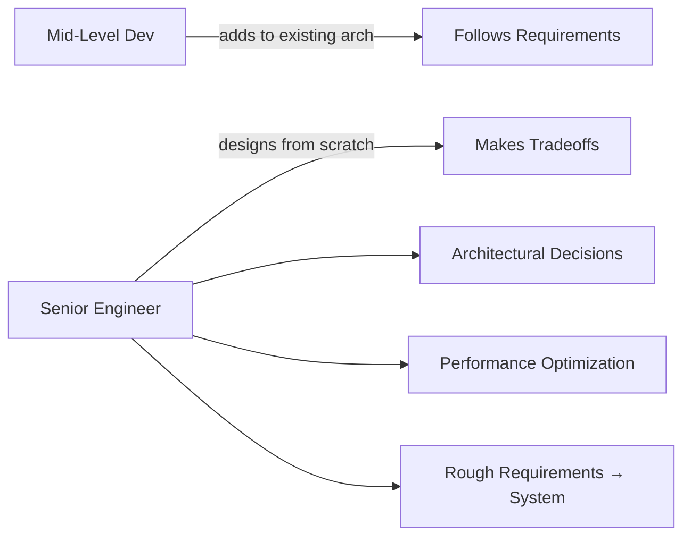

---

## 🧱 Part 1 — Foundations & Core Concepts

### Single Server Setup (Starting Point)

Every complex system starts simple. A single server setup includes:
- Web application
- Database
- Cache
- All other components

**Request Flow:**

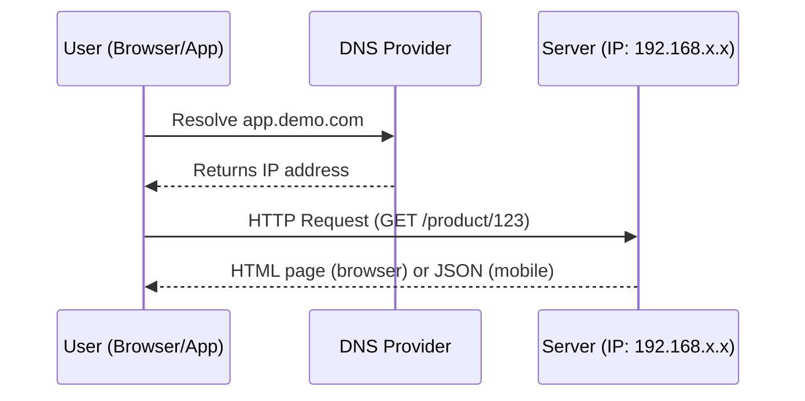

**Example API Request & Response:**

```http
GET /product/123
```

```json
{
  "id": 123,
  "name": "Wireless Headphones",
  "description": "Noise cancelling...",
  "price": 49.99,
  "metadata": { ... }
}
```

> ⚠️ **Key Insight:** Single server = single point of failure + cannot handle heavy traffic

---

## 🗄️ Part 2 — Database Selection

### Separating Web Tier & Data Tier

As user base grows → separate the **web/API layer** from the **database layer** so each can scale independently.

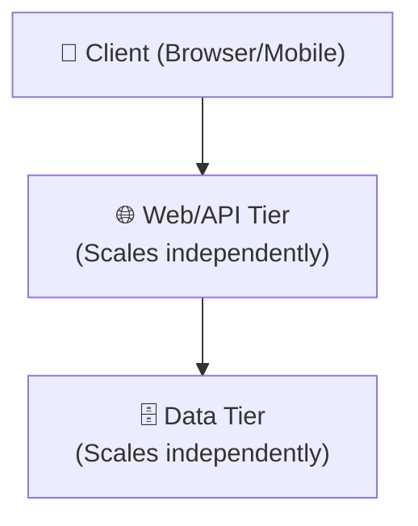

---

### 🔵 Relational Databases (SQL)

**Examples:** `PostgreSQL` · `MySQL` · `Oracle` · `SQLite`

Data is structured in **tables → columns → rows** (like spreadsheets).

**Advantages:**
- ✅ Complex **JOIN** operations across multiple tables
- ✅ **ACID** transactions for data integrity

#### ACID Properties

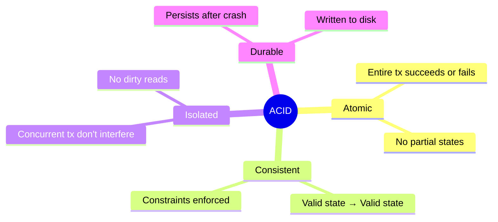

| Property | Meaning |
|---|---|
| **A**tomic | Entire transaction succeeds or fails as one unit |
| **C**onsistent | Transforms DB from one valid state to another |
| **I**solated | Concurrent transactions don't interfere |
| **D**urable | Data persists even after system failure |

> 🏦 *Example: A bank transfer either fully completes or fully rolls back — never halfway.*

**Use SQL when:**
- Data is **well-structured** with clear relationships (e.g., e-commerce: customers + orders)
- You need **strong consistency** and transactional integrity (e.g., financial systems)

---

### 🟢 Non-Relational Databases (NoSQL)

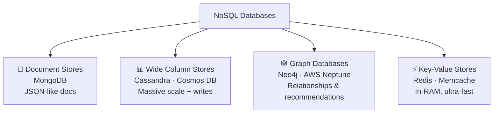

**Four Types:**

#### 1. Document Stores
- **Example:** `MongoDB`
- Data stored as **JSON-like documents**
- Allows complex nested data in a single record
- *Ideal for:* flexible, semi-structured data

#### 2. Wide Column Stores
- **Examples:** `Cassandra` · `Cosmos DB`
- Tables, rows, and **dynamic columns**
- *Ideal for:* massive scale + heavy write operations

#### 3. Graph Databases
- **Example:** `Neo4j` · `AWS Neptune`
- Stores **entities and relationships** as graphs
- *Ideal for:* recommendation engines (Amazon uses Neptune for product suggestions)

#### 4. Key-Value Stores
- **Examples:** `Redis` · `Memcache`
- Stored primarily **in RAM** → extremely fast reads/writes
- *Ideal for:* caching, session management, leaderboards

**Use NoSQL when:**
- You need **super low latency**
- Data is **unstructured or semi-structured**
- You need **flexible, massively scalable** storage (e.g., recommendation engines)

---

### ⚖️ SQL vs NoSQL — Quick Comparison

| Criteria | SQL | NoSQL |
|---|---|---|
| Data structure | Structured, relational | Flexible, dynamic |
| Consistency | Strong (ACID) | Eventual (usually) |
| Scalability | Vertical (mostly) | Horizontal |
| Best for | Banking, e-commerce | Recommendations, real-time, IoT |

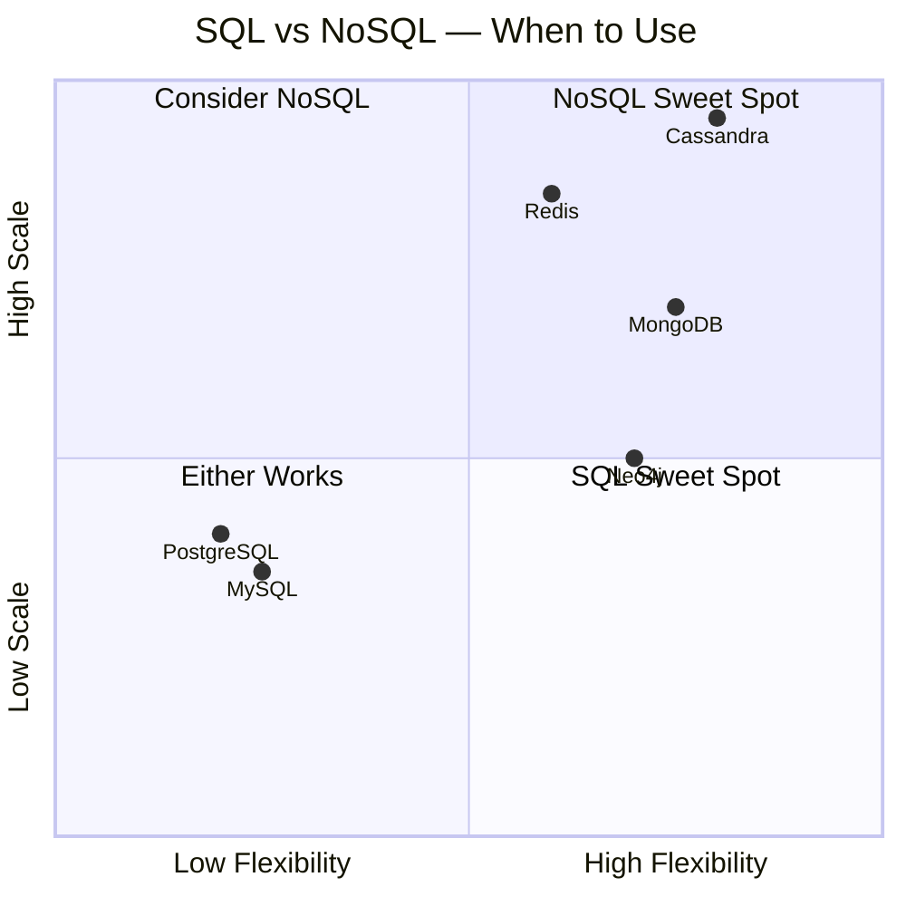

---

## ⚡ Part 3 — Scaling Strategies

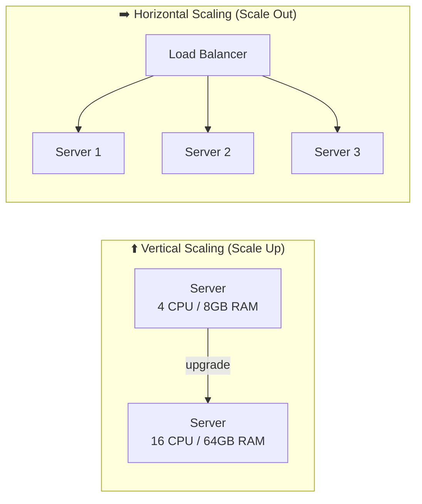

### Vertical Scaling (Scale Up)
Add more **CPU / RAM** to the existing server.

- ✅ Simple, works for low-to-moderate traffic
- ❌ **Hard resource cap** — you'll eventually hit a ceiling
- ❌ **No redundancy** — if server goes down, everything goes down

### Horizontal Scaling (Scale Out)
Add **more servers** to share the load.

- ✅ **Higher fault tolerance** — one server down? Others keep serving
- ✅ **Better scalability** — just spin up more instances
- ✅ Used by all large-scale production systems

---

## ⚖️ Part 4 — Load Balancing

> *A load balancer sits in front of your servers and distributes incoming requests to prevent any single server from being overwhelmed.*

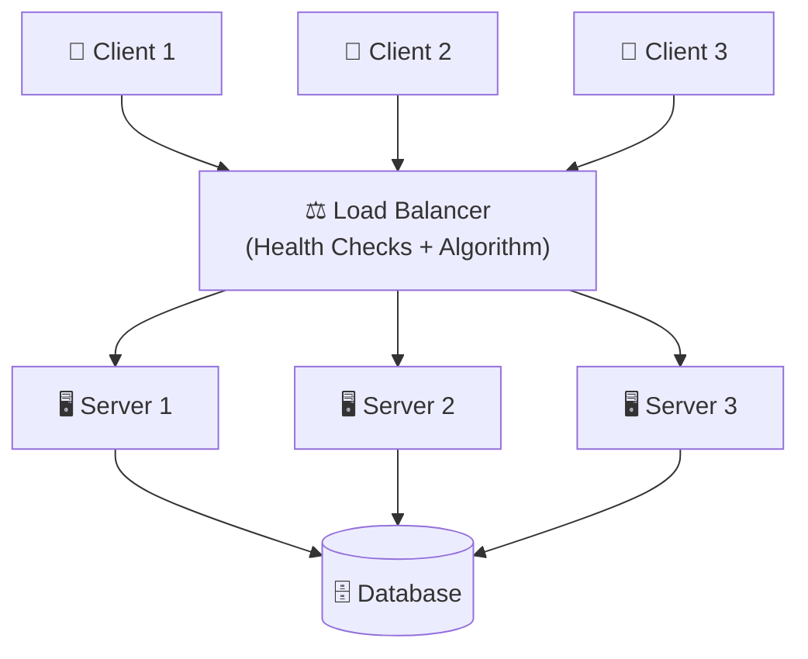

### 7 Load Balancing Algorithms

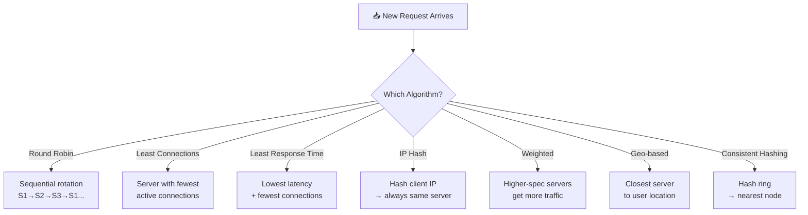

#### 1. 🔄 Round Robin *(most common, simplest)*
Requests are distributed to servers **in rotating sequential order**.
- Request 1 → Server 1
- Request 2 → Server 2
- Request 3 → Server 3
- Request 4 → Server 1 *(loops back)*

> Best for: servers with **similar specs/capacity**

---

#### 2. 🔗 Least Connections
Routes request to the server with the **fewest active connections** at that moment.

```
Server 1: 10 active connections
Server 2: 9 active connections  ← new request goes here
Server 3: 30 active connections
```

> Best for: sessions of **variable length**

---

#### 3. ⏱️ Least Response Time
Routes to server with **lowest response time** + fewest active connections combined.

> Best for: **heterogeneous** server pools with different capabilities

---

#### 4. 🔑 IP Hash
Client's **IP address is hashed** → always routes to the same server.

> Best for: apps where **session stickiness** is required (user data stored per-server)

---

#### 5. ⚖️ Weighted Algorithms
Variants of Round Robin / Least Connections where servers are assigned **weights** based on RAM, CPU, etc.

```
Server 1: 16GB RAM  → low weight
Server 2: 32GB RAM  → medium weight
Server 3: 64GB RAM  → high weight ← gets most traffic
```

---

#### 6. 🌍 Geographical (Geo-based)
Routes users to the **geographically closest server**.

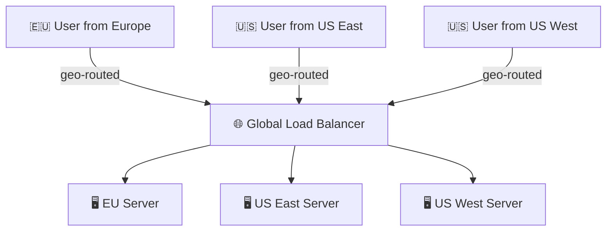

> Best for: **global services** where latency reduction is critical

---

#### 7. 🔁 Consistent Hashing
Uses a **hash ring** (circular hash space). Request IP is placed on the ring → routed to nearest server node.

- Ensures the **same client consistently hits the same server**
- More complex but highly effective for distributed systems

---

### 🏥 Health Checks

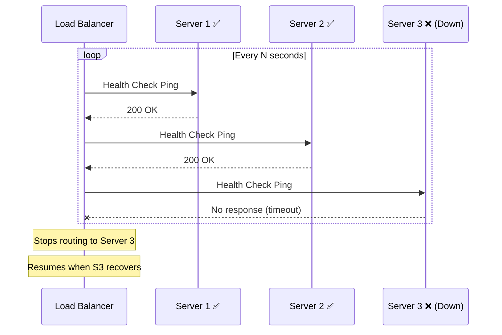

---

### Load Balancer Examples

**Software:**
- `Nginx` — most common, also acts as a web server
- `HAProxy` — open-source, highly configurable

**Hardware:**
- `F5` — high performance
- `Citrix` — enterprise-grade

**Cloud-managed:**
- `AWS Elastic Load Balancing` — auto-scaling, built-in monitoring
- `Azure Load Balancer`
- `Google Cloud Load Balancing`

---

### ⚠️ Single Point of Failure (SPOF)

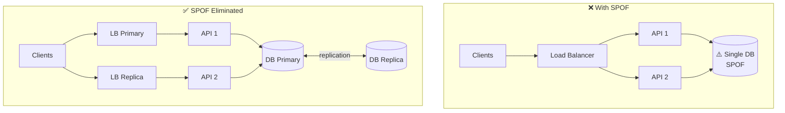

**Strategies to eliminate SPOF:**

1. **Redundancy** — run 2+ load balancers; if one fails, traffic reroutes to the other
2. **Health checks + monitoring** — detect failures instantly
3. **Self-healing systems** — auto-replace a failed LB instance with a new one

---

## 🌐 Part 5 — API Design

> *"The best API is one that developers can use without even reading the documentation."*

### What is an API?

**API** = Application Programming Interface

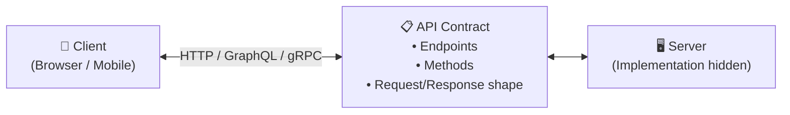

---

### The 3 Major API Styles

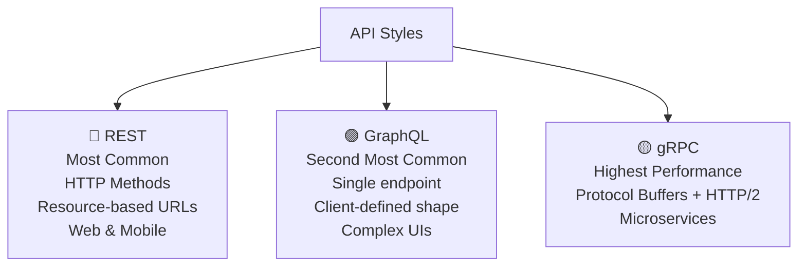

#### 🔵 REST (Representational State Transfer) — *Most Common*

- **Stateless** — each request contains all necessary info
- Uses standard **HTTP methods**: `GET` `POST` `PUT` `PATCH` `DELETE`
- Resource-based URLs (nouns, not verbs)
- Fixed response structure
- Supports **HTTP caching**

> Best for: **web and mobile applications**

---

#### 🟣 GraphQL — *Second Most Common*

- **Single endpoint** for all operations (`/graphql`)
- Client specifies **exactly what data it needs**
- Operations: `query` (read) · `mutation` (write) · `subscription` (real-time)
- Avoids **over-fetching** and **under-fetching**
- Uses **application-level caching** (not HTTP caching)
- Schema evolves **without versioning** (mostly)

> Best for: **complex UIs** needing data from multiple sources in one request

**REST vs GraphQL — Data Fetching:**

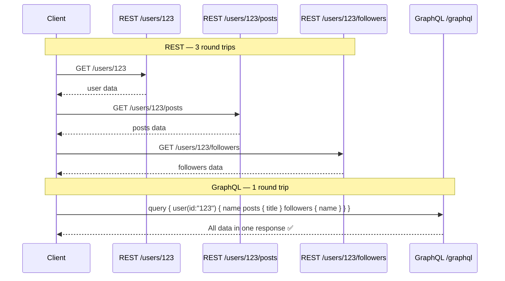

**Example GraphQL Query:**

```graphql
query {
  user(id: "123") {
    name
    posts {
      title
      content
    }
    followers {
      name
    }
  }
}
```

---

#### 🟡 gRPC — *Least Common, Highest Performance*

- Uses **Protocol Buffers** (binary format, not JSON)
- Built on **HTTP/2** → supports streaming + bidirectional communication
- Methods defined in `.proto` files
- Extremely efficient for **server-to-server** communication

> Best for: **microservices internal communication**

---

### REST vs GraphQL — Side by Side

| Feature | REST | GraphQL |
|---|---|---|
| Endpoints | Multiple resource-based | Single `/graphql` |
| Data fetching | Fixed response shape | Client-defined shape |
| Multiple resources | Multiple round trips | Single request |
| Versioning | Explicit (`v1`, `v2`) | Schema evolution |
| Caching | HTTP caching | Application-level |
| Best for | Simple CRUD APIs | Complex UIs |

---

### 4 Core API Design Principles

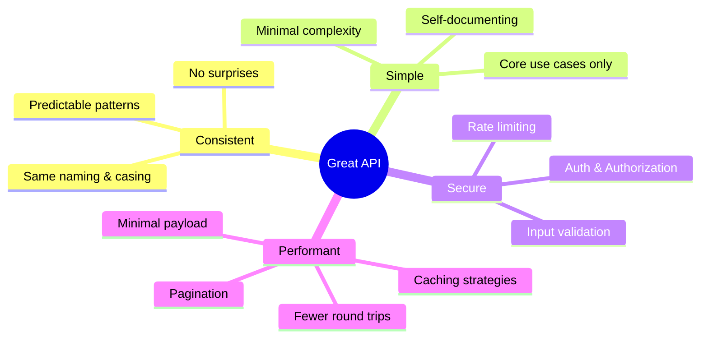

---

### Filtering, Sorting & Pagination

```http
# Filtering
GET /api/products?category=electronics&inStock=true

# Sorting
GET /api/products?sort=price:asc

# Pagination (page-based)
GET /api/products?page=3&limit=10

# Pagination (offset-based)
GET /api/products?offset=20&limit=10

# Pagination (cursor-based)
GET /api/products?cursor=abc123def
```

> Benefits: ✅ Saves bandwidth · ✅ Improves performance · ✅ Gives frontend flexibility

---

### REST HTTP Methods & Status Codes

#### HTTP Methods

| Method | Operation | Idempotent? |
|---|---|---|
| `GET` | Read/retrieve | ✅ Yes |
| `POST` | Create | ❌ No |
| `PUT` | Replace (full update) | ✅ Yes |
| `PATCH` | Partial update | ✅ Yes |
| `DELETE` | Remove | ✅ Yes |

#### Status Codes

| Range | Meaning | Examples |
|---|---|---|
| `2xx` | Success | `200 OK` · `201 Created` · `204 No Content` |
| `3xx` | Redirection | `301 Moved Permanently` |
| `4xx` | Client Error | `400 Bad Request` · `401 Unauthorized` · `404 Not Found` |
| `5xx` | Server Error | `500 Internal Server Error` |

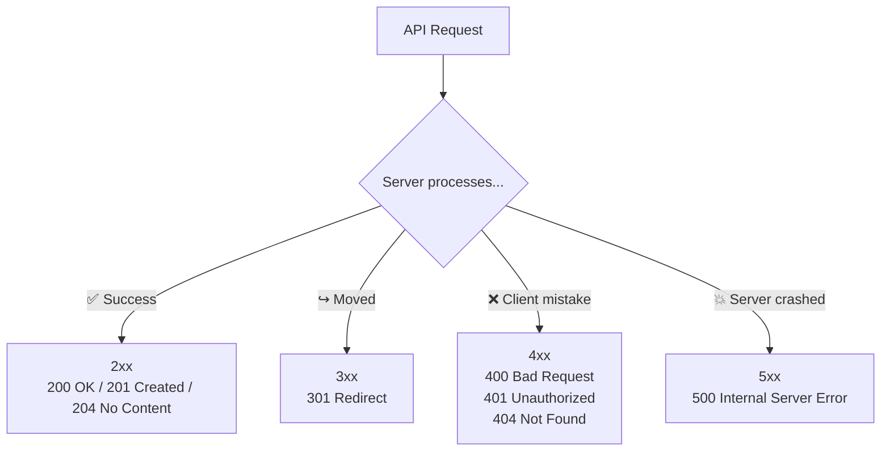

#### REST Best Practices Cheatsheet

```
✅  Use plural nouns:       /products  (not /product or /getProducts)
✅  Proper HTTP methods:    DELETE /users/123  (not POST /users/123/delete)
✅  Always paginate:        ?page=1&limit=10
✅  Version your API:       /api/v1/products
✅  Filter on backend:      ?category=tech&sort=price:asc
```

---

## 🔌 Part 6 — API Protocols

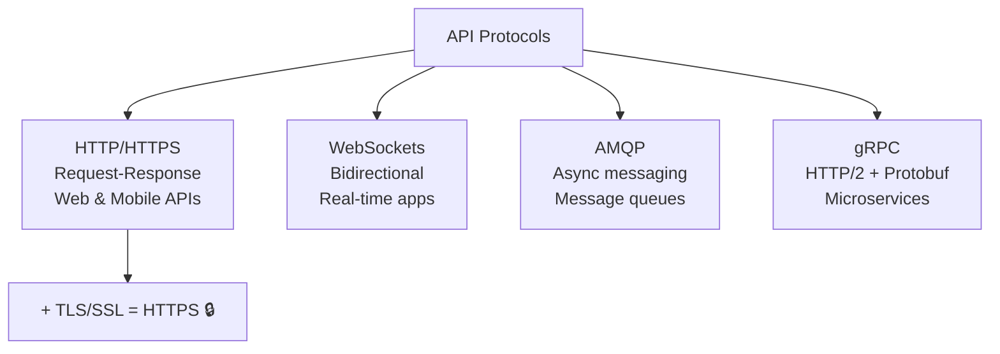

### HTTP / HTTPS

**HTTP** — *foundation of web APIs*

```
Client Request:
  GET /api/v1/products/123 HTTP/1.1
  Host: api.example.com
  Authorization: Bearer <token>

Server Response:
  HTTP/1.1 200 OK
  Content-Type: application/json
  Cache-Control: max-age=3600
  { ... }
```

**HTTPS** = HTTP + **TLS/SSL encryption**
- 🔒 Data encrypted in transit
- ✅ Data integrity guaranteed
- ✅ User authentication
- ✅ SEO benefits

> 🚨 *Golden rule: **Always use HTTPS** in production.*

---

### WebSockets — Real-Time Communication

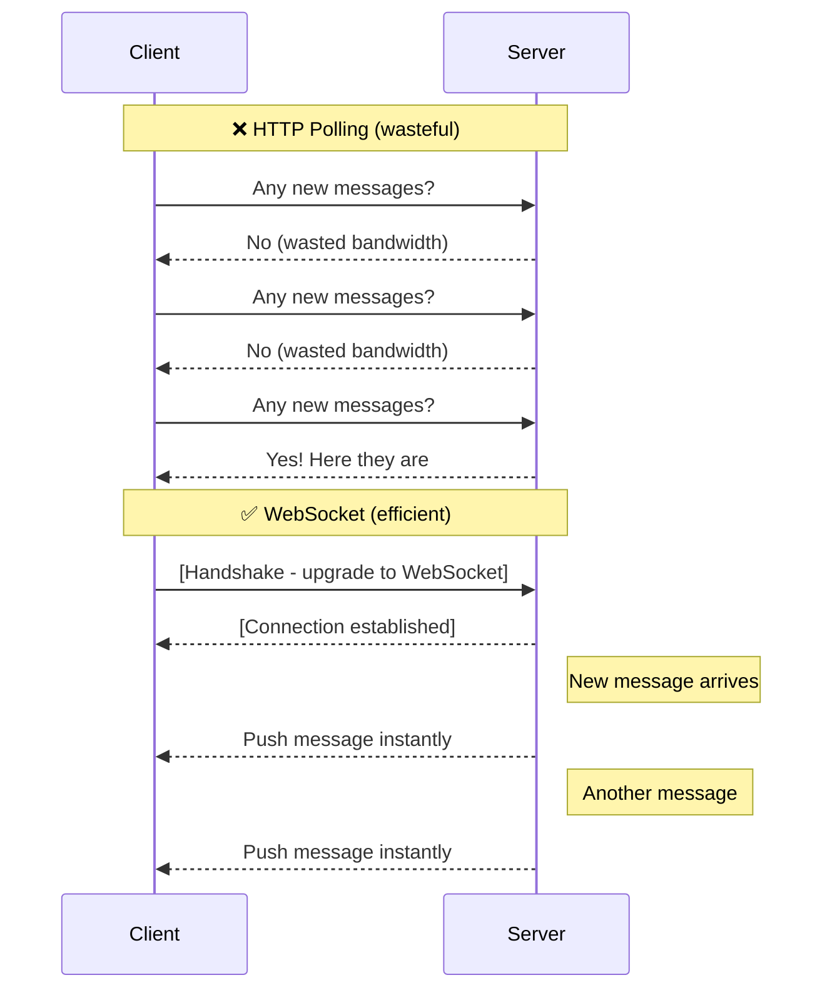

> Best for: **chat apps** · **live dashboards** · **real-time notifications** · **collaborative tools**

---

### AMQP — Advanced Message Queuing Protocol

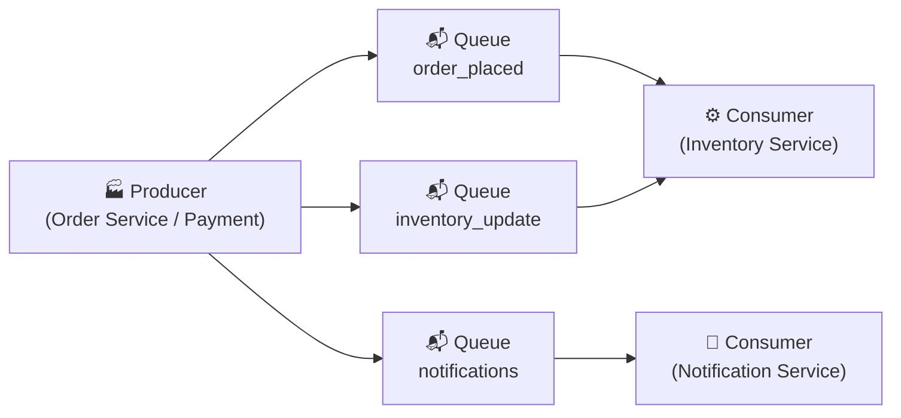

**Exchange types:** Direct · Fan-out · Topic-based

> Best for: **decoupled microservices** · **event-driven architecture**

---

### gRPC — Google Remote Procedure Call

- Built on **HTTP/2**
- Uses **Protocol Buffers** (binary, not JSON) → faster + smaller payloads
- Built-in **streaming** support
- ⚠️ Browsers don't natively support it → mainly **server-to-server**

---

### Choosing the Right Protocol

| Scenario | Protocol |
|---|---|
| Standard web/mobile API | `HTTP/HTTPS` |
| Real-time chat, live feeds | `WebSockets` |
| Async background processing | `AMQP (RabbitMQ/Kafka)` |
| Microservice-to-microservice | `gRPC` |

```mermaid
flowchart TD
    Q1{"Real-time<br/>bidirectional?"}
    Q1 -->|Yes| WS["WebSockets"]
    Q1 -->|No| Q2{"Async / background<br/>processing?"}
    Q2 -->|Yes| AMQP["AMQP<br/>(RabbitMQ / Kafka)"]
    Q2 -->|No| Q3{"Server-to-server<br/>microservices?"}
    Q3 -->|Yes| GRPC["gRPC"]
    Q3 -->|No| HTTP["HTTP / HTTPS<br/>(REST or GraphQL)"]
```

---

## 🚂 Part 7 — TCP vs UDP (Transport Layer)

```mermaid
graph TD
    TL["Transport Layer"]
    TL --> TCP["TCP<br/>Transmission Control Protocol"]
    TL --> UDP["UDP<br/>User Datagram Protocol"]

    TCP --> TCPpros["✅ Guaranteed delivery<br/>✅ Ordered packets<br/>✅ Error recovery"]
    TCP --> TCPcons["❌ More overhead<br/>❌ Slower"]
    TCP --> TCPuse["Banking · Email · Auth · Payments"]

    UDP --> UDPpros["✅ Fast<br/>✅ Low overhead<br/>✅ No handshake delay"]
    UDP --> UDPcons["❌ No delivery guarantee<br/>❌ No ordering"]
    UDP --> UDPuse["Video calls · Gaming · Live streams"]
```

### TCP — Transmission Control Protocol

> *Like sending a package with tracking + signature required*

- ✅ **Guaranteed delivery** — lost packets are resent
- ✅ **Ordered** — packets resequenced if they arrive out of order
- ✅ **Connection-based** — 3-way handshake before data transfer
- ❌ **More overhead** → slower

**3-Way Handshake:**

```mermaid
sequenceDiagram
    participant C as Client
    participant S as Server

    C->>S: SYN (I want to connect)
    S-->>C: SYN-ACK (Acknowledged, ready)
    C->>S: ACK (Got it!)
    Note over C,S: ✅ Connection Established
    C->>S: Data transfer begins...
```

> Best for: **banking** · **email** · **payments** · **user auth** — anything where data loss is unacceptable

---

### UDP — User Datagram Protocol

> *Fire and forget — fast but no guarantees*

- ✅ **Fast** — no handshake, no ordering, no tracking
- ✅ **Low overhead**
- ❌ **No guaranteed delivery** — packets can be lost silently
- ❌ **No ordering** guarantee

> Best for: **video calls** · **online gaming** · **live streaming** — dropped frames are better than lag

---

### TCP vs UDP Summary

| Feature | TCP | UDP |
|---|---|---|
| Delivery guarantee | ✅ Yes | ❌ No |
| Ordering | ✅ Yes | ❌ No |
| Connection | Required (handshake) | Connectionless |
| Speed | Slower | Faster |
| Use case | Payments, auth, email | Video, gaming, streaming |

---

## 🔐 Part 8 — Authentication

> *"Authentication answers: **who is this user?**"*

```mermaid
flowchart LR
    User["👤 User / Service"]
    AuthServer["🔐 Auth Layer"]
    System["🖥️ System / APIs"]

    User -->|"Login Request<br/>(credentials)"| AuthServer
    AuthServer -->|"✅ Identity confirmed<br/>→ Access granted"| System
    AuthServer -->|"❌ Identity rejected<br/>→ 401 Unauthorized"| User
```

### Common Misconceptions (Fixed)

| Misconception | Reality |
|---|---|
| JWT is an authentication method | JWT is a **token format** |
| Bearer auth = JWT | Bearer is a **pattern**; JWT is the most common bearer token type |
| OAuth2 is authentication | OAuth2 is an **authorization framework** |
| SSO is an auth method | SSO is a **user experience pattern** |

---

### Authentication Methods — Evolution

```mermaid
timeline
    title Authentication Methods (Old → Modern)
    Basic Auth        : base64(user:pass) sent each request
                      : Easily reversible ⚠️
    Digest Auth       : MD5 hashing
                      : Slightly better, still outdated
    API Keys          : Random string per client
                      : No expiry, no embedded info
    Session + Cookie  : Server stores session in Redis
                      : Stateful — harder to scale
    JWT Tokens        : Self-contained signed token
                      : Stateless — scalable ✅
    OAuth2 + OIDC     : Delegated auth + identity layer
                      : Modern standard ✅
```

---

#### 3. API Key Authentication

```http
Authorization: Bearer sk-abc123xyz
# or
X-API-Key: sk-abc123xyz
```

- Unique key generated per client
- ⚠️ No built-in expiration unless you implement it
- ⚠️ If key leaks → anyone can impersonate you
- Keys are **random strings** — no embedded info (unlike JWT)
- Server must **look up the key in DB** to verify

---

#### 4. Session-Based Authentication *(Traditional Web)*

```mermaid
sequenceDiagram
    participant U as User
    participant S as Server
    participant R as Redis (Session Store)

    U->>S: POST /login (username + password)
    S->>R: Create session → store session data
    R-->>S: Session ID
    S-->>U: Set-Cookie: session_id=xyz

    Note over U,S: Future requests
    U->>S: GET /profile (Cookie: session_id=xyz)
    S->>R: Lookup session_id=xyz
    R-->>S: Session valid → user data
    S-->>U: 200 OK + profile data
```

**Session Storage Options:**
- `Redis` ← ***recommended for production*** (fast, supports TTL/expiration)
- SQL database
- In-memory (lost on server restart — avoid in production)
- File system (not scalable — avoid)

> ⚠️ **Stateful** — server must remember sessions; harder to scale in distributed systems

---

#### 5. Token-Based Authentication (JWT) *(Modern Standard)*

**JWT = JSON Web Token** — a signed JSON object containing:
- User ID / email
- Expiration time
- Roles & permissions (claims)

```mermaid
sequenceDiagram
    participant U as User
    participant S as Auth Server
    participant API as API Server

    U->>S: POST /login (credentials)
    S->>S: Validate credentials
    S-->>U: Access Token (JWT, 15min) + Refresh Token (7d)

    U->>API: GET /profile (Authorization: Bearer <JWT>)
    API->>API: Verify JWT signature locally (no DB!) ✅
    API-->>U: 200 OK + data

    Note over U,API: Access token expires...
    U->>S: POST /refresh (Refresh Token)
    S-->>U: New Access Token ✅
```

> ✅ **Stateless** — no DB lookup per request → scalable + fast

---

#### Access Token + Refresh Token Pattern

| Token | Lifespan | Purpose |
|---|---|---|
| **Access Token** | 15 min – 1 hour | Used for API requests |
| **Refresh Token** | Days to weeks | Used to renew expired access tokens |

> 🚨 **Never store refresh tokens in `localStorage`** — store in **`HttpOnly cookies`** to prevent XSS attacks

---

### OAuth 2.0 — Authorization Framework

> *OAuth2 answers: "**what can this app access** on behalf of the user?"*

```mermaid
sequenceDiagram
    participant U as You (User)
    participant App as Vercel (Third-party App)
    participant GH as GitHub (Resource Server)

    U->>App: "Connect my GitHub"
    App->>GH: Redirect to consent screen
    GH-->>U: "Allow Vercel to read your repos?"
    U->>GH: ✅ Approve
    GH-->>App: Authorization Code
    App->>GH: Exchange code → Access Token
    GH-->>App: Access Token (scoped permissions)
    App->>GH: API calls using token (not your password!) ✅
```

> ✅ You share **tokens with limited permissions** — never your password

---

### OpenID Connect — Authentication ON TOP of OAuth2

```mermaid
graph LR
    OAuth2["OAuth2<br/>(Authorization)"] -->|adds identity layer| OIDC["OpenID Connect<br/>(Authentication + Authorization)"]
    OIDC --> AT["Access Token<br/>(what you can access)"]
    OIDC --> IT["ID Token (JWT)<br/>(who you are:<br/>email, name, user ID)"]
```

---

### Single Sign-On (SSO)

```mermaid
sequenceDiagram
    participant U as User
    participant IDP as Identity Provider (Google)
    participant GM as Gmail
    participant YT as YouTube
    participant GD as Google Drive

    U->>IDP: Login once with credentials
    IDP-->>U: SSO session + SSO cookie ✅

    U->>GM: Access Gmail
    GM->>IDP: Verify session
    IDP-->>GM: Valid ✅
    GM-->>U: Access granted (no re-login!)

    U->>YT: Access YouTube
    YT->>IDP: Verify session
    IDP-->>YT: Valid ✅
    YT-->>U: Access granted (no re-login!)

    U->>GD: Access Drive
    GD->>IDP: Verify session
    IDP-->>GD: Valid ✅
    GD-->>U: Access granted (no re-login!)
```

**Identity Protocols used under the hood:**
- `SAML` — XML-based, used in enterprise/legacy (Salesforce, corporate dashboards)
- `OpenID Connect` — JWT-based, modern standard (Google, GitHub)

---

## 🛡️ Part 9 — Authorization

> *"Authentication = **who** you are. Authorization = **what** you can do."*

```mermaid
flowchart LR
    AuthN["🔐 Authentication<br/>WHO are you?<br/>Login / verify identity"]
    AuthZ["🛡️ Authorization<br/>WHAT can you do?<br/>Permissions & access control"]
    Resource["📦 Protected Resource"]

    AuthN -->|"Identity confirmed"| AuthZ
    AuthZ -->|"Access granted"| Resource
    AuthZ -->|"Access denied → 403"| Blocked["❌"]
```

### 3 Authorization Models

```mermaid
graph TD
    AuthModels["Authorization Models"]
    AuthModels --> RBAC["RBAC<br/>Role-Based Access Control<br/>Most common<br/>Admin / Editor / Viewer"]
    AuthModels --> ABAC["ABAC<br/>Attribute-Based Access Control<br/>Most flexible<br/>User + Resource + Environment attributes"]
    AuthModels --> ACL["ACL<br/>Access Control Lists<br/>Per-resource permission lists<br/>Used in Google Drive"]
```

#### 1. RBAC — Role-Based Access Control *(Most Common)*

```mermaid
---
config:
  look: handDrawn
---
block-beta
    columns 5
    R["Role"]:1 C["Create"]:1 Re["Read"]:1 U["Update"]:1 D["Delete"]:1
    A["Admin"]:1 AC["✅"]:1 AR["✅"]:1 AU["✅"]:1 AD["✅"]:1
    E["Editor"]:1 EC["✅"]:1 ER["✅"]:1 EU["✅"]:1 ED["❌"]:1
    V["Viewer"]:1 VC["❌"]:1 VR["✅"]:1 VU["❌"]:1 VD["❌"]:1
```

> Used in: GitHub · CMS tools · team management apps

---

#### 2. ABAC — Attribute-Based Access Control *(Most Flexible)*

```mermaid
flowchart TD
    Req["Access Request"]
    UA["User Attributes<br/>department = HR<br/>age = 35"]
    RA["Resource Attributes<br/>classification = internal<br/>owner = alice"]
    EA["Environment<br/>time = business_hours<br/>location = office"]
    PE{"Policy Engine<br/>Evaluate all attributes"}
    ALLOW["✅ ALLOW"]
    DENY["❌ DENY"]

    Req --> PE
    UA --> PE
    RA --> PE
    EA --> PE
    PE --> ALLOW
    PE --> DENY
```

---

#### 3. ACL — Access Control Lists *(Resource-Specific)*

```mermaid
graph TD
    Doc["📄 document.pdf"]
    Doc -->|"READ only"| Alice["👤 Alice"]
    Doc -->|"READ + WRITE"| Bob["👤 Bob"]
    Doc -->|"NO ACCESS"| Carol["👤 Carol"]
```

> Used in: **Google Drive** document sharing
> ⚠️ Hard to scale at millions of users/objects — but possible (Google proves it)

---

### How Authorization is Enforced

**JWT / Bearer Tokens** — carry user identity + claims:

```json
{
  "userId": "usr_123",
  "role": "editor",
  "scopes": ["posts:read", "posts:write"],
  "exp": 1715000000,
  "iss": "api.example.com"
}
```

> ⚠️ **Distinction:** Tokens carry *identity + claims*. Authorization models (RBAC/ABAC/ACL) define *what is allowed*. They work together.

---

## 🔒 Part 10 — API Security (7 Techniques)

```mermaid
mindmap
  root((API Security))
    Rate Limiting
      Per user/IP
      Per endpoint
      Overall DDoS cap
    CORS
      Whitelist allowed origins
      Block malicious domains
    Injection Prevention
      Parameterized queries
      ORM safeguards
      Input sanitization
    Firewalls WAF
      AWS WAF
      Block SQL keywords
      Block strange patterns
    VPN
      Private APIs
      Internal tools only
      Network-level access
    CSRF
      CSRF tokens
      Combined with cookies
    XSS
      Sanitize inputs
      CSP headers
      HttpOnly cookies
```

### 1. Rate Limiting

```mermaid
graph TD
    Req["Incoming Requests"]
    Check{"Rate Limit<br/>Exceeded?"}
    Req --> Check
    Check -->|"No (under 100/min)"| Allow["✅ Pass through to API"]
    Check -->|"Yes (101+)"| Block["❌ 429 Too Many Requests"]
    Block --> Wait["⏳ Wait & retry later"]
```

```
Per user/IP:  Max 100 requests/minute
Per endpoint: /comments → stricter limit
Overall:      Total traffic cap → blocks DDoS bots
```

---

### 2. CORS — Cross-Origin Resource Sharing

```
Allowed: https://app.yourdomain.com  ✅
Blocked: https://evil.otherdomain.com ❌
```

> Without CORS: malicious websites can make requests **on your users' behalf**

---

### 3. SQL / NoSQL Injection Prevention

❌ **Vulnerable code:**
```sql
SELECT * FROM users WHERE username = '" + userInput + "'";
-- Attacker input: ' OR '1'='1 → bypasses auth entirely
-- Attacker input: '; DROP TABLE users; -- → destroys your data
```

✅ **Safe code — use parameterized queries:**
```javascript
// Parameterized query (safe)
db.query("SELECT * FROM users WHERE username = $1", [userInput]);

// ORM safeguards (Mongoose, Sequelize, Prisma, etc.)
User.findOne({ username: sanitizedInput });
```

---

### 4–7. Firewalls, VPN, CSRF, XSS

```mermaid
sequenceDiagram
    participant Attacker
    participant Internet
    participant WAF as 🔥 WAF (Firewall)
    participant VPN as 🔒 VPN Gate
    participant API as API Server

    Attacker->>WAF: Malicious request (SQL injection pattern)
    WAF-->>Attacker: ❌ Blocked

    Note over VPN,API: Internal APIs only accessible via VPN
    Attacker->>VPN: Request to internal API
    VPN-->>Attacker: ❌ Not in network — Blocked

    Note over Internet,API: CSRF Attack
    Attacker->>Internet: Trick user's browser → hidden form submit
    Internet->>API: Request (Cookie ✅, CSRF token ❌)
    API-->>Attacker: ❌ CSRF token mismatch — Blocked
```

### 6. CSRF — Cross-Site Request Forgery

**Prevention:** Use **CSRF tokens** alongside session cookies:

```
Browser sends: Cookie (session) + CSRF token (from form/header)
Server checks: Does CSRF token match stored value?
  ✅ Yes → allow request
  ❌ No  → block request
```

---

### 7. XSS — Cross-Site Scripting

```mermaid
sequenceDiagram
    participant A as Attacker
    participant DB as Database
    participant V as Victim's Browser

    A->>DB: Submit comment: <script>steal(document.cookie)</script>
    DB-->>DB: Stored (unvalidated ❌)
    V->>DB: Load comments page
    DB-->>V: Returns page with injected script
    V->>V: Browser executes malicious JS 💀
    V-->>A: Cookies / session data stolen
```

**Prevention:**
- **Sanitize** all user input before storing
- **Escape** HTML output before rendering
- Use **Content Security Policy (CSP)** headers
- Store sensitive tokens in `HttpOnly` cookies (not accessible via JS)

---

## 🗺️ Complete System Design Roadmap

```mermaid
graph TD
    F["🧱 Foundation"]
    F --> SS["Single Server"]
    SS --> ST["Separate Tiers<br/>(Web + Data)"]
    ST --> DB["Database Selection<br/>SQL vs NoSQL"]

    DB --> SC["⚡ Scaling"]
    SC --> VS["Vertical Scaling"]
    SC --> HS["Horizontal Scaling"]
    HS --> LB["⚖️ Load Balancing<br/>7 Algorithms + Health Checks"]

    LB --> API["🌐 API Layer"]
    API --> REST2["REST"]
    API --> GQL2["GraphQL"]
    API --> GRPC3["gRPC"]

    API --> PROTO["Protocol Choice<br/>HTTP · WebSockets · AMQP · gRPC"]
    PROTO --> TCP2["TCP vs UDP"]

    TCP2 --> SEC["🔒 Security"]
    SEC --> AUTHN["Authentication<br/>Basic → Session → JWT → OAuth2"]
    SEC --> AUTHZ["Authorization<br/>RBAC · ABAC · ACL"]
    SEC --> APISEC["API Protection<br/>Rate Limit · CORS · CSRF · XSS"]

    APISEC --> NEXT["⏭️ Coming Next"]
    NEXT --> CACHE["Caching & CDNs"]
    NEXT --> BIG["Big Data Processing"]
    NEXT --> PROD["Production Infrastructure"]
```

---

## 🧠 Key Takeaways Cheat Sheet

| Topic | Key Point |
|---|---|
| **Database** | SQL for structured + ACID; NoSQL for scale + flexibility |
| **Scaling** | Prefer horizontal; use load balancer to distribute traffic |
| **Load Balancing** | Round Robin (default) → IP Hash (sticky) → Geo (global) |
| **SPOF** | Eliminate via redundancy + health checks + self-healing |
| **REST** | Resource-based URLs, plural nouns, proper HTTP methods, versioning |
| **GraphQL** | Single endpoint, client-defined shape, avoid over-fetching |
| **gRPC** | Binary + HTTP/2, best for microservice-to-microservice |
| **TCP** | Reliable + ordered; use for payments, auth, email |
| **UDP** | Fast + unreliable; use for video, gaming, live streaming |
| **JWT** | Stateless token format; short-lived + refresh token pattern |
| **OAuth2** | Authorization framework (not authentication!) |
| **RBAC** | Roles + permissions; most common auth model |
| **Rate Limiting** | Protect against DDoS + brute force |
| **XSS** | Sanitize inputs, HttpOnly cookies, CSP headers |
| **CSRF** | CSRF tokens + session cookies together |

---

*Notes compiled from the System Design Course by Hikimmon — covering APIs, Databases, Caching, CDNs, Load Balancing & Production Infrastructure.*
