# 🗂️ System Design: Dropbox / Google Drive
### A Premium Engineering Handbook for Senior & Staff Engineers

> **Source:** Hello Interview — Evan (Former Staff Engineer & Interviewer @ Meta)
> **Difficulty:** Mid-Level → Senior → Staff
> **Frequency:** Asked at Google, Amazon, Meta, and all major FAANG companies

---

## 📌 Table of Contents

1. [Interview Roadmap](#-interview-roadmap)
2. [Functional Requirements](#-functional-requirements)
3. [Non-Functional Requirements](#-non-functional-requirements)
4. [Core Entities (Data Model)](#-core-entities-data-model)
5. [API Design](#-api-design)
6. [High-Level Design](#-high-level-design)
7. [Deep Dives](#-deep-dives)
   - [Large File Uploads & Resumable Uploads](#deep-dive-1-large-file-uploads--resumable-uploads)
   - [Low Latency Uploads & Downloads](#deep-dive-2-low-latency-uploads--downloads)
   - [Sync Accuracy & Data Integrity](#deep-dive-3-sync-accuracy--data-integrity)
8. [Final Architecture Diagram](#-final-architecture-diagram)
9. [Updated API (Post Deep Dive)](#-updated-api-post-deep-dive)
10. [Leveling Guide](#-leveling-guide)
11. [Glossary of Terms](#-glossary-of-terms)

---

## 🗺️ Interview Roadmap

> Before touching any design, follow this exact sequence every time you design a **user-facing product** like Dropbox.

```
┌─────────────────────────────────────────────────────────────────────┐
│                  SYSTEM DESIGN INTERVIEW ROADMAP                    │
│                                                                     │
│  1. REQUIREMENTS       →   What should the system DO?               │
│     ├─ Functional          Core features (top 3)                    │
│     └─ Non-Functional      Qualities (scale, latency, consistency)  │
│                                                                     │
│  2. CORE ENTITIES      →   What data is persisted & exchanged?      │
│                                                                     │
│  3. API DESIGN         →   How do clients talk to the system?       │
│                                                                     │
│  4. HIGH-LEVEL DESIGN  →   Boxes & arrows; satisfies func. reqs     │
│                                                                     │
│  5. DEEP DIVES         →   Satisfies non-func. reqs; shows depth    │
└─────────────────────────────────────────────────────────────────────┘
```

> **💡 Interviewer Tip:** The depth and *proactiveness* with which you drive Deep Dives is the **primary signal** for seniority leveling.

---

## ✅ Functional Requirements

> These are the **core features** — what the product must do. Identify the top 3 first.

| # | Requirement | Description |
|---|-------------|-------------|
| 1 | **Upload a File** | User can upload a file to remote (cloud) storage |
| 2 | **Download a File** | User can retrieve and download a file from remote storage |
| 3 | **Auto-Sync Across Devices** | Any change in one location (local or remote) is automatically reflected on all connected devices |

### 🚫 Out of Scope

- **Rolling your own blob storage** — This is a separate interview question ("Design S3"). We assume S3 or equivalent cloud blob storage is a managed dependency.
- File sharing / permissions management
- Version history (unless interviewer asks)

---

## ⚙️ Non-Functional Requirements

> These are the **qualities** of the system. Most candidates breeze through this — **don't**. These directly drive your deep dives.

### 1. Availability over Consistency (CAP Theorem)

> **What is CAP Theorem?**
> In any distributed system, you can only fully guarantee 2 of the 3 following properties:
> - **C**onsistency — Every read receives the most recent write
> - **A**vailability — Every request receives a (non-error) response
> - **P**artition Tolerance — The system continues to operate even if network partitions occur
>
> Partition tolerance is **mandatory** at scale. So the real trade-off is: **Consistency vs. Availability**.

**Decision: Prioritize Availability**

- It is **acceptable** if a user in Germany uploads a file and a user in America sees the old version for a few seconds.
- It is **not acceptable** for users to be unable to download a file at all.
- This is called **Eventual Consistency** — the system will become consistent, just not instantly.

---

### 2. Low Latency Uploads & Downloads

- Goal: Make uploads and downloads as fast as possible.
- Files vary wildly in size, so we can't give a fixed SLA number — we optimize *as low as possible*.

---

### 3. Support Large Files (up to 50 GB)

- Dropbox officially supports up to **50 GB** per file.
- Our system must handle this without timeouts, failures, or restarting from scratch.

---

### 4. Resumable Uploads

- If a user is uploading a 50 GB file and loses internet halfway through — **they should not need to restart**.
- The upload should resume exactly where it left off.

---

### 5. High Data Integrity (Sync Accuracy)

- Eventual consistency is fine — but **once stable**, what's in the local folder must exactly match what's in remote storage.
- Sync accuracy across all connected devices must be guaranteed.

---

## 🧱 Core Entities (Data Model)

> At this stage, you don't need every column. You just need to identify the **key objects** that are persisted and exchanged in the system.

```
┌──────────────────────┐     ┌──────────────────────┐     ┌────────────┐
│      File            │     │    File Metadata      │     │    User    │
│  (Raw binary bytes)  │     │  (Structured info)    │     │            │
│                      │     │                       │     │            │
│  Stored in:          │     │  - file_id            │     │  - user_id │
│  Blob Storage (S3)   │     │  - file_name          │     │  - email   │
│                      │     │  - mime_type          │     │  - ...     │
└──────────────────────┘     │  - size_bytes         │     └────────────┘
                             │  - owner_id (FK)      │
                             │  - s3_link            │
                             │  - created_at         │
                             │  - updated_at         │
                             │  - status             │
                             │  - chunks [ ]         │
                             │  - folder_id          │
                             └──────────────────────┘
```

> **Why separate File and File Metadata?**
> Raw binary bytes and structured metadata are **fundamentally different in nature**:
> - **Raw bytes** → Blob storage (S3) — optimized for cheap, massive object storage
> - **Metadata** → Database (DynamoDB/PostgreSQL) — optimized for fast lookups, filtering, querying

---

## 🔌 API Design

> Each API endpoint should map to at least one functional requirement. Use your core entities as inputs/outputs.

> **Note on User Auth:** User ID is **never** in the request body. It's extracted server-side from a **JWT** or **session token** in the request header. This prevents users from impersonating each other.

### Initial API Design (First Pass)

```
POST   /files           → Upload a file
       Body: { file, file_metadata }
       Returns: 200 OK

GET    /files/:fileId   → Download a file
       Returns: { file, file_metadata }

GET    /changes         → Get list of changed files
       Query: ?since=<timestamp>
       Returns: [ { file_id, metadata... } ]
```

> ⚠️ These are intentionally simplified at this stage. They will be **corrected** after the deep dives reveal the real constraints.

---

## 🏗️ High-Level Design

> Goal: Satisfy all 3 functional requirements. Keep it simple. No over-engineering yet.

### Architecture Overview

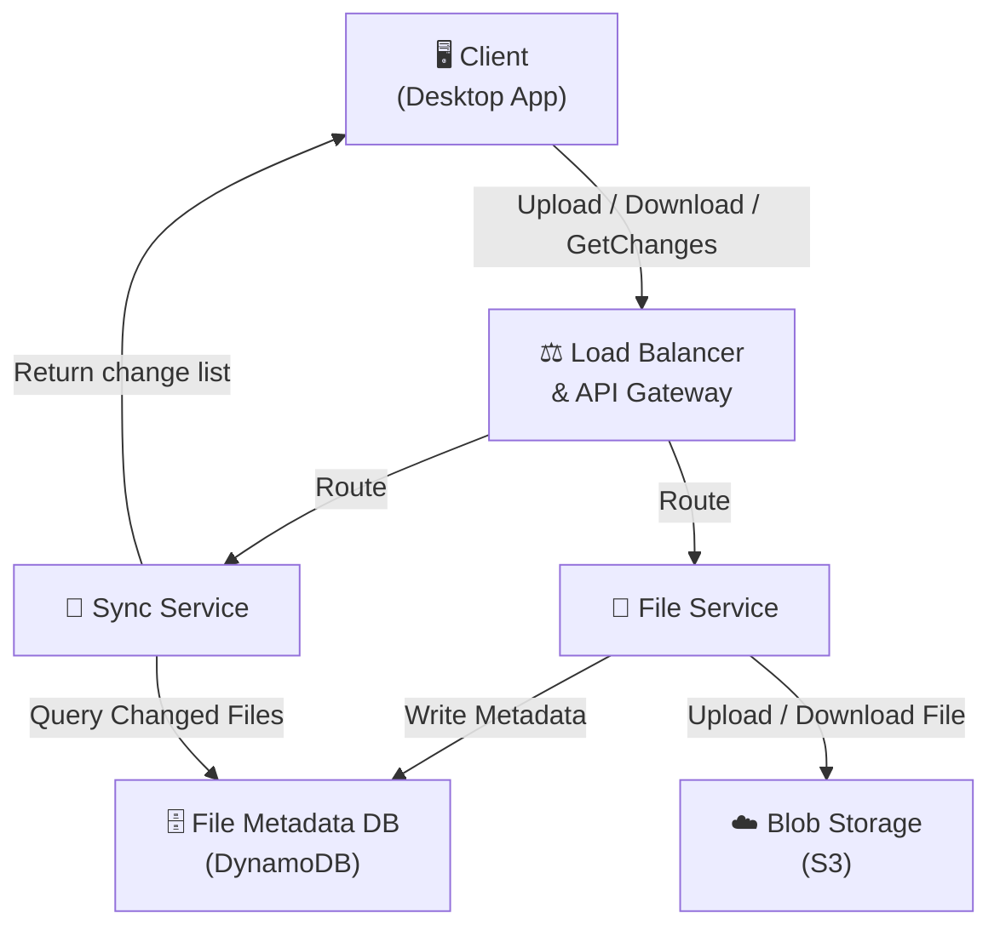

---

### Flow 1: Upload a File

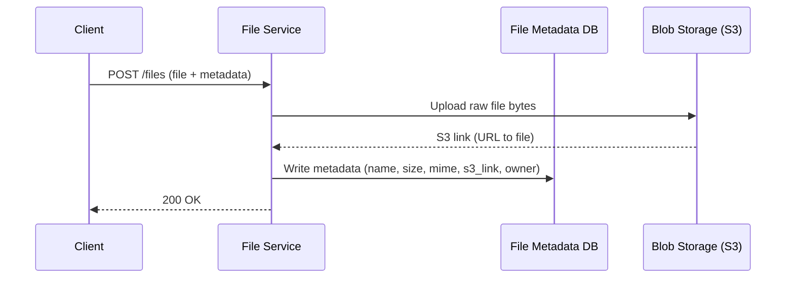

- Client sends the file + metadata to the File Service
- File Service uploads raw bytes to S3
- S3 returns the URL/link to the stored object
- File Service persists metadata (including the S3 link) to the database
- Returns success to the client

---

### Flow 2: Download a File

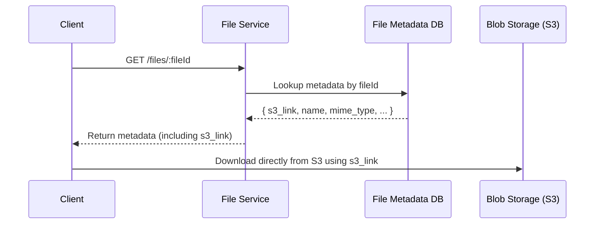

> **Key insight:** The client downloads **directly from S3** using the S3 link. The File Service does **not** proxy the file bytes. This avoids a redundant hop and saves server bandwidth.

---

### Flow 3: Auto-Sync Across Devices

This is the most complex functional requirement. Let's zoom into the client.

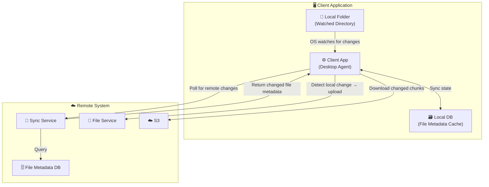

#### Direction A: Remote Changed → Update Local

1. Client App **polls** the Sync Service periodically (`GET /changes?since=<timestamp>`)
2. Sync Service queries File Metadata DB for files with `updated_at > timestamp`
3. Returns list of changed file metadata (with S3 links)
4. Client App downloads the updated files/chunks **directly from S3**
5. Updates the local folder and Local DB

#### Direction B: Local Changed → Update Remote

1. OS-level APIs **watch** the local folder for changes:
   - **Windows:** `FileSystemWatcher`
   - **macOS:** `FSEvents`
2. When a change is detected, Client App uploads the changed file via normal upload path
3. File Service updates S3 and File Metadata DB (updates `s3_link` + `updated_at`)

#### The Local DB (Client-side Cache)

- Stores metadata about every file in the local folder
- Used to **avoid re-downloading** files the client already has
- Cross-references `file_id` and fingerprints against the remote metadata
- Enables **delta sync** (only fetch what changed)

---

## 🔬 Deep Dives

### Deep Dive 1: Large File Uploads & Resumable Uploads

#### The Problem(s) with the Current Upload Design

**Problem 1: Double Upload (Redundant Bandwidth)**

```
Client → File Service → S3   ❌ WRONG
```

- The file is uploaded *twice*: once to our server, once to S3
- Wastes server CPU and bandwidth
- Server becomes a bottleneck

**Problem 2: Request Body Size Limits**

- Browsers, servers, and API gateways all enforce **max request body sizes**
- AWS API Gateway limit: **10 MB**
- A 50 GB file would be **rejected immediately** — never even reaches the server

---

#### Solution 1: Pre-Signed URLs (Direct Upload to S3)

> **What is a Pre-Signed URL?**
> A pre-signed URL is a time-limited, authenticated URL generated by S3 that allows a client to upload (or download) a specific object **directly** to/from S3 — without going through your server — but only within the constraints you've specified (file size, MIME type, expiry window).

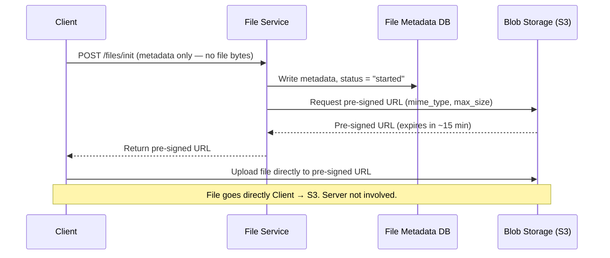

**Benefits:**
- No double-hop: Client → S3 directly ✅
- Bypasses server request body limits ✅
- Server CPU/bandwidth freed entirely ✅
- S3 enforces the constraints (size, type, expiry) ✅

---

#### Solution 2: Chunking (Enables Large Files + Resumability)

> **What is Chunking?**
> Splitting a large file into many smaller pieces (chunks) before uploading. Each chunk is uploaded independently — in series or in parallel.

**Why chunking?**
- Uploading a 50 GB file at 100 Mbps = **1 hour 12 minutes**
- If the connection drops at 59 minutes → without chunking, restart from 0 ❌
- With chunking → only re-upload the failed chunks ✅

```
50 GB File
├── Chunk 1  (5 MB)  ✅ uploaded
├── Chunk 2  (5 MB)  ✅ uploaded
├── Chunk 3  (5 MB)  ✅ uploaded
├── Chunk 4  (5 MB)  ❌ failed — connection dropped
├── Chunk 5  (5 MB)  ⏳ not started
└── ...
    → Resume: only upload Chunk 4, 5, ...
```

**Chunk size:** ~5 MB per chunk (tunable based on network conditions)

---

#### Solution 3: Fingerprinting (Uniquely Identify Chunks)

> **What is Fingerprinting?**
> A cryptographic hash (e.g., SHA-256 or MD5) computed over the raw bytes of a chunk. The same bytes always produce the same hash — making it a reliable unique identifier for that chunk's content.

**Why not just use indexes?**
- Index-based tracking is brittle and error-prone
- A fingerprint is derived from the **content itself**, making it both unique and verifiable

```
Chunk bytes → SHA-256 hash → "a3f9c2b1..." (fingerprint/ID)
```

- **Client computes** fingerprints for all chunks before uploading
- **Server stores** these fingerprints in `file_metadata.chunks[]`
- On resume: compare client fingerprints vs. server fingerprints → upload only missing ones

---

#### Updated File Metadata Schema

```json
{
  "file_id": "uuid-abc",
  "file_name": "project.pdf",
  "mime_type": "application/pdf",
  "size_bytes": 52428800,
  "owner_id": "user-123",
  "folder_id": "folder-456",
  "s3_link": "https://s3.amazonaws.com/...",
  "status": "uploading",
  "created_at": "2024-01-01T10:00:00Z",
  "updated_at": "2024-01-01T10:05:00Z",
  "compression_algo": "gzip",
  "chunks": [
    {
      "id": "a3f9c2b1...",
      "status": "uploaded",
      "s3_link": "https://s3.amazonaws.com/.../chunk_1"
    },
    {
      "id": "d8e7a1f2...",
      "status": "pending",
      "s3_link": null
    }
  ]
}
```

> **Why DynamoDB (NoSQL) for this?**
> The `chunks` field is a nested list — storing it as a DynamoDB document is natural. With SQL (e.g., Postgres), you'd need a separate normalized `chunks` table with a foreign key back to `file_metadata`, which requires joins. Both work — just different trade-offs.

---

#### Chunk Status Update: Trust But Verify

> **The Problem:** After a chunk uploads to S3, how does the server know to update the chunk's status in the DB?

**Naive Approach (Insecure):**
```
Client uploads chunk → S3 responds OK
Client tells server: "Hey, chunk 3 is done!"
Server blindly updates DB ← ❌ Client could lie
```

**Option A: Trust But Verify**

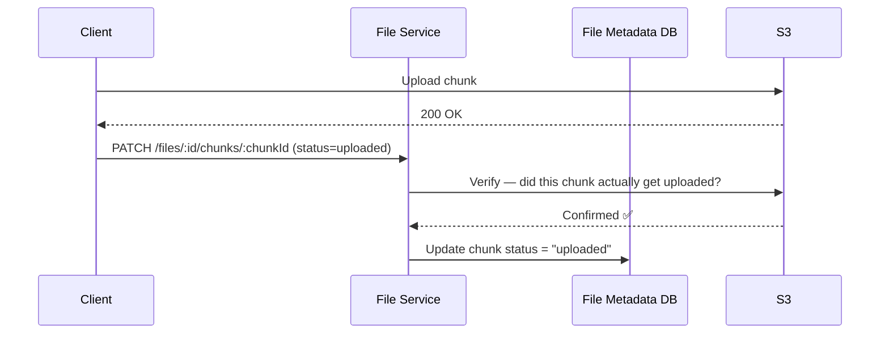

**Option B: S3 Event Notifications**

```
S3 → [S3 Notification] → File Service → Update DB
```

- S3 can trigger a notification/webhook whenever an object is created
- File Service receives this event and updates chunk status autonomously
- **No client trust required** — the update is entirely server-side
- **Caveat:** S3 Multipart Upload doesn't support per-chunk S3 notifications — only on final assembly

> **Which to choose?**
> - **Trust but verify** → simpler, works with multipart upload
> - **S3 Notifications** → more secure, fully decoupled, but added infrastructure complexity
> - Evan's recommendation: **Trust but verify** in an interview context

---

#### S3 Multipart Upload (Real-World Note)

> AWS S3 has a native API called **S3 Multipart Upload** that handles much of what we described:
> - Client-side chunking
> - Parallel chunk uploads
> - Fingerprint/ETag-based validation
> - Final assembly of chunks into a complete object
>
> In a real system, you'd likely use this. In an interview, discussing the underlying mechanics (chunking, fingerprinting, resumability) shows architectural understanding.

---

### Deep Dive 2: Low Latency Uploads & Downloads

#### Optimization 1: Chunking (Already Covered)

- Parallel chunk uploads **maximize available bandwidth** even when total bandwidth is fixed
- Adaptive chunk sizes based on network conditions

#### Optimization 2: CDN — To Use or Not To Use?

> **What is a CDN?**
> A Content Delivery Network (CDN) is a globally distributed network of edge servers that cache content **closer to the end user**, reducing latency by minimizing the physical distance data travels.

**Argument FOR adding a CDN:**
- Dramatically reduces download latency for geographically distributed users
- Takes load off origin servers
- Standard for media-heavy applications (YouTube, Netflix, Spotify)

**Argument AGAINST CDN in Dropbox's case:**

| Factor | CDN Use Case | Dropbox Case |
|--------|-------------|--------------|
| Content | Publicly popular (same file for millions) | Personal files (each user downloads their own) |
| Access Pattern | Many users → same content | Each user → unique content |
| Geographic Pattern | Users often far from origin | Users likely near their own regional data center |
| Cost | Justified by massive reuse | Hard to justify for unique content |

> **Verdict:** CDN is mostly **overkill** for Dropbox unless:
> - Shared/public files become very popular
> - Users frequently travel internationally
> 
> **Top candidates note this trade-off explicitly** rather than reflexively adding a CDN.

---

#### Optimization 3: Compression

> **What is Compression?**
> An algorithm (e.g., gzip, Brotli, zstd) that reduces file size by encoding repeated patterns more efficiently. Fewer bytes over the network = faster transfer.

**Not all files benefit equally:**

| File Type | Compressibility | Should Compress? |
|-----------|----------------|-----------------|
| `.txt`, `.csv`, `.log` | Very high (60–90% reduction) | ✅ Yes |
| `.docx`, `.json`, `.html` | High (40–70% reduction) | ✅ Yes |
| `.jpg`, `.png`, `.mp4` | Very low (already compressed) | ❌ No — overhead not worth it |
| `.zip`, `.gz` | Near zero | ❌ Never |

**Intelligent Compression Logic (Client-side):**

```
IF mime_type is text/* OR application/json OR application/msword:
    compress → record compression_algo in metadata
ELSE:
    skip compression
```

- Compression algorithm stored in `file_metadata.compression_algo`
- Needed so the receiving client knows how to decompress
- Balance: compression speed + decompression time vs. bandwidth savings

---

### Deep Dive 3: Sync Accuracy & Data Integrity

#### Making Sync Fast

##### Approach: Adaptive Polling

> **What is Polling?**
> The client proactively asks the server on a set interval: "Has anything changed since timestamp X?"

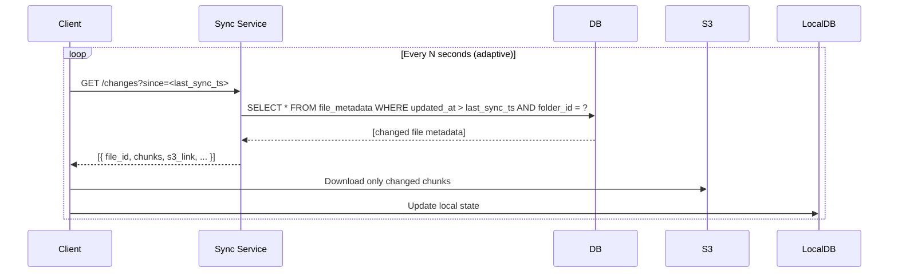

**Adaptive polling frequency:**
- Client app is **actively open / in focus** → poll more frequently (e.g., every 5 seconds)
- Many recent changes → increase poll frequency
- Idle / app in background → poll less frequently (e.g., every 60 seconds)
- User can always hit **Refresh** to trigger an immediate poll

---

##### Why Not WebSockets?

> **What are WebSockets?**
> A protocol that establishes a **persistent, bidirectional** TCP connection between client and server — enabling real-time push notifications without polling.

| Factor | WebSockets | Polling |
|--------|-----------|---------|
| Latency | Near-real-time (ms) | Seconds delay |
| Connection | Always-on, persistent | Stateless, on-demand |
| Infrastructure | Needs WebSocket manager, load balancer config | Standard HTTP |
| Overhead | High — connection held open 24/7 for every device | Low — only active when polling |
| Use case | Chat, live collaboration, trading | File sync, notifications |

**Why WebSockets are overkill for Dropbox:**
- A Dropbox sync client runs 24/7 in the background
- Holding a persistent WebSocket connection open for every connected device at scale = enormous infrastructure cost
- Users don't need **millisecond** sync — seconds or even tens of seconds is totally acceptable
- A refresh button covers edge cases

---

##### Why Not Long Polling?

> **What is Long Polling?**
> A variation of polling where the client makes a request and the **server holds the connection open** (up to ~60 seconds) until it has new data to return. Then the client immediately opens a new long-poll request.

**Why long polling doesn't fit Dropbox:**
- Designed for when you expect a response within a known time window (~60s)
- File changes are **unpredictable** — a user might not change a file for days
- Holding connections open for potentially days = wasteful
- Polling at regular adaptive intervals is simpler and sufficient

---

#### Delta Sync (Fetch Only What Changed)

> **What is Delta Sync?**
> Instead of re-downloading an entire file when something changes, only download the **chunks that are new or modified**.

```
File: report.docx (500 MB, 100 chunks of 5 MB each)
Change: User edited page 3 only

Without delta sync: Download all 500 MB again ❌
With delta sync:    Download 1–2 modified chunks (~5–10 MB) ✅
```

**How it works:**

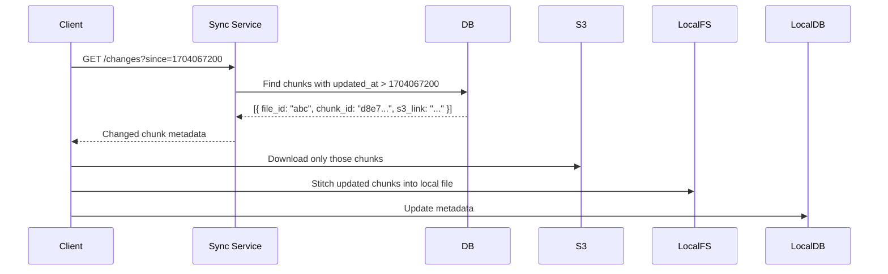

**Schema additions needed for delta sync:**

```json
"chunks": [
  {
    "id": "fingerprint-hash",
    "status": "uploaded",
    "s3_link": "...",
    "updated_at": "2024-01-01T10:05:00Z"
  }
]
```

---

#### Making Sync Consistent

##### Option A: Direct Database Polling (Recommended for Most Interviews)

```
Client → Sync Service → File Metadata DB
         "Give me all files/chunks in folder X changed since timestamp T"
```

- Simple, straightforward, easy to reason about
- Works well at most scales
- Use `folder_id` and `updated_at` indexes for efficient queries
- **Downside:** No audit trail, no rollback capability

---

##### Option B: Event Bus with Sync Cursor (Advanced — What Dropbox Actually Does)

> **What is an Event Bus?**
> A distributed message queue (e.g., Kafka) that stores a **sequential, ordered log of all events**. Consumers read from a position (cursor) in the log.

> **What is a Cursor?**
> A pointer to a specific position in the event stream — like a bookmark. "I've read up to event #4,521."

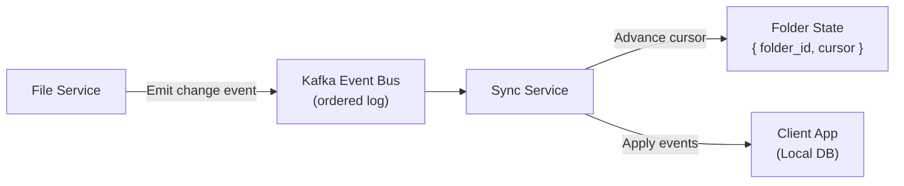

**How it works:**

1. Every file change emits an event to Kafka: `{ event_type: "chunk_updated", file_id, chunk_id, timestamp }`
2. Each folder has a **sync cursor** — the last event it processed
3. First time a device connects: **replay all events** from the beginning to reconstruct full state
4. Subsequent syncs: **read only events after the cursor** → apply changes → advance cursor

**Advantages over DB polling:**
- Built-in **audit trail** — every change ever made is preserved
- **Version control** — roll back to any previous state
- **Data recovery** — replay events to rebuild any state
- **Snapshots** can be taken to avoid replaying entire history

**Why Evan calls this overkill:**
- Our functional requirements don't include version history or audit trails
- Adds significant infrastructure complexity (Kafka cluster, cursor management, snapshotting)
- DB polling achieves 99% of the same outcome with 20% of the complexity
- Only add it if the interviewer explicitly requires version history

---

#### Reconciliation (Safety Net)

> **What is Reconciliation?**
> A periodic, scheduled process that performs a **full comparison** between local state and remote state to catch and fix any inconsistencies that slipped through the real-time sync process.

**Why it's needed:**
- Despite best efforts, bugs happen
- Network failures can cause partial syncs
- Race conditions in distributed systems can create edge cases
- Software updates can introduce subtle sync bugs

**How it works:**

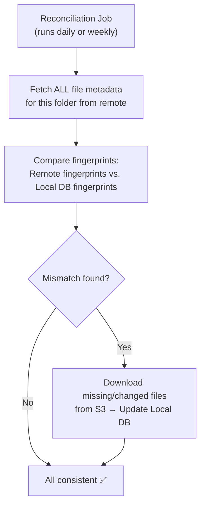

- Frequency: daily or weekly (configurable)
- Uses fingerprints to detect inconsistencies without downloading every file
- Acts as the **ultimate safety net** after all real-time sync mechanisms

---

## 🗺️ Final Architecture Diagram

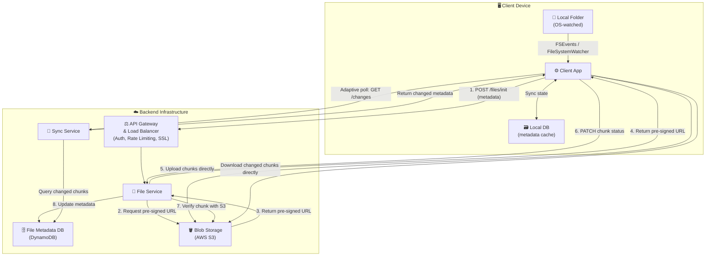

---

## 📝 Updated API (Post Deep Dive)

> The original simple API needed corrections after the deep dives revealed real constraints.

### Step 1: Initialize Upload (Metadata Only)

```
POST /files/init
Header: Authorization: Bearer <jwt>
Body: {
  "file_name": "project.pdf",
  "mime_type": "application/pdf",
  "size_bytes": 52428800,
  "folder_id": "folder-456",
  "chunks": [
    { "id": "fingerprint-1", "size_bytes": 5242880 },
    { "id": "fingerprint-2", "size_bytes": 5242880 },
    ...
  ]
}
Response: {
  "file_id": "uuid-abc",
  "pre_signed_urls": {
    "fingerprint-1": "https://s3.amazonaws.com/...?signed=...",
    "fingerprint-2": "https://s3.amazonaws.com/...?signed=...",
    ...
  }
}
```

### Step 2: Upload Chunks Directly to S3

```
PUT <pre_signed_url>   (direct to S3, not our server)
Body: <raw chunk bytes>
```

### Step 3: Confirm Chunk Upload

```
PATCH /files/:fileId/chunks/:chunkId
Header: Authorization: Bearer <jwt>
Body: { "status": "uploaded" }
→ Server verifies with S3, then updates DB
```

### Step 4: Download File

```
GET /files/:fileId
Header: Authorization: Bearer <jwt>
Response: {
  "file_id": "uuid-abc",
  "file_name": "project.pdf",
  "s3_link": "https://s3.amazonaws.com/...",
  "chunks": [ ... ]
}
→ Client downloads directly from s3_link
```

### Step 5: Get Changes (Sync)

```
GET /changes
Header: Authorization: Bearer <jwt>
Query: ?folder_id=folder-456&since=1704067200
Response: [
  {
    "file_id": "uuid-abc",
    "file_name": "project.pdf",
    "updated_at": "2024-01-01T10:05:00Z",
    "changed_chunks": [
      { "id": "fingerprint-2", "s3_link": "...", "status": "uploaded" }
    ]
  }
]
```

---

## 📊 Leveling Guide

| Level | Expectation |
|-------|-------------|
| **Mid-Level (E4/L4)** | Complete high-level design. Answer interviewer follow-up questions competently. Chunking, pre-signed URLs optional but impressive. |
| **Senior (E5/L5)** | Drive 1–2 deep dives proactively. Chunking, fingerprinting, pre-signed URLs required. Discuss CDN trade-offs. |
| **Staff (E6/L6)** | Drive 2–3 deep dives with hands-on depth. Delta sync, event bus cursor, reconciliation. Know *why* each decision is made. Anticipate and address trade-offs unprompted. |

> **Interviewer tip:** The key differentiator between senior and staff is not **breadth** of knowledge but **depth** of reasoning — can you justify every decision? Do you know the trade-offs? Do you have real-world intuition about when to add complexity vs. when simplicity is the right answer?

---

## 📖 Glossary of Terms

| Term | Definition |
|------|------------|
| **Blob Storage** | Storage system optimized for large binary objects (images, videos, documents). AWS S3, GCP Cloud Storage, Azure Blob Storage are examples. |
| **Pre-Signed URL** | A time-limited, authenticated URL that allows direct access to S3 (upload or download) without exposing credentials. |
| **CAP Theorem** | In a distributed system, you can only guarantee 2 of: Consistency, Availability, Partition Tolerance. |
| **Eventual Consistency** | A model where all nodes in a distributed system will *eventually* converge to the same value, given no new updates. |
| **Chunking** | Splitting a large file into smaller pieces for independent, resumable, parallel transfer. |
| **Fingerprinting** | Computing a cryptographic hash of data (e.g., SHA-256) to uniquely identify it. Same bytes → same hash. |
| **Delta Sync** | Syncing only the changed portions of a file (chunks), not the entire file. |
| **Adaptive Polling** | Adjusting polling frequency dynamically based on activity level, app state, or network conditions. |
| **WebSockets** | A protocol for persistent, bidirectional, real-time communication between client and server. |
| **Long Polling** | A polling technique where the server holds the connection open until it has new data, up to a timeout (usually ~60s). |
| **CDN (Content Delivery Network)** | A globally distributed network of edge servers that cache and serve content closer to users. |
| **Reconciliation** | A scheduled process that compares two systems' state in full to detect and fix discrepancies. |
| **Event Bus** | A distributed messaging system (e.g., Kafka, RabbitMQ) that stores events in an ordered, persistent log. |
| **Sync Cursor** | A pointer in an event stream representing the last event a consumer has processed. |
| **Trust But Verify** | A security pattern where you accept a client's claim but independently verify it with the authoritative source. |
| **S3 Notifications** | AWS S3 feature that triggers events (webhooks, SQS messages, Lambda invocations) when objects are created or modified. |
| **S3 Multipart Upload** | AWS S3's native API for chunked, parallel, resumable uploads — handles chunking, ETags (fingerprints), and final assembly. |
| **File Metadata** | Structured data *about* a file: name, size, type, owner, location — stored in a database, not blob storage. |
| **FSEvents (macOS)** | Apple's OS API for watching file system changes in a directory on macOS. |
| **FileSystemWatcher (Windows)** | Microsoft's OS API for monitoring changes to files and directories on Windows. |
| **Compression (gzip/Brotli/zstd)** | Algorithms that reduce file size by encoding repetitive data more efficiently. |
| **Mime Type** | A standard identifier for file format (e.g., `application/pdf`, `image/jpeg`, `text/plain`). |
| **DynamoDB** | AWS's managed NoSQL document/key-value database. Scales horizontally, supports nested document structures. |
| **Kafka** | A distributed event streaming platform used as a high-throughput, durable event bus. |
| **Snapshot (Event Sourcing)** | A periodic saved state of the system that allows event replay to start from a recent point rather than the very beginning. |
| **RBAC** | Role-Based Access Control — restricting system access based on the roles of users. |
| **JWT (JSON Web Token)** | A compact, self-contained token for securely transmitting user identity between client and server. |

---

*Document generated from Hello Interview — System Design: Dropbox/Google Drive*
*Instructor: Evan (Former Staff Engineer & Interviewer, Meta)*
