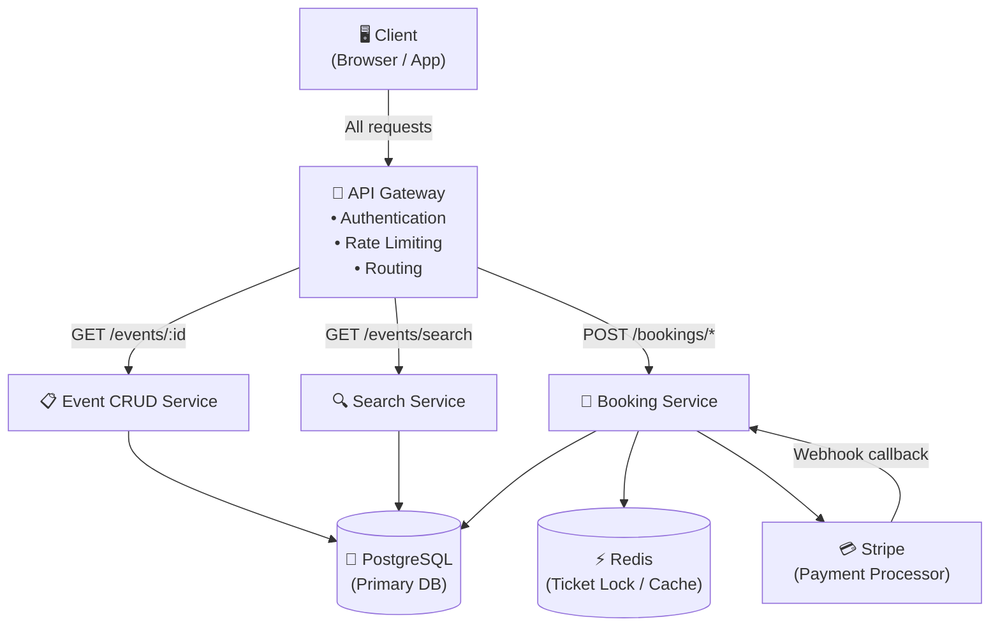
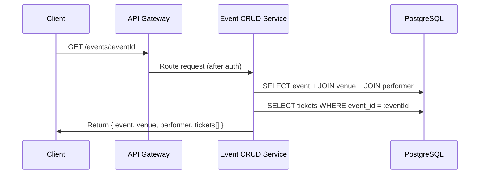
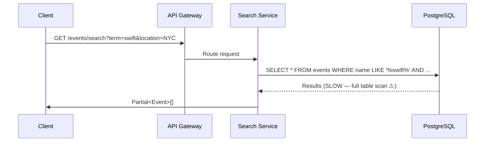
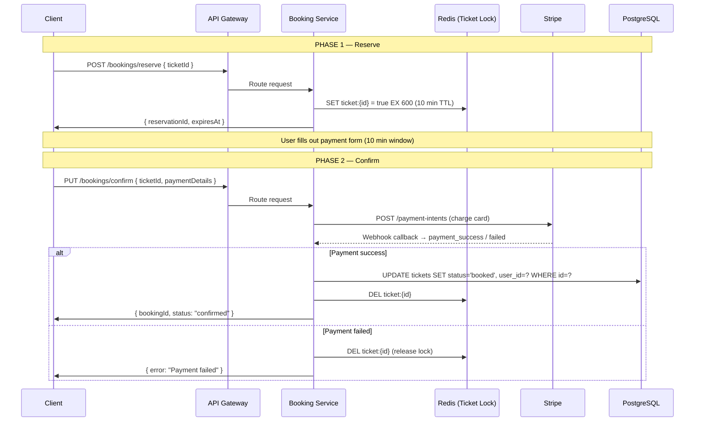
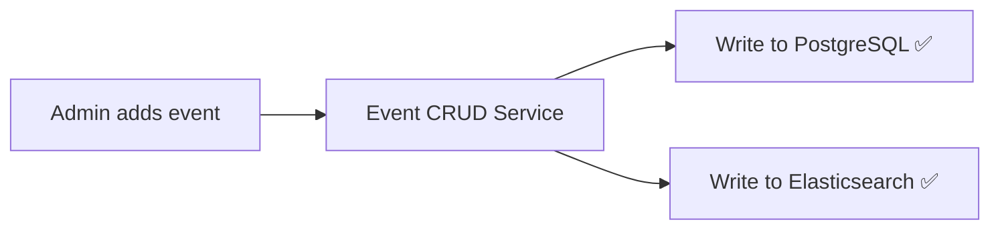
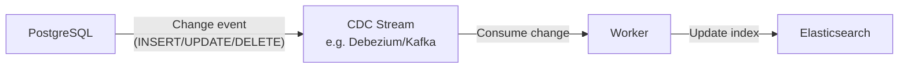
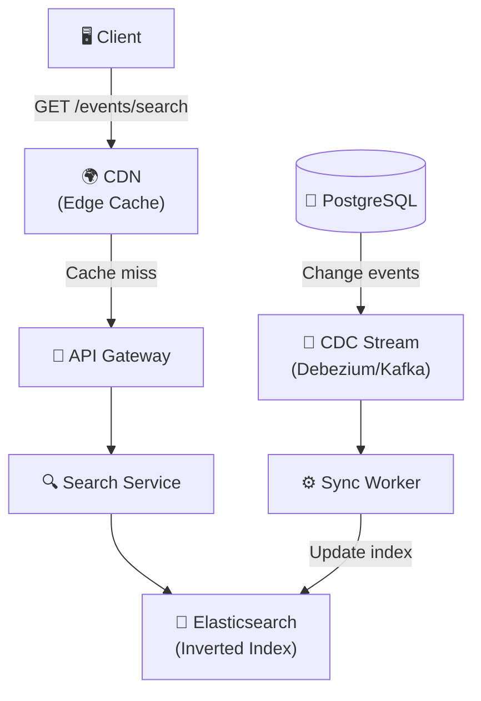
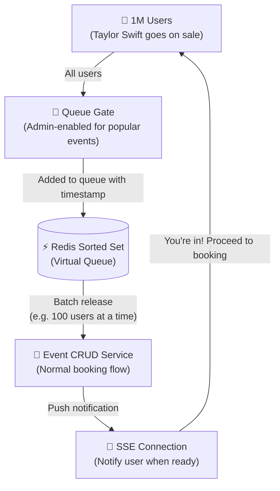

# 🎟️ System Design: Ticket Booking Service (Ticketmaster)
> **A Premium Engineering Handbook | Interview Preparation Guide | Technical Architecture Wiki**
>
> *Based on a real system design walkthrough by a former Meta Staff Engineer & Interviewer*

---

## 📋 Table of Contents

1. [Interview Roadmap](#interview-roadmap)
2. [Requirements](#requirements)
   - [Functional Requirements](#functional-requirements)
   - [Non-Functional Requirements](#non-functional-requirements)
3. [Core Entities](#core-entities)
4. [API Design](#api-design)
5. [High-Level Design](#high-level-design)
   - [Architecture Overview](#architecture-overview)
   - [Database Schema](#database-schema)
   - [Request Flows](#request-flows)
   - [Two-Phase Booking Problem & Solutions](#two-phase-booking-problem--solutions)
6. [Deep Dives](#deep-dives)
   - [Low Latency Search with Elasticsearch](#low-latency-search-with-elasticsearch)
   - [Real-Time Seat Map](#real-time-seat-map)
   - [Handling Surge Traffic (Virtual Waiting Queue)](#handling-surge-traffic-virtual-waiting-queue)
   - [Scalability & Caching](#scalability--caching)
7. [Terminology Glossary](#terminology-glossary)
8. [Interview Tips & Common Mistakes](#interview-tips--common-mistakes)

---

## 🗺️ Interview Roadmap

> **Follow this exact order in every system design interview for user-facing product design questions.**

```
┌─────────────────────────────────────────────────────────────────┐
│                    SYSTEM DESIGN ROADMAP                        │
├──────────┬──────────────┬──────────┬─────────────┬─────────────┤
│    1     │      2       │    3     │      4      │      5      │
│  Reqs    │   Entities   │   APIs   │  High-Level │  Deep Dives │
│ (~5 min) │  (~2 min)    │ (~5 min) │  (~15 min)  │  (~15 min)  │
├──────────┼──────────────┼──────────┼─────────────┼─────────────┤
│Functional│ What data is │User-     │ Simple      │ Satisfy     │
│    +     │  persisted   │facing    │ design that │Non-Func     │
│Non-Func  │ & exchanged  │endpoints │ satisfies   │Requirements │
│          │              │          │ func reqs   │ (NFRs)      │
└──────────┴──────────────┴──────────┴─────────────┴─────────────┘
                                                 ▲
                                    Senior/Staff candidates
                                    really earn their keep here
```

**Total Time:** ~35–40 minutes

---

## ✅ Requirements

### Functional Requirements

> **Definition:** Features of the system — stated as "Users should be able to..."

These are the **core features** without which the system cannot function. Walk backwards through the user journey to discover them:

```
User Journey (Backwards):
  Book a ticket ← View an event ← Search for events
```

| # | Requirement | Description |
|---|-------------|-------------|
| 1 | **Search for events** | Users can search by term, location, category, date range |
| 2 | **View an event** | Users can see event details, venue info, performer, and the seat map |
| 3 | **Book a ticket** | Users can reserve a seat and confirm purchase — a two-phase process |

> **Out of Scope:** Admin adding events, user authentication flows, email notifications, refund flows

---

### Non-Functional Requirements

> **Definition:** The *qualities* of the system — not features, but properties like consistency, availability, latency.

> ⚠️ **Biggest Interview Mistake:** Just writing buzzwords like "scalability," "availability," "reliability" without context. Every system needs those. The goal is to identify what makes *this* system unique and challenging.

---

#### CAP Theorem Analysis

> **CAP Theorem:** In a distributed system, you can only guarantee two of three: **C**onsistency, **A**vailability, **P**artition Tolerance. Since Partition Tolerance is always assumed in distributed systems, the real choice is **C vs A**.

```
┌──────────────────────────────────────────────────────┐
│                   CAP THEOREM                        │
│                                                      │
│   Mid-level answer:  "Prioritize consistency"        │
│                       → No double booking            │
│                                                      │
│   Senior-level answer: BOTH can coexist in           │
│   different parts of the system:                     │
│                                                      │
│   ┌──────────────────┬──────────────────────────┐   │
│   │  BOOKING         │  SEARCH & VIEW EVENTS    │   │
│   │  Strong          │  High Availability       │   │
│   │  Consistency     │  (Eventual OK)           │   │
│   │  ──────────────  │  ──────────────────────  │   │
│   │  No ticket can   │  OK if newly added event │   │
│   │  be assigned to  │  appears with a few      │   │
│   │  more than one   │  seconds delay           │   │
│   │  user            │                          │   │
│   └──────────────────┴──────────────────────────┘   │
└──────────────────────────────────────────────────────┘
```

---

#### Non-Functional Requirements Summary

| Requirement | Why It Matters for Ticketmaster |
|-------------|--------------------------------|
| **Strong consistency for booking** | No double-booking — a seat can only be assigned to one user |
| **High availability for search/view** | Minor stale data is acceptable; availability matters more |
| **High read/write ratio (~100:1)** | Far more people browse events than buy tickets (assume ~1% conversion) |
| **Scalability for surge traffic** | Taylor Swift, Super Bowl, World Cup → millions of users simultaneously |
| **Low latency search** | Search results must be near-instant; full table scans won't work |

> *Out of scope (but worth mentioning):* GDPR compliance, fault tolerance, audit logging

---

## 🗃️ Core Entities

> **Purpose:** Understand what data is persisted in the system. These will map directly to database tables/collections and inform your API design.

> **Tip:** Don't deep-dive into every field at this stage. Define entities now, flesh out columns when drawing the database schema in the High-Level Design.

```
┌─────────────────────────────────────────────────────────┐
│                    CORE ENTITIES                        │
│                                                         │
│   ┌──────────┐     ┌─────────┐     ┌───────────┐       │
│   │  Event   │────▶│  Venue  │     │ Performer │       │
│   │          │     │         │     │  / Team   │       │
│   └────┬─────┘     └─────────┘     └───────────┘       │
│        │ 1                                              │
│        │                                                │
│        │ many                                           │
│        ▼                                                │
│   ┌──────────┐                                          │
│   │  Ticket  │  ← one per seat per event                │
│   │          │                                          │
│   └──────────┘                                          │
└─────────────────────────────────────────────────────────┘
```

| Entity | Role | Key Fields (rough) |
|--------|------|--------------------|
| **Event** | The concert, game, or show | `id`, `name`, `description`, `date`, `venue_id`, `performer_id` |
| **Venue** | Where the event is held | `id`, `name`, `location`, `seat_map` |
| **Performer** | Artist, team, or act | `id`, `name`, metadata |
| **Ticket** | One seat at one event | `id`, `event_id`, `seat`, `price`, `status` |

---

## 🔌 API Design

> **REST API** — the standard choice for system design interviews unless GraphQL is specifically better (e.g., flexible queries from a mobile client).

> **Rule:** Create one API per functional requirement. Each API takes entity fields as input and returns entities or partial entities as output.

---

### API 1 — View an Event

```
GET /events/:eventId
```

**Purpose:** Render a full event detail page including the seat map.

```
Headers:
  Authorization: Bearer <JWT>

Path Params:
  eventId: string

Response:
  {
    event: Event,         // name, description, date, etc.
    venue: Venue,         // location, seat_map
    performer: Performer, // artist/team info
    tickets: Ticket[]     // all tickets with availability status
  }
```

---

### API 2 — Search for Events

```
GET /events/search
```

**Purpose:** Discover events matching user's criteria.

```
Headers:
  Authorization: Bearer <JWT>

Query Params:
  term: string          // free-text search (e.g., "Taylor Swift")
  location: string      // city or lat/long
  category: string      // "music" | "sports" | "theatre"
  date: DateRange       // { from, to }
  ...                   // other optional filters

Response:
  Partial<Event>[]      // limited fields — enough to render search cards
                        // (name, date, venue summary, performer, thumbnail)
```

> **Why Partial?** You only need enough data to render search result cards. The full event is fetched when the user clicks one.

---

### API 3 — Book a Ticket (Two-Phase)

> **Key Insight:** Booking is a **two-step process**, like booking an airline seat. The user selects a seat → seat is reserved → user has 10 minutes to pay → payment confirms the booking.

#### Phase 1 — Reserve a Ticket

```
POST /bookings/reserve
```

```
Headers:
  Authorization: Bearer <JWT>   ← User identity lives here, NOT in body

Body:
  {
    ticketId: string
  }

Response:
  {
    reservationId: string,
    expiresAt: timestamp    // 10 minutes from now
  }
```

> **Security Note:** Never put `userId` in the request body — it can be tampered with. User identity is always inferred from the JWT in the Authorization header.

---

#### Phase 2 — Confirm Purchase

```
PUT /bookings/confirm
```

```
Headers:
  Authorization: Bearer <JWT>

Body:
  {
    ticketId: string,
    paymentDetails: {
      stripePaymentIntentId: string,
      ...
    }
  }

Response:
  {
    bookingId: string,
    status: "confirmed"
  }
```

---

### Full API Summary

```
┌────────────────────────────────────────────────────────────┐
│                     API ENDPOINTS                          │
├──────────┬────────────────────────┬────────────────────────┤
│ Method   │ Path                   │ Purpose                │
├──────────┼────────────────────────┼────────────────────────┤
│ GET      │ /events/:eventId       │ View event + seat map  │
│ GET      │ /events/search         │ Search events          │
│ POST     │ /bookings/reserve      │ Reserve a seat (10min) │
│ PUT      │ /bookings/confirm      │ Confirm purchase       │
└──────────┴────────────────────────┴────────────────────────┘
```

---

## 🏗️ High-Level Design

### Architecture Overview

> **Microservices Architecture** — the default choice for most system design interviews. Services can scale independently, fail independently, and be owned by separate teams.



---

### Database Schema

> **Database Choice: PostgreSQL**
>
> **Why PostgreSQL?**
> - ACID properties (Atomicity, Consistency, Isolation, Durability) — critical for ticket booking
> - Supports transactions — needed for safe concurrent writes
> - Relational model fits the data (Events → Tickets, Venues → Events)
>
> **Could you use NoSQL (e.g., DynamoDB)?** Yes. Modern NoSQL databases also support ACID transactions. The **senior-level answer** is: "Both would work — what matters is the *qualities* I need: ACID, transactions, relational joins. I'm choosing PostgreSQL because I'm most familiar with it and it satisfies all requirements."
>
> ⚠️ **SQL vs NoSQL is an outdated debate in interviews.** Senior candidates focus on the database *properties* they need, not the SQL/NoSQL label.

```
┌─────────────────────────────────────────────────────────────┐
│                      DATABASE SCHEMA                        │
│                                                             │
│  ┌─────────────────────┐    ┌──────────────────────────┐   │
│  │       events        │    │         venues           │   │
│  ├─────────────────────┤    ├──────────────────────────┤   │
│  │ id          PK      │    │ id           PK          │   │
│  │ name        VARCHAR │    │ name         VARCHAR     │   │
│  │ description TEXT    │    │ location     TEXT        │   │
│  │ date        TIMESTAMP│   │ seat_map     JSONB       │   │
│  │ venue_id    FK ─────┼───▶│ ...                      │   │
│  │ performer_id FK     │    └──────────────────────────┘   │
│  │ ...                 │                                   │
│  └────────┬────────────┘    ┌──────────────────────────┐   │
│           │                 │       performers         │   │
│           │ 1-to-many       ├──────────────────────────┤   │
│           ▼                 │ id           PK          │   │
│  ┌─────────────────────┐    │ name         VARCHAR     │   │
│  │       tickets       │    │ ...                      │   │
│  ├─────────────────────┤    └──────────────────────────┘   │
│  │ id          PK      │                                   │
│  │ event_id    FK      │                                   │
│  │ seat        VARCHAR │ ← e.g. "Section A, Row 3, Seat 7" │
│  │ price       DECIMAL │                                   │
│  │ status      ENUM    │ ← 'available' | 'booked'          │
│  │ user_id     FK      │ ← set when booked                 │
│  └─────────────────────┘                                   │
└─────────────────────────────────────────────────────────────┘
```

---

### Request Flows

#### Flow 1: View an Event



**What happens:**
- Client hits API Gateway with event ID
- Gateway authenticates the JWT and routes to Event CRUD Service
- Service does a JOIN query across `events`, `venues`, `performers`
- Service also fetches all `tickets` for that event (with availability)
- Entire response sent back to render the event page + seat map

---

#### Flow 2: Search Events (Basic Version)



> ⚠️ **This is intentionally a bad implementation.** The `LIKE '%term%'` query requires a **full table scan** — it cannot use a B-tree index. This will be fixed in the Deep Dives section with Elasticsearch.

---

#### Flow 3: Book a Ticket (Two-Phase)



---

### Two-Phase Booking Problem & Solutions

> **The Problem:** When a user reserves a ticket, what happens if they close their browser and never complete payment? The ticket would be "reserved" forever, blocking anyone else from buying it.

```
Timeline of the problem:
  t=0:00  User clicks seat → ticket reserved
  t=0:01  User closes laptop 😴
  t=9:59  Ticket should have expired by now...
  t=∞     Ticket still shows as "reserved" — no one can buy it ❌
```

---

#### Solution 1: Reserved Timestamp + Query Filter (Mid-Level Answer)

Add a `reserved_at` timestamp column to the `tickets` table. Modify availability queries to treat old reservations as available.

```sql
-- Instead of:
SELECT * FROM tickets WHERE status = 'available' AND event_id = ?

-- Use:
SELECT * FROM tickets
WHERE event_id = ?
  AND (
    status = 'available'
    OR (status = 'reserved' AND reserved_at < NOW() - INTERVAL '10 minutes')
  )
```

**Pros:**
- Simple to implement
- No additional infrastructure

**Cons:**
- Data model becomes confusing — a ticket shows `status = 'reserved'` but isn't actually reserved
- Every availability query becomes more complex
- Inconsistency between status field and actual state

---

#### Solution 2: Cron Job Cleanup (Mid-Level Answer)

A background job runs periodically and resets expired reservations.

```
Every 10 minutes:
  SELECT * FROM tickets
  WHERE status = 'reserved'
    AND reserved_at < NOW() - INTERVAL '10 minutes'
  → UPDATE status = 'available'
```

**Pros:**
- Clean data model
- Simple logic

**Cons (why this fails at senior level):**
```
The Delta Problem (Δ):

  Ticket should expire at 12:00:00
  Cron job last ran at  11:51:00
  Cron job runs next at 12:01:00
                        ────────
  Δ = 9 minutes of extra reservation time
  
  User reserved for 10 min → actually reserved for up to 19 min ❌
```

---

#### Solution 3: Distributed Lock in Redis with TTL ✅ (Senior-Level Answer)

> **The Elegant Solution:** Don't store reservation state in the database at all. Use Redis as a distributed lock with a built-in Time-To-Live (TTL).

**Key Concepts:**

| Term | Explanation |
|------|-------------|
| **Distributed Lock** | A mechanism that prevents multiple processes from accessing the same resource simultaneously, stored in a shared system (Redis) accessible by all service instances |
| **TTL (Time To Live)** | An expiry timer set on a Redis key. When the timer hits zero, Redis automatically deletes the key |
| **Redis** | An in-memory key-value store, famous for being extremely fast (~sub-millisecond reads/writes) |

```
When user reserves ticket:
  Redis SET ticket:{id} = true EX 600
               ↑                  ↑
           ticket key          600 seconds = 10 min TTL

After 10 minutes:
  Redis automatically DELETES the key — zero extra code needed ✅

When user confirms payment:
  Booking Service validates Redis lock still exists
  → Updates PostgreSQL: status = 'booked'
  → DEL Redis key
```

**Why Redis and not in-memory (local cache)?**

```
Without Redis (BAD):
  ┌──────────────┐  ┌──────────────┐  ┌──────────────┐
  │  Booking     │  │  Booking     │  │  Booking     │
  │  Service #1  │  │  Service #2  │  │  Service #3  │
  │  lock: T-101 │  │  lock: T-99  │  │  lock: ???   │
  └──────────────┘  └──────────────┘  └──────────────┘
  Each instance has its own memory → they don't share state
  → Two users on different instances can reserve the same ticket ❌

With Redis (GOOD):
  ┌──────────────┐  ┌──────────────┐  ┌──────────────┐
  │  Booking     │  │  Booking     │  │  Booking     │
  │  Service #1  │  │  Service #2  │  │  Service #3  │
  └──────┬───────┘  └──────┬───────┘  └──────┬───────┘
         │                 │                 │
         └─────────────────┼─────────────────┘
                           ▼
                  ┌────────────────┐
                  │     Redis      │
                  │  ticket:T-101  │  ← ONE shared truth
                  │  ticket:T-99   │
                  └────────────────┘
```

**Updated ticket availability query:**

```
1. Query PostgreSQL: SELECT all tickets WHERE status = 'available' AND event_id = ?
2. For each ticket, check Redis: EXISTS ticket:{id}
3. If Redis key exists → ticket is reserved → exclude from available list
4. Return remaining tickets as truly available
```

**What if Redis goes down?**

- Bring a new instance up immediately (auto-detected)
- For the brief window Redis was down: reservations lost → multiple users may reach the payment page for the same ticket
- PostgreSQL ACID guarantees ensure only ONE user's `UPDATE` succeeds (first write wins)
- Others get an error — bad UX but no data corruption
- This trade-off is acceptable and should be discussed with the product team

---

## 🔬 Deep Dives

> **Purpose of Deep Dives:** Satisfy the Non-Functional Requirements. This is where senior/staff candidates stand out.
>
> **Process:** Look back at your NFRs → find what's missing in the high-level design → lead the conversation there.

---

### Low Latency Search with Elasticsearch

#### The Problem

The basic search implementation does a full table scan:

```sql
SELECT * FROM events WHERE name LIKE '%taylor swift%'
```

- `LIKE '%term%'` (leading wildcard) **cannot use a B-tree index**
- Must scan every row in the entire events table
- Completely unacceptable at scale

---

#### The Solution: Elasticsearch

> **Elasticsearch** is a distributed search engine built on top of Apache Lucene. It's optimized for full-text search and uses an **inverted index** data structure.

**What is an Inverted Index?**

```
Normal (forward) index:        Inverted index:
  Doc 1 → "Eagles playoff"      "Eagles"  → [Doc 1, Doc 3]
  Doc 2 → "Taylor Swift tour"   "playoff" → [Doc 1]
  Doc 3 → "Eagles Super Bowl"   "Taylor"  → [Doc 2]
                                "Swift"   → [Doc 2]
                                "tour"    → [Doc 2]
                                "Super"   → [Doc 3]
                                "Bowl"    → [Doc 3]

Search "Eagles" → O(1) lookup → immediately returns Doc 1, Doc 3
vs full table scan → O(n) → reads every single document
```

**How it works for Ticketmaster:**

```
Event: "Philadelphia Eagles Wild Card Playoff vs Broncos"
         ↓ tokenize
Terms: ["philadelphia", "eagles", "wild", "card", "playoff", "broncos"]
         ↓ stored in inverted index
Query: "eagles playoff"
         ↓ lookup
Results: [Event 1, Event 3, ...] — instant ✅
```

**Additional Elasticsearch capabilities used here:**
- **Geospatial queries** — search by location using geo-hashing and quad trees
- **Multi-field search** — search across `name`, `description`, `performer`, `category` simultaneously
- **Faceted search** — filter by date range, category, price range

---

#### Keeping Elasticsearch in Sync with PostgreSQL

> **Important:** Elasticsearch is NOT used as your primary data store. It lacks robust ACID transaction support and complex transaction management. Use it as a **read-optimized secondary index**.

**Option 1: Dual Write (Application Code)**



- **Pro:** Simple, no extra infrastructure
- **Con:** If one write fails, data gets out of sync. Requires careful retry logic and compensation.

---

**Option 2: Change Data Capture (CDC) — Recommended**

> **CDC (Change Data Capture):** A pattern where every change to a database (INSERT, UPDATE, DELETE) is captured as an event and published to a stream. Consumers can react to those events.



- **Pro:** Decoupled, reliable, event-driven
- **Con:** Eventual consistency (small lag between DB write and ES update)
- **For Ticketmaster:** Events and venues rarely change → CDC write rate is very low → no need for batching

---

#### Making Search Even Faster: Caching

| Strategy | How | Best For | Trade-offs |
|----------|-----|----------|------------|
| **Elasticsearch Node Query Cache** | ES caches top 10K queries per shard in LRU cache | Simple, zero-code, works out of the box | Limited control |
| **Redis Cache** | Cache `searchTerm → results[]` with TTL | Full control over TTL and invalidation | Need to manage invalidation on data changes |
| **CDN Cache** | Cache search API responses at edge nodes for 30–60 seconds | Extremely popular queries (same term, millions of users) | Less useful with many query param combinations (lat/long, multiple filters kill cache hit rate) |

> **CDN Caching Caveat:** Works great for `?term=taylor+swift&location=NYC`. Falls apart when location is precise lat/long (`?lat=40.7128&long=-74.0060`) — too many permutations, zero cache hits.

> **When CDN caching breaks entirely:** If the system adds personalized recommendations, two users searching for the same term would need different results → CDN caching is no longer valid.

---

#### Updated Architecture with Elasticsearch



---

### Real-Time Seat Map

#### The Problem

When a user opens an event page and sees available seats, that data **immediately starts going stale**. Other users are booking seats in real time. If the seat map isn't updated, users click an "available" seat → get an error → terrible experience.

This is especially bad during popular events (Taylor Swift, Super Bowl) where seats sell out in seconds.

---

#### Option 1: Long Polling

> **Long Polling:** The client sends an HTTP request. The server holds the connection open (up to 30–60 seconds) and responds only when there's new data (or the timeout expires). The client immediately sends another request → repeat.

```
Client                          Server
  │                               │
  ├──── GET /events/:id/seats ───▶│
  │     (connection held open)    │
  │                               │ ← waiting for a change...
  │                               │ ← change! Seat T-99 booked
  │◀───── { updatedSeats } ───────┤
  │                               │
  ├──── GET /events/:id/seats ───▶│  ← immediately reconnects
  │                               │
```

**Best for:** Users who spend 1–5 minutes on the page
**Pros:** No extra infrastructure, easy to implement
**Cons:** Not truly real-time; repeated connections add overhead

---

#### Option 2: Server-Sent Events (SSE) — Recommended

> **SSE (Server-Sent Events):** A persistent, **unidirectional** (server → client only) HTTP connection. The server can push data to the client at any time without the client re-requesting.

> **Websockets vs SSE:**
> | | WebSockets | SSE |
> |--|--|--|
> | Direction | Bidirectional (both ways) | Unidirectional (server → client) |
> | Protocol | WS:// | HTTP |
> | Use case | Chat apps, collaborative tools | Live feeds, notifications, seat updates |
>
> **For seat maps:** We only need server → client updates. SSE is simpler and sufficient.

```
Client                          API Gateway / Event Service
  │                               │
  ├── GET /events/:id/seats/stream▶│
  │   (persistent connection)     │
  │                               │
  │◀── data: { seat: "A3", status: "reserved" } ──┤  ← User1 reserves A3
  │◀── data: { seat: "B7", status: "booked" }   ──┤  ← User2 confirms B7
  │◀── data: { seat: "A3", status: "available" } ─┤  ← User1's 10min expired
  │                               │
  (connection stays open)
```

---

#### The UX Reality for Super-Popular Events

Even with real-time updates, here's what happens when Taylor Swift tickets go live:

```
t=0:00  Seat map loads → 50,000 seats available (shown in green)
t=0:01  1 million users simultaneously trying to book
t=0:02  Seat map turns almost entirely BLACK (all sold/reserved)
t=0:03  User in despair tries to click any green seat remaining
t=0:04  Gets "no longer available" error
```

This is a terrible experience. The solution is a **Virtual Waiting Queue**.

---

### Handling Surge Traffic (Virtual Waiting Queue)

> The virtual waiting queue is an example of a solution that is **simple in concept but sophisticated in effect**. It doesn't require complex tech — it solves the problem elegantly.

#### What It Does

Instead of letting 1 million users hammer the event page simultaneously, the system puts them in a queue and admits them in batches.

```
Without queue:                    With queue:
  1M users → event page             1M users → queue page
  → all try to book at once         → "You're #247,832 in line"
  → servers overwhelmed             → users admitted in batches
  → terrible performance            → smooth, fair experience
  → bad UX for everyone             → sets expectations correctly
```

---

#### Architecture



**Implementation Details:**

- **Queue Storage:** Redis Sorted Set
  - Key: `queue:event:{id}`
  - Member: `userId` or `sessionToken`
  - Score: arrival timestamp (for FIFO ordering)
  - Alternative: random score (fairer — doesn't advantage users physically close to servers)
- **Batch Release Logic:** Event-driven — e.g., "as each batch of 100 seats becomes confirmed, admit the next 100 users"
- **User Notification:** SSE connection kept open → server pushes "you're in!" message
- **Admin Control:** Queue enabled/disabled per event via config flag

**What users see:**
```
┌─────────────────────────────────────────────────────┐
│  🎟️  Taylor Swift | Eras Tour — Dallas              │
│                                                     │
│  You're in the virtual queue!                       │
│  Position: #247,832                                 │
│  Estimated wait: ~12 minutes                        │
│                                                     │
│  We'll notify you as soon as it's your turn.        │
│  Don't close this tab!                              │
└─────────────────────────────────────────────────────┘
```

---

### Scalability & Caching

#### When to Do Math in Interviews

> **Anti-pattern:** Doing back-of-envelope math at the start just to say "wow, it's a big system" and then not using those numbers.
>
> **Best practice:** Only do calculations when the result **directly influences a design decision**.

**Good example:**

```
Storage estimate for tickets table:
  - 10,000 events/year
  - 50,000 seats/event avg
  - → 500M tickets/year
  - Each ticket row ≈ 200 bytes
  - → 100 GB/year
  - → Fits in one well-spec'd PostgreSQL instance for years
  - → Sharding is NOT yet necessary
  Decision: No sharding for now ✅
```

---

#### Horizontal Scaling

```
┌─────────────────────────────────────────────────────────────┐
│                   SCALING EACH LAYER                        │
├────────────────────────────┬────────────────────────────────┤
│ Layer                      │ Scaling Strategy               │
├────────────────────────────┼────────────────────────────────┤
│ API Gateway (AWS managed)  │ Auto-scales, built-in LB       │
│ Microservices              │ Horizontal scale + LB          │
│                            │ (CPU/memory-based autoscaling) │
│ PostgreSQL                 │ Read replicas for reads        │
│                            │ Shard by event_id if needed    │
│ Redis                      │ Cluster mode                   │
│ Elasticsearch              │ Shards + replicas              │
└────────────────────────────┴────────────────────────────────┘
```

---

#### Caching Static Data (Events, Venues, Performers)

Events, venues, and performers almost **never change** — they're created once and rarely updated. This makes them perfect candidates for aggressive caching.

```
Without Cache:
  GET /events/:id
  → Query PostgreSQL (JOIN events + venues + performers) ← slow
  → Query PostgreSQL (SELECT tickets) ← dynamic, can't cache

With Redis Cache:
  GET /events/:id
  → Redis GET event:{id} → cache HIT → return in <1ms ✅
  → Query PostgreSQL (SELECT tickets only) ← still dynamic
```

**Cache Invalidation:** When an event is updated → invalidate or update `event:{id}` in Redis.

**Cache Scope:** Only cache upcoming events within a reasonable window (e.g., next 2 years) to keep Redis memory bounded.

---

## 📖 Terminology Glossary

| Term | Definition |
|------|------------|
| **ACID** | **A**tomicity, **C**onsistency, **I**solation, **D**urability — the four properties that guarantee database transactions are processed reliably |
| **API Gateway** | A single entry point that routes incoming requests to the correct microservice. Also handles auth, rate limiting, and SSL termination |
| **CAP Theorem** | In distributed systems: you can guarantee at most two of Consistency, Availability, and Partition Tolerance at the same time |
| **CDC (Change Data Capture)** | A pattern that captures every database change as an event and publishes it to a stream for other systems to consume |
| **CDN (Content Delivery Network)** | A geographically distributed network of servers that cache content close to end users to reduce latency |
| **Cron Job** | A scheduled task that runs at fixed intervals (e.g., every 10 minutes). Named after the Unix `cron` scheduler |
| **Distributed Lock** | A mechanism using a shared external store (like Redis) to prevent multiple service instances from modifying the same resource simultaneously |
| **Elasticsearch** | A distributed search and analytics engine optimized for full-text search via inverted indexes |
| **Eventual Consistency** | A consistency model where replicas will *eventually* have the same data, but may be temporarily out of sync |
| **Horizontal Scaling** | Adding more machines/instances to handle more load (vs. vertical scaling = making existing machines bigger) |
| **Inverted Index** | A data structure that maps terms/words to the documents that contain them — the core of search engines |
| **JWT (JSON Web Token)** | A compact, self-contained token used for authentication. Contains encoded user identity and is signed to prevent tampering |
| **Long Polling** | A technique where the client sends a request and the server holds it open until there's data to send |
| **Microservices** | An architecture where a system is split into small, independent services that each own their domain and communicate via APIs |
| **PostgreSQL** | An open-source relational database with strong ACID compliance, known for reliability and feature richness |
| **RBAC** | Role-Based Access Control — permissions are tied to roles (admin, user) rather than individual users |
| **Redis** | An in-memory key-value store used for caching, session management, distributed locks, and pub/sub |
| **Redis Sorted Set** | A Redis data structure where each member has a score, enabling sorted operations — ideal for priority queues |
| **Sharding** | Splitting a database horizontally across multiple machines by a shard key (e.g., event_id) to distribute load |
| **SSE (Server-Sent Events)** | A browser API for receiving server-pushed updates over a persistent HTTP connection (server → client only) |
| **Stripe** | A third-party payment processor. In system design, always abstract payment to Stripe unless designing a payment system |
| **Strong Consistency** | Every read receives the most recent write — no stale data possible |
| **TTL (Time To Live)** | An expiry duration set on a cached item or Redis key — automatically deleted when it expires |
| **Virtual Waiting Queue** | A pattern where users are held in a queue and admitted in batches to prevent backend overload during traffic surges |
| **WebSockets** | A protocol for full-duplex (bidirectional) persistent connections between client and server |

---

## 🎯 Interview Tips & Common Mistakes

### ✅ What Strong Candidates Do

- **State requirements conversationally** — ask clarifying questions before diving in, like you would with a product team
- **Go senior on CAP theorem** — recognize that consistency and availability can coexist in different parts of the system
- **Acknowledge technical debt** — say "this search is slow, I'll come back to optimize it" and actually do it
- **Justify database choices** by capabilities, not the SQL/NoSQL label
- **Lead deep dives proactively** — don't wait for the interviewer to ask; reference your NFRs and say "I want to go deeper on X"
- **Do math with purpose** — only calculate things that change your design decisions
- **Discuss trade-offs honestly** — e.g., "if Redis goes down, users get a bad experience but we don't lose data — that's a trade-off I'd bring to the product team"

---

### ❌ Common Mistakes to Avoid

| Mistake | What to Do Instead |
|---------|-------------------|
| Writing "scalability, availability, reliability" without context | Explain *why* each matters *for this specific system* |
| Designing search as a SQL LIKE query only | Mention it's a placeholder; fix it with Elasticsearch in deep dives |
| Treating booking as a single-step process | Recognize and design the two-phase reserve → confirm flow |
| Putting userId in the request body | User identity comes from the JWT header only |
| Doing back-of-envelope math just to check a box | Only do math when it influences a design decision |
| Stopping at the Cron Job solution for reservation expiry | Push to the Redis TTL lock — it's the elegant, senior-level answer |
| SQL vs NoSQL debate | Focus on database *properties* needed; both work for most use cases |
| Treating deep dives as just "add a load balancer" | Go deep on specific, interesting problems: search latency, real-time updates, surge traffic |

---

### 📊 Candidate Level Benchmarks

```
┌──────────────────────────────────────────────────────────────────┐
│                    EXPECTED OUTCOMES BY LEVEL                    │
├────────────────┬─────────────────────────────────────────────────┤
│ Mid-Level      │ • Gets all 3 functional requirements            │
│                │ • Cron job for reservation expiry (acceptable)  │
│                │ • Basic search (SQL) with acknowledgment it's   │
│                │   slow                                          │
│                │ • Passes if answers deep dive questions well    │
├────────────────┼─────────────────────────────────────────────────┤
│ Senior         │ • Redis distributed lock with TTL               │
│                │ • Elasticsearch for search (proactively)        │
│                │ • SSE for real-time seat map                    │
│                │ • Discusses caching strategies                  │
├────────────────┼─────────────────────────────────────────────────┤
│ Staff/         │ • All of the above +                            │
│ Principal      │ • Virtual waiting queue for surges              │
│                │ • Deep trade-off discussions                    │
│                │ • Proactively leads deep dives                  │
│                │ • Handles edge cases (Redis failure, CDC lag)   │
└────────────────┴─────────────────────────────────────────────────┘
```

---

## 🏁 Final Design Verification Checklist

Before concluding your interview, verify:

```
Functional Requirements:
  ☑ Users can search for events (Elasticsearch + CDN cache)
  ☑ Users can view event details and seat map (Event CRUD Service + PostgreSQL)
  ☑ Users can book tickets — two-phase reserve + confirm (Booking Service + Redis lock)

Non-Functional Requirements:
  ☑ No double booking (Redis distributed lock + PostgreSQL ACID transactions)
  ☑ High availability for search/view (Elasticsearch + Redis cache + CDN)
  ☑ Low latency search (Elasticsearch inverted index)
  ☑ Handles surge traffic (Virtual waiting queue)
  ☑ Read-heavy system handled (Read replicas, aggressive caching)
```

---

> 💡 **Final Tip:** Close by walking the interviewer through your design one more time against your requirements. Showing you can verify your own work demonstrates engineering maturity.
>
> *"Looking back at my requirements — search is handled by Elasticsearch with CDC sync, viewing events uses a cached PostgreSQL query, and booking uses a two-phase flow with a Redis distributed lock for consistency. I believe this satisfies all functional and non-functional requirements we identified."*

---

*Document compiled from: "System Design Interview: Design Ticketmaster w/ an Ex-Meta Staff Engineer"*
*Source: Hello Interview — [hellointerview.com](https://www.hellointerview.com)*
