# 🚗 Designing Uber — System Design Interview Handbook

> *Based on a mock interview breakdown by an Ex-Meta Staff Engineer with 50+ iterations of this question.*

---

## 📋 Table of Contents

1. [Interview Roadmap](#interview-roadmap)
2. [Functional Requirements](#functional-requirements)
3. [Non-Functional Requirements](#non-functional-requirements)
4. [Core Entities](#core-entities)
5. [API Design](#api-design)
6. [High-Level Design](#high-level-design)
7. [Deep Dives](#deep-dives)
   - [Location Service & Geospatial Indexing](#deep-dive-1-location-service--geospatial-indexing)
   - [Consistency of Matching](#deep-dive-2-consistency-of-matching)
   - [High Throughput & Surge Handling](#deep-dive-3-high-throughput--surge-handling)
   - [High Availability](#deep-dive-4-high-availability)
8. [Final Architecture](#final-architecture)
9. [Interview Tips by Level](#interview-tips-by-level)

---

## Interview Roadmap

Follow this structure for any user-facing product system design:

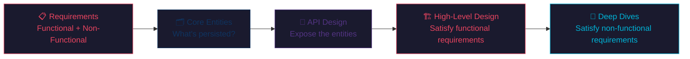
```mermaid
flowchart LR
    A[📋 Requirements\nFunctional + Non-Functional] --> B[🗂 Core Entities\nWhat's persisted?]
    B --> C[🔌 API Design\nExpose the entities]
    C --> D[🏗 High-Level Design\nSatisfy functional requirements]
    D --> E[🔬 Deep Dives\nSatisfy non-functional requirements]

    style A fill:#1a1a2e,color:#e94560,stroke:#e94560
    style B fill:#1a1a2e,color:#0f3460,stroke:#0f3460
    style C fill:#1a1a2e,color:#533483,stroke:#533483
    style D fill:#1a1a2e,color:#e94560,stroke:#e94560
    style E fill:#1a1a2e,color:#00b4d8,stroke:#00b4d8
```

> **⏱ Time Budget** (35-min interview): Requirements (5 min) → Entities + API (10 min) → HLD (10 min) → Deep Dives (10 min)

---

## Functional Requirements

### ✅ In Scope

| # | Requirement |
|---|-------------|
| 1 | User inputs a **start location + destination** → gets an **estimated fare** |
| 2 | User can **request a ride** based on that estimate → matched with a nearby available driver |
| 3 | Driver can **accept/deny** the request, then **navigate** to pick-up and drop-off |

### ❌ Out of Scope

- Multiple car types (UberXL, UberBlack, etc.) — assuming UberX only
- Driver/rider **ratings**
- **Scheduled rides** in advance
- GDPR / privacy compliance
- Monitoring, alerting, logging
- CI/CD pipelines

> **💡 Interview Tip:** Explicitly calling out what's out of scope shows product thinking and ability to prioritize. Stay focused on 3 core features max.

---

## Non-Functional Requirements

> **⚠️ Common Mistake:** Don't just list buzzwords like "scalability" and "availability." Ground each requirement in *this system*, and quantify where possible.

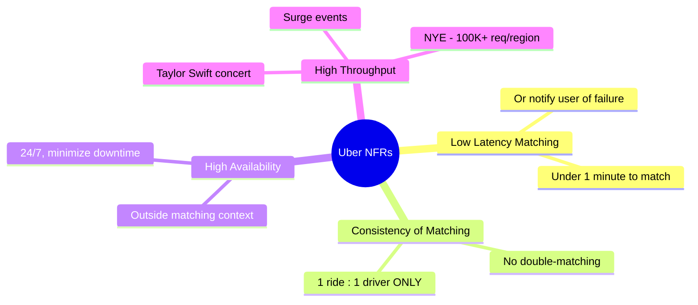
```mermaid
mindmap
  root((Uber NFRs))
    Low Latency Matching
      Under 1 minute to match
      Or notify user of failure
    Consistency of Matching
      1 ride : 1 driver ONLY
      No double-matching
    High Availability
      Outside matching context
      24/7, minimize downtime
    High Throughput
      Surge events
      Taylor Swift concert
      NYE - 100K+ req/region
```

### CAP Theorem Consideration

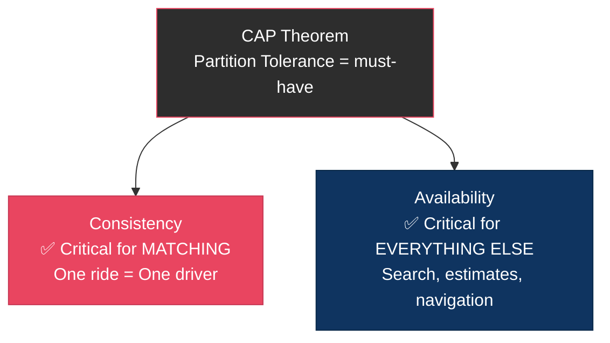
```mermaid
graph TD
    CAP["CAP Theorem\nPartition Tolerance = must-have"]
    CAP --> C["Consistency\n✅ Critical for MATCHING\nOne ride = One driver"]
    CAP --> A["Availability\n✅ Critical for EVERYTHING ELSE\nSearch, estimates, navigation"]

    style CAP fill:#2d2d2d,color:#fff,stroke:#e94560
    style C fill:#e94560,color:#fff,stroke:#c73652
    style A fill:#0f3460,color:#fff,stroke:#0a2a4a
```

---

## Core Entities

> **Why "Core Entities" not "Data Schema"?** At this stage you don't know all fields/columns yet. These map roughly 1:1 to your tables/collections and inform your API design.

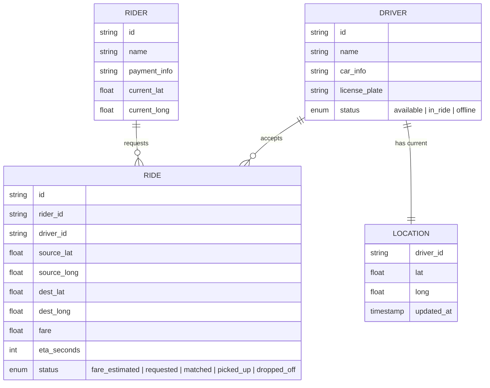
```mermaid
erDiagram
    RIDER {
        string id
        string name
        string payment_info
        float current_lat
        float current_long
    }
    DRIVER {
        string id
        string name
        string car_info
        string license_plate
        enum status "available | in_ride | offline"
    }
    RIDE {
        string id
        string rider_id
        string driver_id
        float source_lat
        float source_long
        float dest_lat
        float dest_long
        float fare
        int eta_seconds
        enum status "fare_estimated | requested | matched | picked_up | dropped_off"
    }
    LOCATION {
        string driver_id
        float lat
        float long
        timestamp updated_at
    }

    RIDER ||--o{ RIDE : "requests"
    DRIVER ||--o{ RIDE : "accepts"
    DRIVER ||--|| LOCATION : "has current"
```

---

## API Design

> **Senior/Staff Tip:** Skip data types for obvious fields (lat/long = float, id = string). Only spell out enums or non-obvious types. User ID comes from JWT header, never the body.

### Endpoint Overview

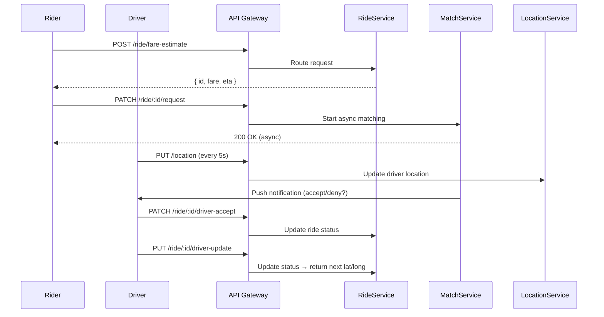
```mermaid
sequenceDiagram
    participant Rider
    participant Driver
    participant API Gateway
    participant RideService
    participant MatchService
    participant LocationService

    Rider->>API Gateway: POST /ride/fare-estimate
    API Gateway->>RideService: Route request
    RideService-->>Rider: { id, fare, eta }

    Rider->>API Gateway: PATCH /ride/:id/request
    API Gateway->>MatchService: Start async matching
    MatchService-->>Rider: 200 OK (async)

    Driver->>API Gateway: PUT /location (every 5s)
    API Gateway->>LocationService: Update driver location

    MatchService->>Driver: Push notification (accept/deny?)

    Driver->>API Gateway: PATCH /ride/:id/driver-accept
    API Gateway->>RideService: Update ride status

    Driver->>API Gateway: PUT /ride/:id/driver-update
    API Gateway->>RideService: Update status → return next lat/long
```

### API Details

#### 1. Get Fare Estimate
```
POST /ride/fare-estimate

Body: { source, destination }
Returns: Partial<Ride> { id, fare, eta }
```

#### 2. Request a Ride
```
PATCH /ride/:id/request

Body: { rideId }
Returns: 200 OK | 400 (async — matching happens in background)
```

#### 3. Update Driver Location *(called every N seconds)*
```
PUT /location

Body: { lat, long }
Headers: Authorization: Bearer <JWT>
Returns: 200 OK
```

#### 4. Driver Accept/Deny
```
PATCH /ride/:id/driver-accept

Body: { accepted: boolean }
Headers: Authorization: Bearer <JWT>
Returns: 200 OK
```

#### 5. Driver Status Update (Picked Up / Dropped Off)
```
PUT /ride/:id/driver-update

Body: { status: "picked_up" | "dropped_off" }
Headers: Authorization: Bearer <JWT>
Returns: { nextLatLong } | null
```

> **Security Note:** Driver/Rider identity is always derived from the JWT token in the `Authorization` header — never trust IDs in the request body.

---

## High-Level Design

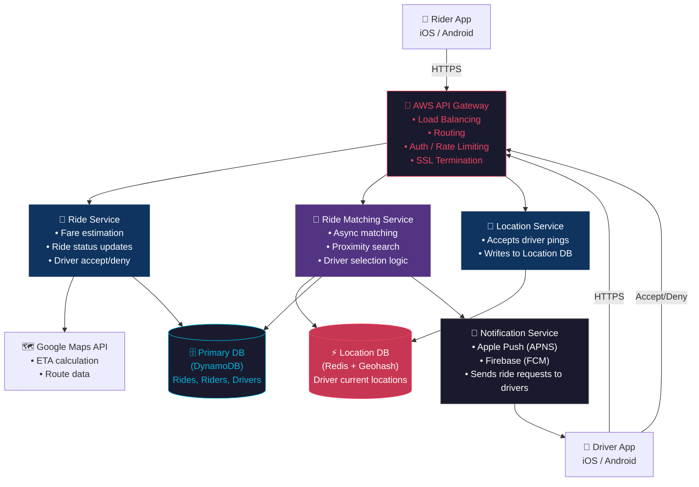
```mermaid
flowchart TD
    RiderApp["📱 Rider App\niOS / Android"]
    DriverApp["📱 Driver App\niOS / Android"]

    Gateway["🔀 AWS API Gateway\n• Load Balancing\n• Routing\n• Auth / Rate Limiting\n• SSL Termination"]

    RideService["🎯 Ride Service\n• Fare estimation\n• Ride status updates\n• Driver accept/deny"]
    MatchService["🔗 Ride Matching Service\n• Async matching\n• Proximity search\n• Driver selection logic"]
    LocationService["📍 Location Service\n• Accepts driver pings\n• Writes to Location DB"]
    NotifService["🔔 Notification Service\n• Apple Push (APNS)\n• Firebase (FCM)\n• Sends ride requests to drivers"]

    ThirdParty["🗺 Google Maps API\n• ETA calculation\n• Route data"]

    PrimaryDB[("🗄 Primary DB\n(DynamoDB)\nRides, Riders, Drivers")]
    LocationDB[("⚡ Location DB\n(Redis + Geohash)\nDriver current locations")]

    RiderApp -->|HTTPS| Gateway
    DriverApp -->|HTTPS| Gateway

    Gateway --> RideService
    Gateway --> MatchService
    Gateway --> LocationService

    RideService --> ThirdParty
    RideService --> PrimaryDB

    LocationService --> LocationDB

    MatchService --> LocationDB
    MatchService --> PrimaryDB
    MatchService --> NotifService

    NotifService --> DriverApp
    DriverApp -->|Accept/Deny| Gateway

    style Gateway fill:#1a1a2e,color:#e94560,stroke:#e94560
    style RideService fill:#0f3460,color:#fff,stroke:#0f3460
    style MatchService fill:#533483,color:#fff,stroke:#533483
    style LocationService fill:#0f3460,color:#fff,stroke:#0f3460
    style NotifService fill:#1a1a2e,color:#fff,stroke:#888
    style LocationDB fill:#c73652,color:#fff,stroke:#e94560
    style PrimaryDB fill:#1a1a2e,color:#00b4d8,stroke:#00b4d8
```

### Flow 1 — Fare Estimate

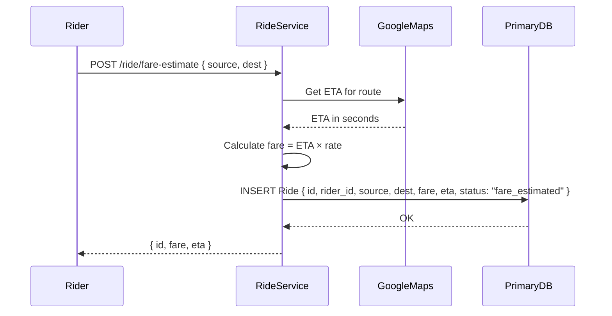
```mermaid
sequenceDiagram
    participant Rider
    participant RideService
    participant GoogleMaps
    participant PrimaryDB

    Rider->>RideService: POST /ride/fare-estimate { source, dest }
    RideService->>GoogleMaps: Get ETA for route
    GoogleMaps-->>RideService: ETA in seconds
    RideService->>RideService: Calculate fare = ETA × rate
    RideService->>PrimaryDB: INSERT Ride { id, rider_id, source, dest, fare, eta, status: "fare_estimated" }
    PrimaryDB-->>RideService: OK
    RideService-->>Rider: { id, fare, eta }
```

### Flow 2 — Requesting & Matching a Ride

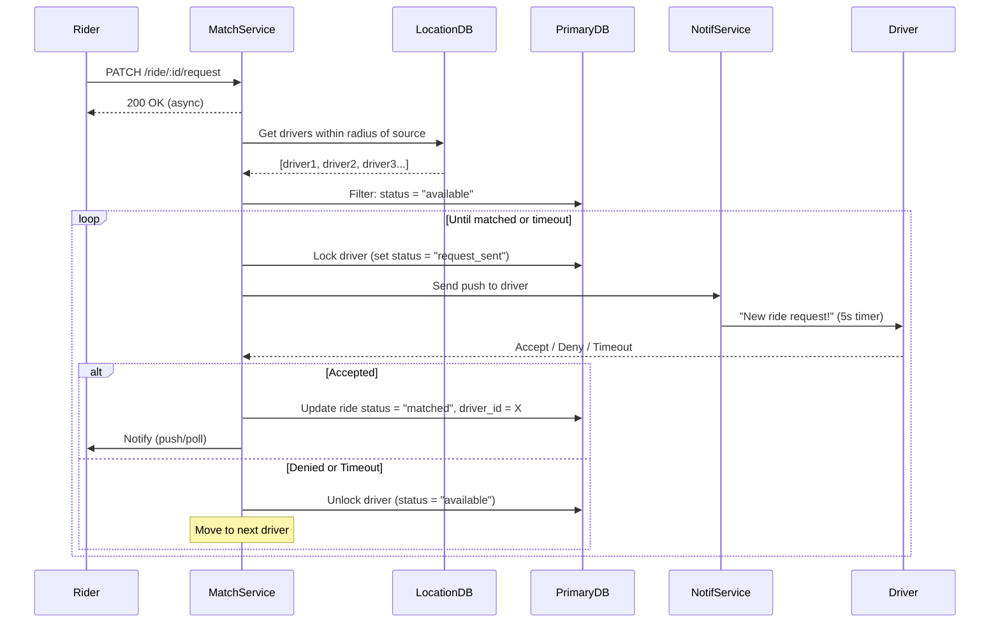
```mermaid
sequenceDiagram
    participant Rider
    participant MatchService
    participant LocationDB
    participant PrimaryDB
    participant NotifService
    participant Driver

    Rider->>MatchService: PATCH /ride/:id/request
    MatchService-->>Rider: 200 OK (async)

    MatchService->>LocationDB: Get drivers within radius of source
    LocationDB-->>MatchService: [driver1, driver2, driver3...]

    MatchService->>PrimaryDB: Filter: status = "available"

    loop Until matched or timeout
        MatchService->>PrimaryDB: Lock driver (set status = "request_sent")
        MatchService->>NotifService: Send push to driver
        NotifService->>Driver: "New ride request!" (5s timer)
        Driver-->>MatchService: Accept / Deny / Timeout

        alt Accepted
            MatchService->>PrimaryDB: Update ride status = "matched", driver_id = X
            MatchService->>Rider: Notify (push/poll)
        else Denied or Timeout
            MatchService->>PrimaryDB: Unlock driver (status = "available")
            Note over MatchService: Move to next driver
        end
    end
```

### Ride Schema (evolved through HLD)

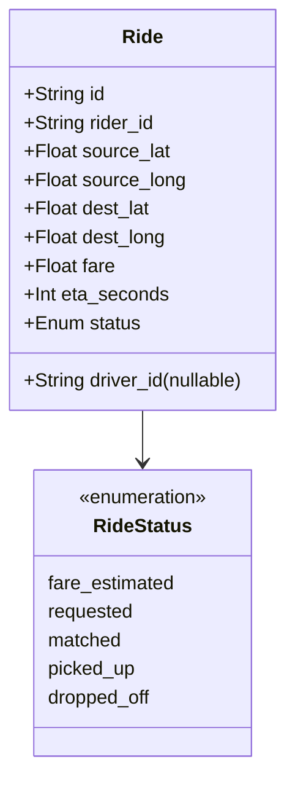
```mermaid
classDiagram
    class Ride {
        +String id
        +String rider_id
        +String driver_id (nullable)
        +Float source_lat
        +Float source_long
        +Float dest_lat
        +Float dest_long
        +Float fare
        +Int eta_seconds
        +Enum status
    }
    class RideStatus {
        <<enumeration>>
        fare_estimated
        requested
        matched
        picked_up
        dropped_off
    }
    Ride --> RideStatus
```

---

## Deep Dives

### Deep Dive 1: Location Service & Geospatial Indexing

#### The Math First

```
Uber active drivers globally     ≈ 3,000,000
Location update frequency        = every 5 seconds
TPS required                     = 3,000,000 / 5 = 600,000 writes/sec
```

> This rules out Postgres (2–4K TPS). We need something much faster.

#### Option A — Postgres + B-Tree Index ❌

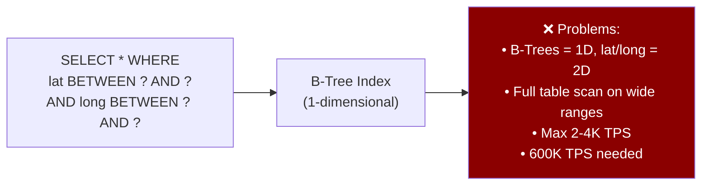
```mermaid
graph LR
    Query["SELECT * WHERE\nlat BETWEEN ? AND ?\nAND long BETWEEN ? AND ?"]
    BTree["B-Tree Index\n(1-dimensional)"]
    Problem["❌ Problems:\n• B-Trees = 1D, lat/long = 2D\n• Full table scan on wide ranges\n• Max 2-4K TPS\n• 600K TPS needed"]

    Query --> BTree --> Problem
    style Problem fill:#8b0000,color:#fff
```

#### Option B — Postgres + PostGIS + Quad Tree ⚠️ (Acceptable for Mid-Level)

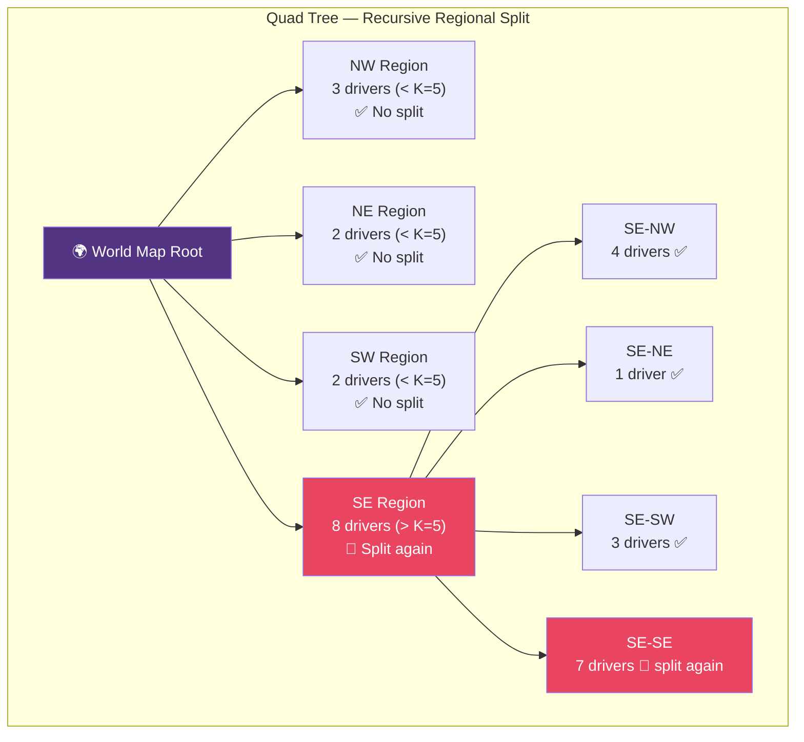
```mermaid
graph TD
    subgraph QuadTree["Quad Tree — Recursive Regional Split"]
        Root["🌍 World Map Root"]
        Root --> NW["NW Region\n3 drivers (< K=5)\n✅ No split"]
        Root --> NE["NE Region\n2 drivers (< K=5)\n✅ No split"]
        Root --> SW["SW Region\n2 drivers (< K=5)\n✅ No split"]
        Root --> SE["SE Region\n8 drivers (> K=5)\n🔀 Split again"]
        SE --> SE1["SE-NW\n4 drivers ✅"]
        SE --> SE2["SE-NE\n1 driver ✅"]
        SE --> SE3["SE-SW\n3 drivers ✅"]
        SE --> SE4["SE-SE\n7 drivers 🔀 split again"]
    end

    style Root fill:#533483,color:#fff
    style SE fill:#e94560,color:#fff
    style SE4 fill:#e94560,color:#fff
```

**Quad Tree Pros:** Great for uneven/dense distributions (e.g., Yelp — dense NYC, sparse Kansas)

**Quad Tree Cons:**
- Re-indexing on every write = expensive
- Requires a queue to batch 600K TPS → introduces latency
- In-memory tree structure is large

#### Option C — Redis + Geohash ✅ (Optimal)

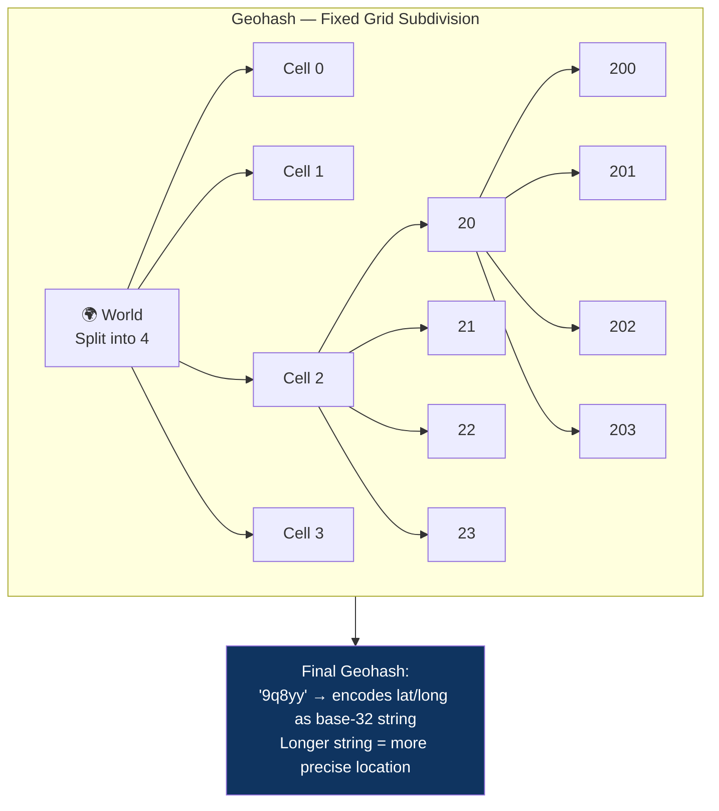
```mermaid
graph TD
    subgraph GeoHash["Geohash — Fixed Grid Subdivision"]
        L0["🌍 World\nSplit into 4"]
        L0 --> C0["Cell 0"]
        L0 --> C1["Cell 1"]
        L0 --> C2["Cell 2"]
        L0 --> C3["Cell 3"]
        C2 --> C20["20"]
        C2 --> C21["21"]
        C2 --> C22["22"]
        C2 --> C23["23"]
        C20 --> C200["200"]
        C20 --> C201["201"]
        C20 --> C202["202"]
        C20 --> C203["203"]
    end

    Result["Final Geohash:\n'9q8yy' → encodes lat/long as base-32 string\nLonger string = more precise location"]
    GeoHash --> Result

    style Result fill:#0f3460,color:#fff
```

**Geohash vs Quad Tree — Decision Guide:**

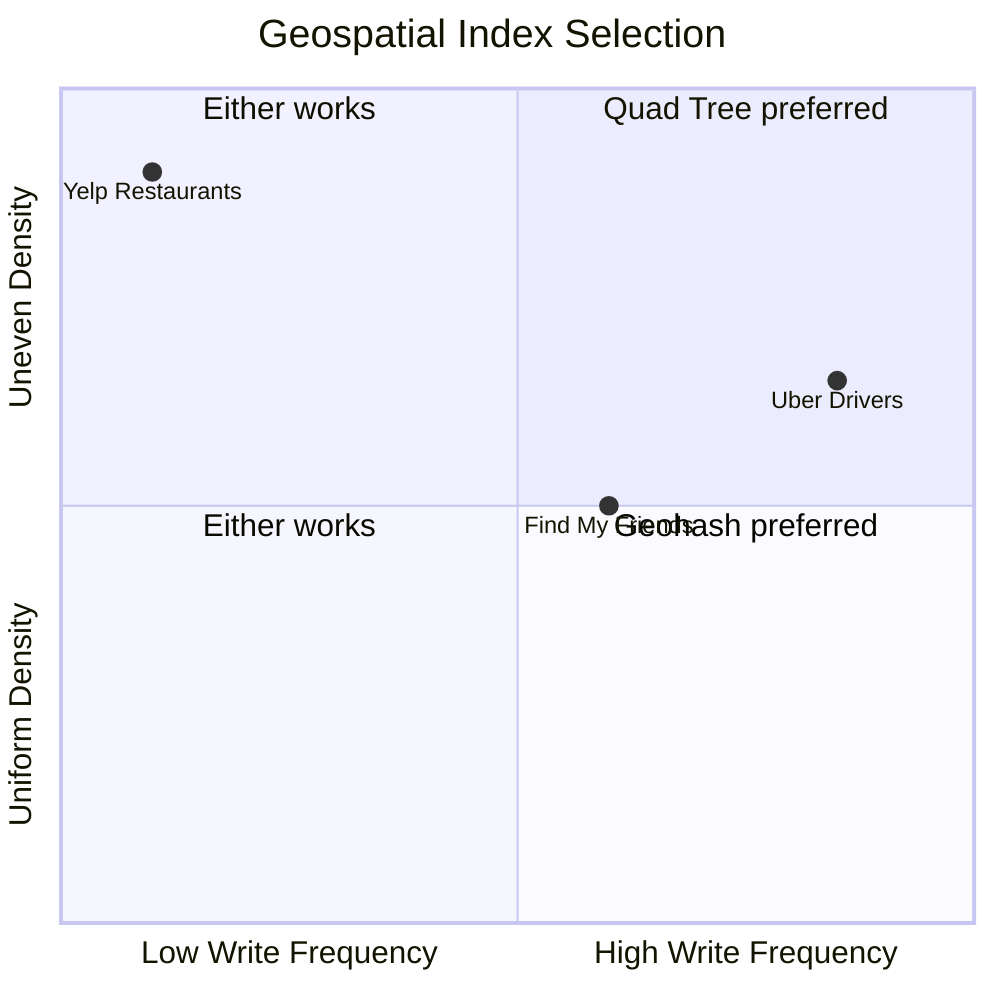
```mermaid
quadrantChart
    title Geospatial Index Selection
    x-axis Low Write Frequency --> High Write Frequency
    y-axis Uniform Density --> Uneven Density
    quadrant-1 Quad Tree preferred
    quadrant-2 Either works
    quadrant-3 Either works
    quadrant-4 Geohash preferred
    Uber Drivers: [0.85, 0.65]
    Yelp Restaurants: [0.1, 0.9]
    Find My Friends: [0.6, 0.5]
```

| Feature | Quad Tree | Geohash |
|---|---|---|
| Good for uneven density | ✅ Yes | ⚠️ Less optimal |
| Good for high write freq | ❌ Re-index cost | ✅ Just update string |
| Storage | Extra data structure | Just a string |
| Redis support | ❌ No native | ✅ `GEOADD`/`GEORADIUS` |
| Uber's choice | ❌ | ✅ (hexagons variant) |

> **Uber actually uses hexagonal geohashing** (H3 library) — the center-to-edge distance of a hexagon is uniform, unlike squares, making radius queries more accurate.

#### Dynamic Location Updates (Bonus / Staff-Level)

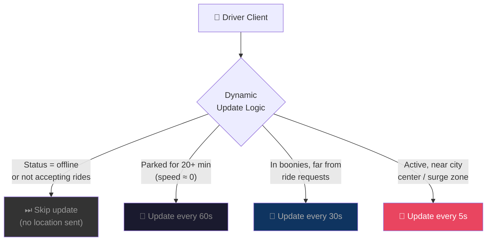
```mermaid
flowchart TD
    Driver["🚗 Driver Client"]
    Decision{"Dynamic\nUpdate Logic"}

    Driver --> Decision

    Decision -->|"Status = offline\nor not accepting rides"| Skip["⏭ Skip update\n(no location sent)"]
    Decision -->|"Parked for 20+ min\n(speed ≈ 0)"| Rare["📡 Update every 60s"]
    Decision -->|"In boonies, far from\nride requests"| Medium["📡 Update every 30s"]
    Decision -->|"Active, near city\ncenter / surge zone"| Frequent["📡 Update every 5s"]

    style Skip fill:#333,color:#999
    style Rare fill:#1a1a2e,color:#888
    style Medium fill:#0f3460,color:#aaa
    style Frequent fill:#e94560,color:#fff
```

> This reduces 600K TPS dramatically — maybe to 50–100K — without sacrificing real-world accuracy.

---

### Deep Dive 2: Consistency of Matching

**Goal:** Ensure `1 ride → 1 driver` and `1 driver → max 1 ride request at a time`

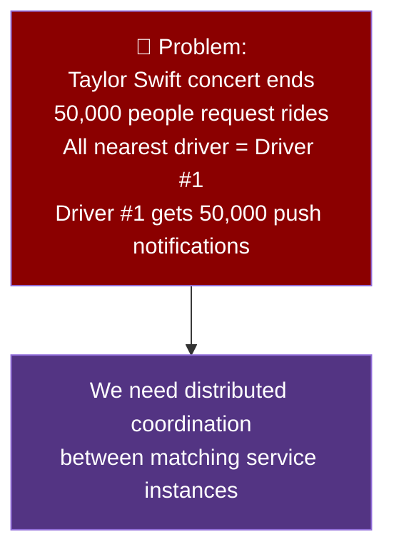
```mermaid
flowchart TD
    Problem["🚨 Problem:\nTaylor Swift concert ends\n50,000 people request rides\nAll nearest driver = Driver #1\nDriver #1 gets 50,000 push notifications"]
    Problem --> Sol["We need distributed coordination\nbetween matching service instances"]
    style Problem fill:#8b0000,color:#fff
    style Sol fill:#533483,color:#fff
```

#### Constraint 1: One request per ride at a time

This is handled by **application logic** within a single matching service instance:

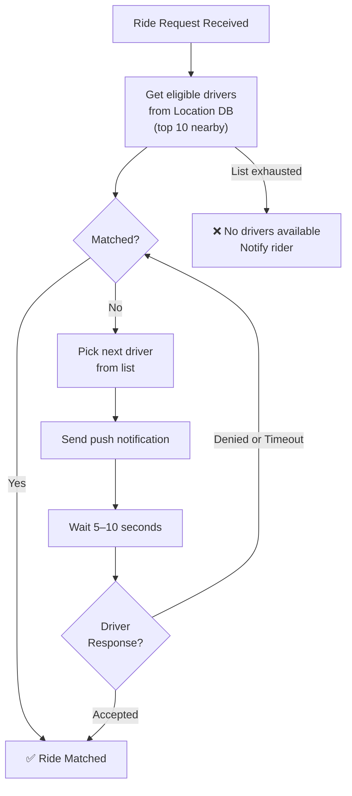
```mermaid
flowchart TD
    Start["Ride Request Received"]
    GetDrivers["Get eligible drivers\nfrom Location DB\n(top 10 nearby)"]
    NoMatch{Matched?}
    NextDriver["Pick next driver\nfrom list"]
    SendNotif["Send push notification"]
    Wait["Wait 5–10 seconds"]
    Response{Driver\nResponse?}
    Done["✅ Ride Matched"]
    Fail["❌ No drivers available\nNotify rider"]

    Start --> GetDrivers --> NoMatch
    NoMatch -->|No| NextDriver
    NoMatch -->|Yes| Done
    NextDriver --> SendNotif --> Wait --> Response
    Response -->|Accepted| Done
    Response -->|Denied or Timeout| NoMatch
    GetDrivers -->|List exhausted| Fail
```

#### Constraint 2: No driver gets multiple requests simultaneously

This is where **distributed coordination** is needed across N matching service instances:

##### Option A — DB Status Field + Cron Job ⚠️ (Mid-Level)

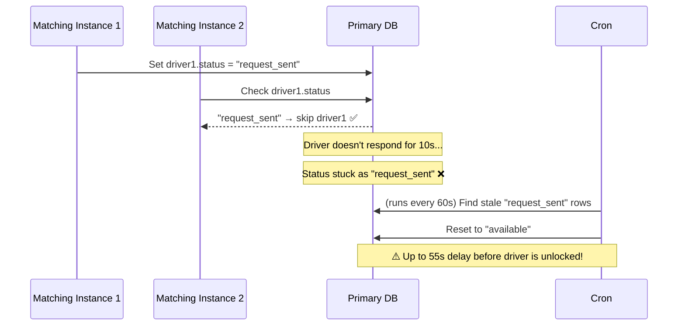
```mermaid
sequenceDiagram
    participant MS1 as Matching Instance 1
    participant MS2 as Matching Instance 2
    participant DB as Primary DB
    participant Cron

    MS1->>DB: Set driver1.status = "request_sent"
    MS2->>DB: Check driver1.status
    DB-->>MS2: "request_sent" → skip driver1 ✅
    Note over DB: Driver doesn't respond for 10s...
    Note over DB: Status stuck as "request_sent" ❌
    Cron->>DB: (runs every 60s) Find stale "request_sent" rows
    Cron->>DB: Reset to "available"
    Note over Cron,DB: ⚠️ Up to 55s delay before driver is unlocked!
```

##### Option B — Redis Distributed Lock with TTL ✅ (Senior/Staff)

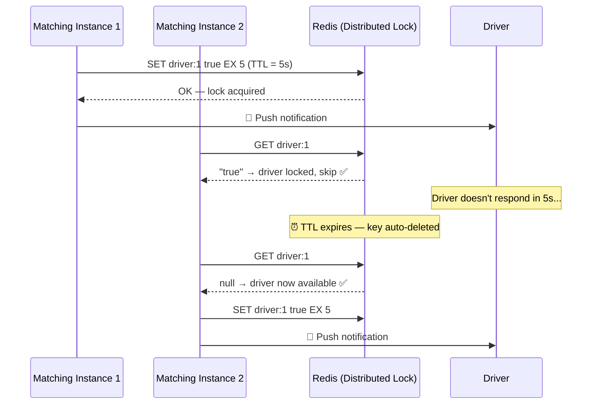
```mermaid
sequenceDiagram
    participant MS1 as Matching Instance 1
    participant MS2 as Matching Instance 2
    participant Redis as Redis (Distributed Lock)
    participant Driver

    MS1->>Redis: SET driver:1 true EX 5 (TTL = 5s)
    Redis-->>MS1: OK — lock acquired
    MS1->>Driver: 📲 Push notification

    MS2->>Redis: GET driver:1
    Redis-->>MS2: "true" → driver locked, skip ✅

    Note over Driver: Driver doesn't respond in 5s...
    Note over Redis: ⏰ TTL expires — key auto-deleted

    MS2->>Redis: GET driver:1
    Redis-->>MS2: null → driver now available ✅
    MS2->>Redis: SET driver:1 true EX 5
    MS2->>Driver: 📲 Push notification
```

**Why Redis TTL beats a cron job:**

| | Cron Job | Redis TTL |
|---|---|---|
| Unlock delay | Up to `cron_interval - lock_duration` (e.g. 55s) | Exactly at TTL expiry (5s) |
| Complexity | Extra job to maintain | Built into Redis |
| Precision | Low | High |
| Failure surface | More components | Fewer |

#### Matching Service Pseudocode

```javascript
async function matchRide(rideId) {
  const drivers = await locationDB.getNearbyDrivers(ride.source, radiusMiles = 2);
  let matched = false;

  while (!matched && drivers.length > 0) {
    const driver = drivers.shift(); // next closest

    // Try to acquire distributed lock
    const locked = await redis.set(`driver:${driver.id}`, true, 'EX', 5, 'NX');
    if (!locked) continue; // already locked by another instance

    await notificationService.send(driver.id, rideId);

    const response = await waitForResponse(driver.id, timeoutMs = 5000);

    if (response?.accepted) {
      await primaryDB.updateRide(rideId, { driverId: driver.id, status: 'matched' });
      await primaryDB.updateDriver(driver.id, { status: 'in_ride' });
      matched = true;
    }
    // Lock auto-expires — no cleanup needed
  }

  if (!matched) {
    await notifyRider(rideId, 'No drivers available');
  }
}
```

---

### Deep Dive 3: High Throughput & Surge Handling

**Scenario:** Taylor Swift concert ends → 100,000 ride requests in seconds within 1 region

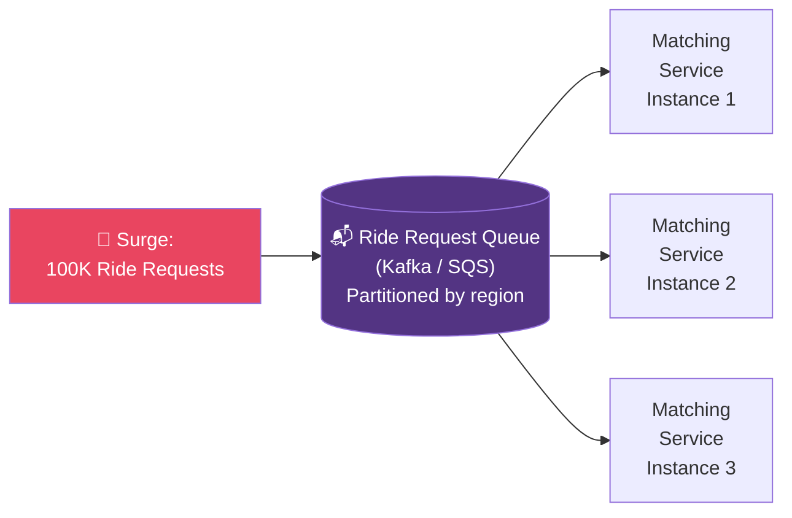
```mermaid
flowchart LR
    Riders["🌊 Surge:\n100K Ride Requests"]
    Queue[("📬 Ride Request Queue\n(Kafka / SQS)\nPartitioned by region")]
    MS1["Matching\nService\nInstance 1"]
    MS2["Matching\nService\nInstance 2"]
    MS3["Matching\nService\nInstance 3"]

    Riders --> Queue
    Queue --> MS1
    Queue --> MS2
    Queue --> MS3

    style Queue fill:#533483,color:#fff
    style Riders fill:#e94560,color:#fff
```

#### Why a Queue?

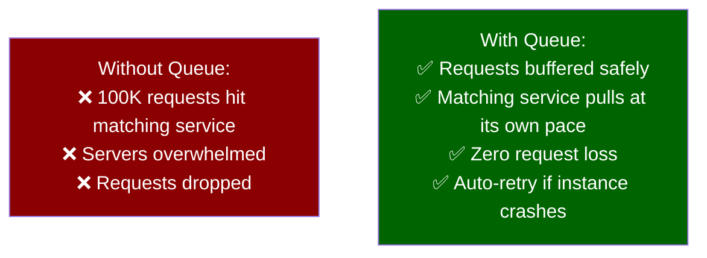
```mermaid
graph TD
    A["Without Queue:\n❌ 100K requests hit matching service\n❌ Servers overwhelmed\n❌ Requests dropped"]
    B["With Queue:\n✅ Requests buffered safely\n✅ Matching service pulls at its own pace\n✅ Zero request loss\n✅ Auto-retry if instance crashes"]

    style A fill:#8b0000,color:#fff
    style B fill:#006400,color:#fff
```

#### Queue Partitioning by Region

```mermaid
graph LR
    Queue["Ride Request Queue"]
    Queue --> NYC["🗽 NYC Partition\n(borough-level)"]
    Queue --> LA["🌴 LA Partition"]
    Queue --> CHI["🌬️ Chicago Partition"]
    Queue --> Rural["🌾 Rural Partition"]

    NYC --> MS_NYC["Matching Service\n(NYC fleet)"]
    LA --> MS_LA["Matching Service\n(LA fleet)"]

    style Queue fill:#0f3460,color:#fff
```

**Why partition?** Without it, a hard-to-match rural ride could block city riders in a simple FIFO queue.

**Bonus:** If a matching service instance crashes mid-match, the message is not acknowledged → it re-queues → another instance picks it up. **No ride lost.**

---

### Deep Dive 4: High Availability

```mermaid
graph TD
    subgraph USEast["☁️ US East — Data Center 1"]
        GW1["API Gateway"]
        RS1["Ride Service\n(3 instances)"]
        MS1["Match Service\n(3 instances)"]
        LS1["Location Service\n(3 instances)"]
        DB1[("DynamoDB\nPrimary")]
        Redis1[("Redis Cluster")]
    end

    subgraph USWest["☁️ US West — Data Center 2"]
        GW2["API Gateway"]
        RS2["Ride Service"]
        MS2["Match Service"]
        LS2["Location Service"]
        DB2[("DynamoDB\nReplica")]
        Redis2[("Redis Cluster")]
    end

    Global["🌐 Global Load Balancer\n(Route 53)"]
    Global --> GW1
    Global --> GW2

    DB1 -.->|Async Replication| DB2

    style Global fill:#e94560,color:#fff
    style DB1 fill:#0f3460,color:#fff
    style DB2 fill:#0f3460,color:#aaa
```

**Scaling summary:**

| Component | Scaling Approach |
|---|---|
| API Gateway | Managed by AWS, auto-scales |
| Ride Service | Horizontal scaling + load balancer |
| Match Service | Horizontal + message queue buffer |
| Location Service | Horizontal (stateless writers) |
| Redis | Redis Cluster (sharded) — 100K–1M TPS |
| DynamoDB | Near-infinite horizontal scale |
| Regions | Separate full stacks per geographic region |

---

## Final Architecture

```mermaid
flowchart TD
    RiderApp["📱 Rider App"]
    DriverApp["📱 Driver App"]

    Gateway["🔀 API Gateway\nAuth · Rate Limit · Route"]

    RideService["🎯 Ride Service"]
    MatchService["🔗 Match Service"]
    LocationService["📍 Location Service"]
    NotifService["🔔 Notification Service\nAPNS · FCM"]

    RideQueue[("📬 Ride Request Queue\n(Kafka — partitioned by region)")]
    LocationDB[("⚡ Redis Cluster\nGeohash · 600K+ TPS")]
    LockDB[("🔒 Redis Distributed Lock\nDriver locks w/ TTL")]
    PrimaryDB[("🗄 DynamoDB\nRides · Drivers · Riders")]
    GoogleMaps["🗺 Google Maps API"]

    RiderApp -->|HTTPS| Gateway
    DriverApp -->|HTTPS| Gateway

    Gateway --> RideService
    Gateway --> LocationService
    Gateway --> RideQueue

    RideQueue --> MatchService

    RideService --> GoogleMaps
    RideService --> PrimaryDB

    LocationService --> LocationDB

    MatchService --> LocationDB
    MatchService --> LockDB
    MatchService --> PrimaryDB
    MatchService --> NotifService

    NotifService --> DriverApp

    DriverApp -->|Accept/Deny| Gateway

    style Gateway fill:#1a1a2e,color:#e94560,stroke:#e94560,stroke-width:2px
    style RideQueue fill:#533483,color:#fff,stroke:#7a4fbf,stroke-width:2px
    style LocationDB fill:#c73652,color:#fff,stroke:#e94560,stroke-width:2px
    style LockDB fill:#8b0000,color:#fff,stroke:#c73652,stroke-width:2px
    style PrimaryDB fill:#0f3460,color:#fff,stroke:#1a5276,stroke-width:2px
    style MatchService fill:#533483,color:#fff
    style RideService fill:#0f3460,color:#fff
    style LocationService fill:#0f3460,color:#fff
```

---

## Interview Tips by Level

```mermaid
graph TD
    All["All Candidates"]
    All --> FR["✅ Clear functional requirements\n(3 features, explicit out-of-scope)"]
    All --> NFR["✅ Quantified non-functional requirements\n(not just buzzwords)"]
    All --> HLD["✅ High-level design satisfying\nall functional requirements"]

    HLD --> Mid["🟡 Mid-Level\nHLD + answer probing questions\nPostGIS/Quad Tree or simple cron OK"]
    HLD --> Senior["🟠 Senior\nHLD + 2 deep dives\nGeohash + Redis lock with TTL"]
    HLD --> Staff["🔴 Staff\nHLD + 3+ deep dives\nTeach the interviewer something\nH3 hexagons, dynamic location updates,\nDynamoDB TTL instead of Redis"]

    style Mid fill:#555500,color:#ffff00
    style Senior fill:#553300,color:#ffaa00
    style Staff fill:#550000,color:#ff5555
```

### Back-of-the-Envelope: When to Do It

> ❌ **Don't** do it immediately after requirements (wastes ~5 min, adds no signal).
>
> ✅ **Do** say: *"I prefer to skip estimations now and only calculate when the result directly influences a design decision. Is that okay?"*
>
> ✅ **Do** it during deep dives when it matters: e.g., `3M drivers ÷ 5s = 600K TPS → rules out Postgres → must use Redis`

---

## Key Takeaways

| Topic | Answer |
|---|---|
| Fare estimation | Ride Service → Google Maps API → store in DynamoDB |
| Driver location storage | Redis + Geohash (`GEOADD`/`GEORADIUS`) |
| Why not Postgres for location | B-Tree = 1D, lat/long = 2D; max 4K TPS vs 600K needed |
| Geohash vs Quad Tree | Geohash for high write frequency; Quad Tree for uneven density |
| Driver TPS reduction | Dynamic client-side updates (status, speed, proximity) |
| Matching consistency | Redis distributed lock with 5s TTL — auto-expires, no cron |
| Surge handling | Kafka queue partitioned by region; matching service pulls |
| High availability | Multi-region deployment, DynamoDB replication, Redis cluster |
| Uber's actual approach | H3 hexagonal geohashing (more uniform radius than squares) |

---

*Handbook based on a system design breakdown by an Ex-Meta Staff Engineer — Hello Interview*
