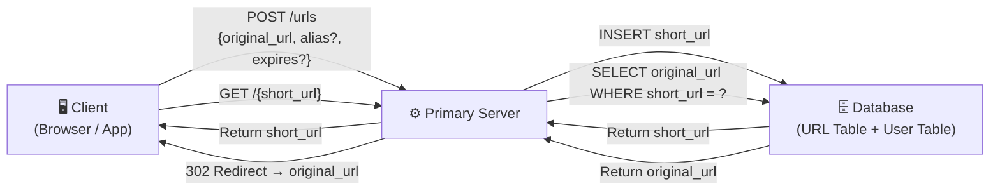
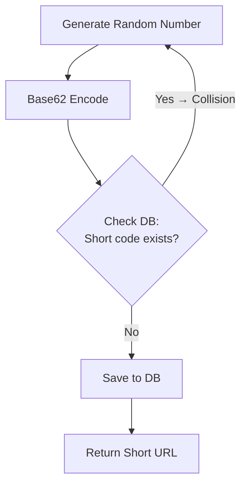
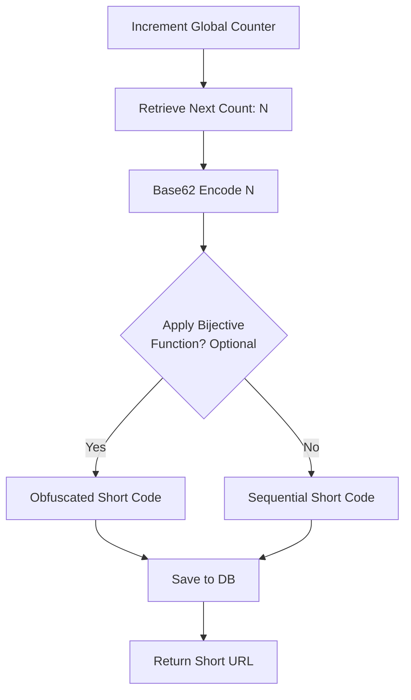
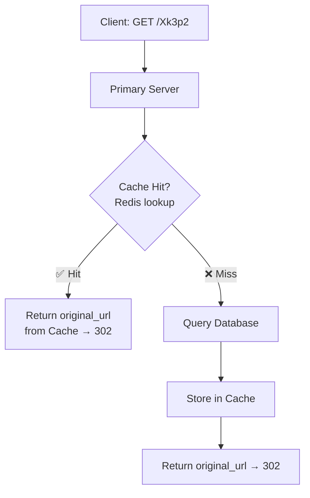
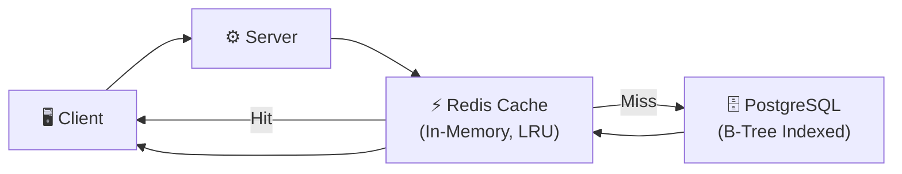
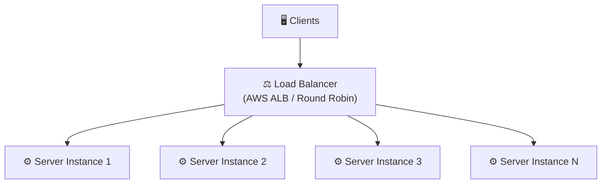
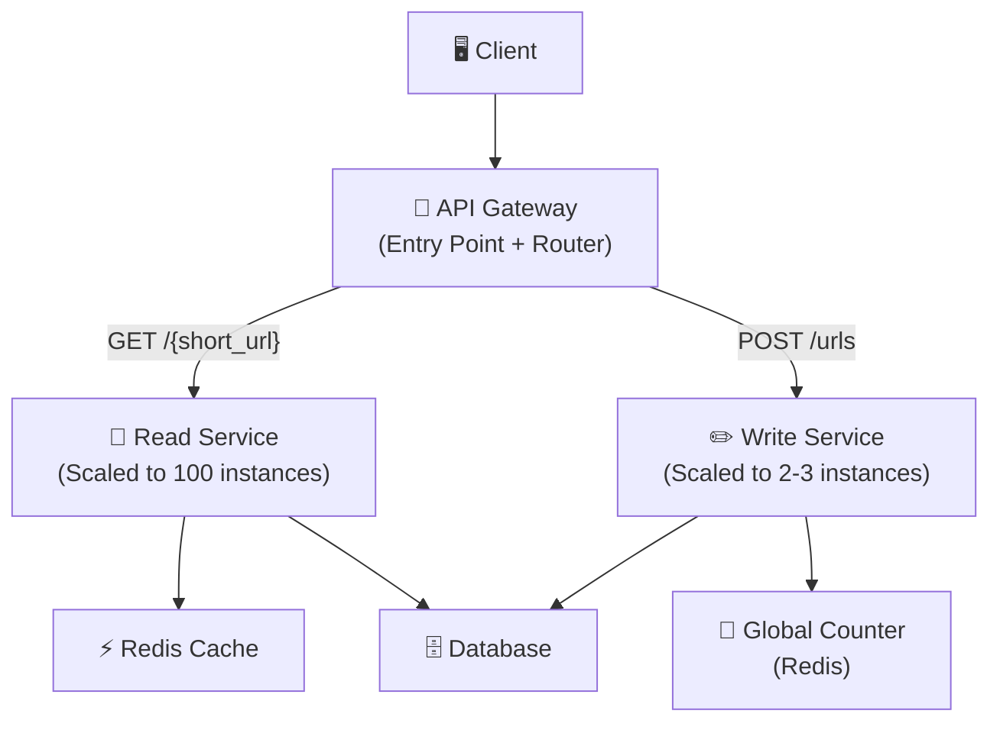
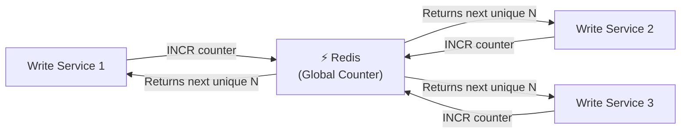
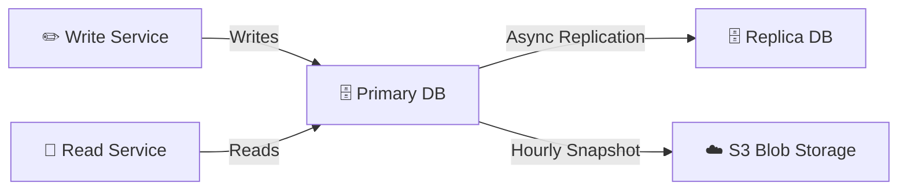
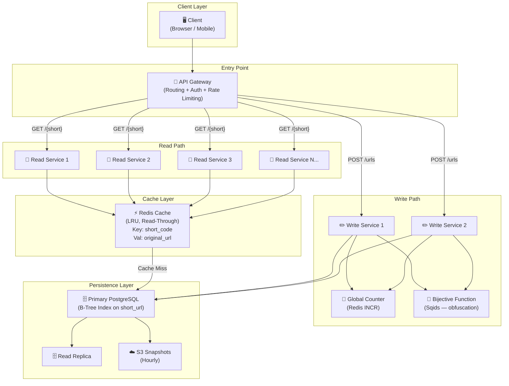

# 🔗 System Design: URL Shortener (Bitly)
> **A Premium Engineering Handbook** | Interview Preparation Guide | Technical Architecture Wiki

---

## 📋 Table of Contents

1. [The Interview Framework](#-the-interview-framework)
2. [Step 1 — Functional Requirements](#-step-1--functional-requirements)
3. [Step 2 — Non-Functional Requirements](#-step-2--non-functional-requirements)
4. [Step 3 — Core Entities](#-step-3--core-entities)
5. [Step 4 — API Design](#-step-4--api-design)
6. [Step 5 — High-Level Design](#-step-5--high-level-design)
7. [Step 6 — Deep Dives](#-step-6--deep-dives)
   - [6A — Ensuring Uniqueness of Short Codes](#6a--ensuring-uniqueness-of-short-codes)
   - [6B — Low Latency on Redirects](#6b--low-latency-on-redirects)
   - [6C — Scaling to 100M DAU](#6c--scaling-to-100m-dau)
   - [6D — High Availability](#6d--high-availability)
8. [Final Architecture Diagram](#-final-architecture-diagram)
9. [Key Terminology Glossary](#-key-terminology-glossary)
10. [Interview Cheat Sheet](#-interview-cheat-sheet)

---

## 🧭 The Interview Framework

> Before jumping into any design, follow this structured step-by-step approach. This works for **every** system design question, not just URL shorteners.

```
Step 1 → Define Functional Requirements     (What does the system DO?)
Step 2 → Define Non-Functional Requirements (What QUALITIES does the system need?)
Step 3 → Identify Core Entities            (What data does the system store?)
Step 4 → Design the API                    (What is the contract with the client?)
Step 5 → High-Level Design                 (Draw boxes, satisfy functional reqs FIRST)
Step 6 → Deep Dives                        (Evolve design to meet non-functional reqs)
```

### ⚠️ Critical Interview Tips

- **Do NOT go too deep early.** A common mistake is going deep on one part and running out of time before satisfying all functional requirements.
- **Blackbox complexity** in the High-Level Design, then revisit it in Deep Dives.
- **Skip back-of-the-envelope math upfront** — only do calculations when the result will directly inform a design decision.
- **Communicate proactively** with your interviewer: *"I'm blackboxing this for now and will come back to it."*

---

## ✅ Step 1 — Functional Requirements

> Functional requirements = **the core features** of the system.
> Phrased as: *"Users should be able to..."*

### What is a URL Shortener?

A URL shortener is a service that:
- Takes a **long URL** as input
- Returns a **short URL** (e.g., `bitly.com/Xk3p2`) as output
- When a user visits the short URL → they are **redirected** to the original long URL

### Core Functional Requirements

| # | Requirement | Description |
|---|---|---|
| FR1 | **Create a short URL** | Users can submit a long/original URL and receive a short URL in return |
| FR2 | **Redirect to original URL** | Users visiting the short URL are redirected to the original long URL |
| FR3 | **Custom Alias (optional)** | Users can optionally provide their own short alias (e.g., `bitly.com/evan`) instead of a system-generated one |
| FR4 | **Expiration Time (optional)** | Users can optionally specify an expiration time; after which the short URL returns an error |

### Notes on FR3 — Custom Alias
- If a user provides alias `evan` → short URL becomes `bitly.com/evan`
- System must **check if alias already exists** before accepting it
- If alias is taken → return an error

### Notes on FR4 — Expiration Time
- Useful for time-limited campaigns (e.g., a conference for one week)
- After expiration → visiting the short URL returns an **error or expired message**

---

## ⚙️ Step 2 — Non-Functional Requirements

> Non-functional requirements = **the qualities** of the system.
> Phrased as: *"The system should be..."*
> These are sometimes called **"ility" statements** — scalability, availability, durability, etc.

### NFR 1 — Low Latency on Redirects

- **The system should have < 200ms latency on redirects**
- Why 200ms? It is the threshold below which humans perceive a response as **real-time** (like the snap of a finger)
- The redirect operation is the most critical user-facing action → must be as fast as possible

### NFR 2 — Scale

- **The system should support 100 million Daily Active Users (DAU)**
- **The system should support 1 billion total shortened URLs**
- These numbers come from asking your interviewer or making a reasonable assumption

### NFR 3 — Uniqueness of Short Codes

- **The system must guarantee uniqueness of every generated short code**
- Two different long URLs must never map to the same short code
- Without uniqueness → users could be redirected to the wrong website (catastrophic)

### NFR 4 — CAP Theorem (Availability vs Consistency)

#### 📚 What is CAP Theorem?

> CAP Theorem states: In a distributed system, you can only guarantee **two out of three** of the following:
> - **C**onsistency — Every read returns the most recent write
> - **A**vailability — Every request receives a response (no timeout)
> - **P**artition Tolerance — System continues operating despite network partitions

Since **Partition Tolerance** is always required in distributed systems (you will always have multiple nodes and possible network splits), the real choice is:

```
Do we need strong CONSISTENCY or high AVAILABILITY?
```

#### 🤔 Does a URL Shortener Need Strong Consistency?

**Strong Consistency (Read-After-Write):** Every read must reflect the latest write. Required in systems where a stale read causes fatal errors.

| System | Needs Strong Consistency? | Reason |
|---|---|---|
| Banking App | ✅ Yes | Stock trade must be visible to all parties immediately |
| Ticket Booking (Taylor Swift concert) | ✅ Yes | Two users can't book the same last seat |
| **URL Shortener** | ❌ No | A few seconds of eventual consistency is acceptable |

#### Why URL Shortener can use Eventual Consistency:
- After creating a short URL, a user still needs time to **share** it with others before it gets heavily used
- If someone clicks a brand-new URL in the first few seconds and gets an error → showing: *"We're still saving this, try again in a moment"* is **acceptable**
- Nobody shows up to the Taylor Swift concert fighting over the same seat 😄

#### Decision: **High Availability + Eventual Consistency**

```
The system should be:
  ✅ Highly Available
  ✅ Eventually Consistent (NOT strongly consistent)
```

---

## 🗂️ Step 3 — Core Entities

> Core Entities = the main objects your system **stores and exchanges**.
> Think of these as the **table names** in your database.

> 💡 **Tip:** Don't define the full data model yet. List the entities first, fill in the columns later as you design the API and High-Level Design.

### Entities

```
1. URL          → maps a short URL/code to an original long URL
2. User         → represents the person who created the short URL
```

### Data Model (defined later in High-Level Design)

#### `url` table

| Field | Type | Notes |
|---|---|---|
| `short_url` | `VARCHAR(10)` | **Primary Key** — the short code (e.g., `Xk3p2`) |
| `original_url` | `TEXT` | The full original long URL |
| `created_at` | `TIMESTAMP` | Creation timestamp (8 bytes) |
| `user_id` | `UUID` | Foreign key → User who created it |
| `custom_alias` | `VARCHAR(100)` | Optional — user-defined alias |
| `expires_at` | `TIMESTAMP` | Optional — expiration timestamp |

#### `user` table

| Field | Type | Notes |
|---|---|---|
| `user_id` | `UUID` | Primary Key |
| `email` | `VARCHAR` | User email |
| `password_hash` | `TEXT` | Hashed password |
| ...additional metadata | | Focus on core fields in interview |

> ⚠️ **Interview Tip:** Don't get distracted listing every user field (salt, tokens, avatar, etc.). It wastes time. Say *"and additional metadata"* and move on.

---

## 🌐 Step 4 — API Design

> API = the **contract** between your client/users and your backend.
> In most cases: **one API endpoint per functional requirement**.

### REST API Basics (Quick Reference)

| HTTP Verb | When to Use |
|---|---|
| `POST` | Creating a new resource |
| `PUT` / `PATCH` | Updating an existing resource |
| `GET` | Fetching/retrieving a resource |
| `DELETE` | Deleting a resource |

> Path naming convention: use **plural nouns** (e.g., `/urls`, `/users`)

---

### API Endpoint 1 — Shorten a URL

**Maps to:** FR1 — Users can create a short URL from a long URL

```http
POST /urls
Content-Type: application/json
```

**Request Body:**

```json
{
  "original_url": "https://www.some-very-long-website.com/article/foo?ref=bar",
  "custom_alias": "evan",        // optional
  "expires_at": "2025-12-31"    // optional
}
```

**Response:**

```json
{
  "short_url": "https://bitly.com/evan"
}
```

---

### API Endpoint 2 — Redirect to Original URL

**Maps to:** FR2 — Users can be redirected to the original URL from the short URL

```http
GET /{short_url}
```

**Response:**

```
HTTP/1.1 302 Found
Location: https://www.some-very-long-website.com/article/foo?ref=bar
```

> The `{short_url}` is the short code (e.g., `Xk3p2` or custom alias `evan`)
> The browser automatically follows the `Location` header and navigates to the original URL

---

### 302 vs 301 Redirect — Which to Choose?

> 📚 **HTTP Redirect Codes:**
> - **301 Moved Permanently** → Browsers & DNS servers **cache** this redirect. Future requests may never hit your server.
> - **302 Found (Temporary)** → Never cached. Every redirect hits your server first.

| Property | 301 (Permanent) | 302 (Temporary) |
|---|---|---|
| Browser caches redirect | ✅ Yes | ❌ No |
| Hits your server on every request | ❌ No | ✅ Yes |
| Can log/track redirect events | ❌ No | ✅ Yes |
| Reduces compute cost | ✅ Yes | ❌ No |
| Supports internal analytics | ❌ No | ✅ Yes |

#### Decision: **Use 302**

**Why?**
- Even without user-facing analytics, you need to **monitor if your service is working**
- If redirect traffic drops to zero on your server → you'd know something broke
- With 301 (cached), you lose all visibility into actual request traffic
- The small compute cost savings from 301 are not worth losing observability

---

## 🏗️ Step 5 — High-Level Design

> Primary goal: **Satisfy all functional requirements** with the simplest possible design.
> Don't worry about scale, latency, or availability yet — that comes in the Deep Dives.

### System Architecture (Base)



### Flow 1 — Creating a Short URL (POST /urls)

```
1. Client sends:  POST /urls  { original_url, custom_alias?, expires_at? }
2. Server:
     a. Generate short_code (blackboxed for now — covered in Deep Dive 6A)
     b. If custom_alias provided:
          → Check DB: does alias already exist?
          → If NO  → use alias as short_url
          → If YES → return error (409 Conflict)
     c. Save to DB: { short_url, original_url, created_at, user_id, expires_at }
3. Server returns: { short_url: "bitly.com/Xk3p2" }
```

### Flow 2 — Redirecting from Short URL (GET /{short_url})

```
1. Client visits:  GET /Xk3p2
2. Server:
     a. Look up short_url = "Xk3p2" in DB
     b. Check expiration:
          → IF expires_at < NOW() → return 410 Gone / error page
          → IF not expired → proceed
     c. Return original_url with HTTP 302 redirect
3. Browser automatically navigates to original_url
```

---

## 🔬 Step 6 — Deep Dives

> Now we go one-by-one through the Non-Functional Requirements and **evolve the design** to meet them.

---

## 6A — Ensuring Uniqueness of Short Codes

> This is the **core technical challenge** of a URL shortener. We blackboxed it in the High-Level Design — now we open the box.

### Requirements for a Short Code

A good short code must be:
- ✅ **Unique** — no two long URLs map to the same short code
- ✅ **Short** — 5–7 characters is the target range
- ✅ **Fast to generate** — should not slow down the request

---

### 📚 What is Base62 Encoding?

> Base62 is like our familiar decimal numbering system (base 10: 0–9) but with 62 possible values per character.

| System | Characters Used | Digits per Position |
|---|---|---|
| Base 10 (decimal) | `0–9` | 10 |
| Base 16 (hex) | `0–9`, `A–F` | 16 |
| **Base 62** | `0–9`, `A–Z`, `a–z` | **62** |

**Why Base62?**
- No special characters (`+`, `/`) → URL-safe
- Compact: a 6-character Base62 string can represent **62⁶ ≈ 56 billion** unique values

```
Base62 Mapping Example:
  0  → '0'
  9  → '9'
  10 → 'A'
  11 → 'B'
  ...
  35 → 'Z'
  36 → 'a'
  ...
  61 → 'z'
```

**Example:** The number `12345678` in Base62 encodes to a short 5-character string.

---

### Option 1 — URL Prefix (❌ Bad)

**Idea:** Take the first 5–7 characters of the long URL as the short code.

**Why it fails:**
- Thousands of URLs start with `https://www.twitter.com/` → **same prefix = same short code**
- Creates a **one-to-many** mapping: one short code, many long URLs
- Ambiguous redirect → system cannot determine which long URL to return

> ❌ **Never suggest this in an interview.**

---

### Option 2 — Random Number Generator + Base62 (⚠️ Acceptable with caveat)

```
Flow:
  1. Generate random number between 0 and 56 billion
  2. Base62-encode it → 6-character short code
  3. Check DB: does this short code already exist?
  4. If YES → regenerate
  5. If NO  → save to DB
```

**Why it has issues — The Birthday Paradox:**

> 📚 **Birthday Paradox:** In a room of just **23 people**, there is a >50% chance that at least 2 share the same birthday — despite there being 365 days in a year. This counterintuitive probability phenomenon applies to our collision probability too.

- With 56 billion possible codes and 1 billion URLs generated → estimated **~880,000 collisions**
- Collision means an extra DB read every time a duplicate is generated
- **Still workable** — just adds an extra DB read on collision. Not a dealbreaker.



---

### Option 3 — Hash the Long URL + Base62 (⚠️ Functionally Same as Option 2)

```
Flow:
  1. Run long URL through a hash function (MD5, MurmurHash, SHA-256)
  2. Get hash output (e.g., 128-bit string)
  3. Base62-encode the hash
  4. Slice to first 6 characters → short code
  5. Same collision check as Option 2
```

**Hash Function Properties:**
- **Deterministic** — same input always gives same output
- **Avalanche Effect** — changing 1 bit of input causes the entire hash output to change drastically
- This makes the output effectively as random as a random number generator

> ⚠️ **Collision rate is identical to Option 2** — the "waterfall/avalanche effect" creates the same randomness. Same DB check is still required. Hashing the URL does NOT guarantee uniqueness.

---

### Option 4 — Auto-Incrementing Counter + Base62 ✅ (Recommended)

> This is the cleanest approach. No collision possible.

```
Flow:
  1. Maintain a global counter (starts at 0, increments by 1 for every new URL)
  2. Retrieve the next counter value (e.g., 1,000,001)
  3. Base62-encode it → unique 6-character short code
  4. (Optional) Apply a Bijective Function to obfuscate sequential pattern
  5. Save to DB → guaranteed unique
```

**Why no collision?**
- Counter is **strictly monotonically increasing** — each value is used exactly once
- `0 → "000000"`, `1 → "000001"`, ..., `56,000,000,000 → "zzzzzz"` (6 chars)
- Never need a DB read to check for duplicates → **faster**



**Tradeoff — Predictability / Security Risk:**
- Counter is sequential → attackers/competitors can:
  - Enumerate all short URLs by incrementing the code
  - Scrape all long URLs stored in your system
  - Estimate total number of URLs shortened (business intelligence leak)

**Solution — Bijective Functions:**

> 📚 **Bijective Function:** A function that creates a **perfect one-to-one mapping** — every input maps to exactly one output, and every output maps back to exactly one input. No two inputs share an output.

- Libraries like **Sqids** (formerly Hashids) implement this
- Input: counter number `1000001`
- Output: obfuscated string like `"kR93mP"` — looks random, not sequential
- The mapping is **reversible** — you can always decode back to the original counter number
- Competitors cannot enumerate your URLs just by incrementing

---

### Short Code Options — Summary Comparison

| Option | Collision-Free? | Extra DB Read? | Predictable? | Recommended? |
|---|---|---|---|---|
| URL Prefix | ❌ No | — | ✅ Yes | ❌ Never |
| Random + Base62 | ❌ No (collisions possible) | ✅ Yes (on collision) | ❌ No | ⚠️ Acceptable |
| Hash + Base62 | ❌ No (same as random) | ✅ Yes (on collision) | ❌ No | ⚠️ Acceptable |
| Counter + Base62 | ✅ Yes | ❌ No | ⚠️ Yes (sequential) | ✅ Best |
| Counter + Base62 + Bijective | ✅ Yes | ❌ No | ❌ No (obfuscated) | ✅✅ Best + Secure |

---

## 6B — Low Latency on Redirects

> Goal: Achieve **< 200ms** latency on the redirect operation.

### What Makes a Redirect Slow?

```
Current flow:
  Client → Primary Server → Database (disk read) → Server → Client

The bottleneck: DATABASE READ (going to disk to look up 1 row in 1 billion)
```

Without optimization:
- 1 billion rows in DB
- Full table scan = reading every row → **prohibitively slow**

---

### Solution 1 — Database Indexing

> 📚 **Index:** A data structure (usually kept in memory) that acts as a pointer to exact row locations on disk. Instead of scanning all rows, the DB jumps directly to the right row.

**How it works in PostgreSQL:**
- Setting `short_url` as the **Primary Key** automatically creates a **B-Tree index** on that column
- A **B-Tree** (self-balancing tree) makes lookups **O(log n)** instead of O(n)
- Modern databases are so well-optimized that B-Tree lookups for exact matches approach **O(1)**

**Optional: Hash Index on short_url**
- A hash index maps the short URL directly to its disk location → true **O(1)** lookup
- In practice, PostgreSQL's B-Tree is already so fast for equality lookups that a hash index provides negligible benefit

```
Without Index:  scan 1,000,000,000 rows → O(n) → very slow
With B-Tree:    traverse ~30 levels of tree → O(log n) → fast
With Hash Index: one hash lookup → O(1) → fastest
```

**Still going to disk** → the index tells us WHERE to look on disk, but we still read from disk (SSD). Fast, but we can go faster.

---

### Solution 2 — In-Memory Cache (Redis) ✅ Recommended

> 📚 **Cache:** A separate, ultra-fast in-memory storage layer. RAM is ~100x faster than SSD.

**Cache Type: Read-Through, LRU (Least Recently Used)**

> 📚 **Read-Through Cache:** On a cache miss, the system automatically fetches the data from the DB, stores it in the cache, and returns it. Future reads for the same key hit the cache (not the DB).

> 📚 **LRU Eviction Policy:** When the cache is full, the item that was **accessed least recently** is removed to make room. This is ideal for URL shorteners because old URLs are rarely accessed.



**Cache Key-Value Structure:**
```
Key:   "Xk3p2"              ← short code
Value: "https://long-url..."  ← original URL
```

**Performance Gain:**
- Cache hit → **O(1) in-memory lookup** → ~1ms latency
- Cache miss → DB read → update cache → subsequent reads are O(1)
- Hot URLs (frequently accessed) stay warm in cache
- Old/cold URLs are evicted naturally by LRU policy

---

### Solution 3 — CDN Caching (Optional / Tradeoff)

> 📚 **CDN (Content Delivery Network):** Geographically distributed edge servers. Users hit the nearest edge server instead of your origin server, reducing network latency.

**How it would work:**
- Cache the redirect response at edge servers worldwide
- User in India hits a Mumbai CDN node instead of a server in California
- Network latency: 5ms (local) vs 200ms+ (cross-continent)

**The Tradeoff:**

| Benefit | Cost |
|---|---|
| Extreme latency reduction globally | Redirect never hits your origin server |
| Offloads traffic from your servers | You cannot log redirect events |
| Great for globally distributed traffic | Zero visibility into service health |

**Decision: Skip CDN (for same reasons as choosing 302 over 301)**
- Losing observability into redirect traffic is too costly
- Internal monitoring requires knowing when redirects occur
- Redis cache already achieves the latency target

---

### Redirect Latency — Final Architecture



---

## 6C — Scaling to 100M DAU

> Goal: The system must handle **100 million daily active users** and **1 billion stored URLs**.

### Back-of-the-Envelope Calculations

> ✅ This is where math is useful — it directly informs whether we need to horizontally scale, and how.

#### Request Rate Estimation

```
Assumption: 1 redirect per DAU per day (conservative)

Daily redirects = 100 million = 10⁸
Seconds in a day ≈ 100,000 = 10⁵

Requests/second = 10⁸ ÷ 10⁵ = 10³ = 1,000 req/s (average)

With 10x peak factor: 10,000 req/s peak
With 100x peak factor: 100,000 req/s peak

Write operations (URL creation) ≈ 1/1000 of reads = ~1 req/s
```

> 📚 **Pro Tip:** Use exponents (powers of 10) for quick mental math. Dividing 10⁸ by 10⁵ = 10^(8-5) = 10³. Easy!

#### Server Capacity

```
Typical EC2 instance (T3 medium):
  Handles ≈ 1,000 concurrent requests

We need: 10,000–100,000 req/s peak
→ We need 10–100 instances (horizontal scaling)
```

#### Storage Estimation

```
Per URL record:
  short_url:      8 bytes
  original_url:  100 bytes
  created_at:     8 bytes
  user_id:        16 bytes
  expires_at:     8 bytes
  custom_alias:  100 bytes (generous upper bound)
  ─────────────────────────
  Total:         ~240 bytes → round up to 500 bytes (with overhead)

1 billion rows × 500 bytes = 500 GB

Modern SSDs: hundreds of TBs → 500 GB fits on a SINGLE instance
```

> **Conclusion:** Database storage is NOT a bottleneck. A single DB instance is fine for storage.

---

### Horizontal Scaling — Primary Server

> 📚 **Vertical Scaling:** Making one machine bigger (more CPU, RAM). Expensive, has an upper limit.
> 📚 **Horizontal Scaling:** Adding more machines of the same size. Cheaper, theoretically unlimited.

**We choose horizontal scaling:**



**Auto-scaling in practice (AWS example):**
- Configure: if CPU > 75% → spin up a new EC2 instance
- Configure: if CPU < 20% → terminate an instance
- Load Balancer routes traffic across all healthy instances
- This is fully managed by cloud infrastructure

---

### Microservice Architecture — Read vs. Write Services

> Since **reads (redirects) vastly outnumber writes (URL creation)**, we can split into two independently scalable services.



> 📚 **API Gateway:** A single entry point for all client requests. It handles routing, authentication, rate limiting, and forwards requests to the appropriate downstream service.

**Scale separately:**
- **Read Service:** 10–100 instances (handles massive redirect traffic)
- **Write Service:** 2–3 instances (URL creation is rare — ~1 req/s)

**Tradeoff:** Two services = two codebases to maintain. For a system this simple, could be overkill. Valid to mention both options and their tradeoffs.

---

### Global Counter Problem — Multi-Server Coordination

> If multiple Write Service instances each maintain their own counter → they'll generate duplicate values.

```
Instance 1: counter = 0, 1, 2, 3...
Instance 2: counter = 0, 1, 2, 3...
                          ↑ COLLISION!
```

**Solution: Global Counter in Redis**

> 📚 **Redis INCR command:** Atomically increments a key's integer value by 1. Because Redis is **single-threaded**, INCR operations are serialized — no two clients can get the same value simultaneously.



**Optimization — Batch Counter Fetching:**
- Instead of hitting Redis for every single request, each Write Service instance **pre-fetches a batch of 1,000 counter values** at startup
- Uses those 1,000 values locally without network round-trips
- When exhausted → fetch the next batch from Redis
- If a server crashes before using all 1,000 → those counts are lost forever, but that's fine (56 billion capacity, losing a few thousand is negligible)

```
Batch example:
  Instance 1 fetches:  1,000,001 → 1,001,000 (stores locally)
  Instance 2 fetches:  1,001,001 → 1,002,000 (stores locally)
  Instance 3 fetches:  1,002,001 → 1,003,000 (stores locally)
  No overlap → no collisions → no network call per request
```

---

### Database Scaling

**Storage:** 500GB → single instance, no sharding needed

**Read Throughput:** Most reads are served by Redis cache → DB is not under heavy load

**If DB sharding were needed:**
```
Shard Key: short_url
Strategy:  short_url MOD 3 → determines which DB shard stores the record

Shard 0: short_urls where hash(short_url) % 3 == 0
Shard 1: short_urls where hash(short_url) % 3 == 1
Shard 2: short_urls where hash(short_url) % 3 == 2
```

> For this system at this scale → **sharding is not required**. The math proves it.

---

## 6D — High Availability

> Goal: The system should continue operating even if individual components fail.

> 📚 **High Availability (HA):** The system's ability to remain operational and accessible even during partial failures. Typically measured as "nines" — 99.9%, 99.99%, 99.999% uptime.

### What components could fail?

```
Component              | Failure Impact            | Mitigation
─────────────────────────────────────────────────────────────
Primary Server         | Requests drop             | Auto-scaling + Load Balancer
Redis Cache            | Slower (DB fallback works)| Low priority, read-through saves us
Global Counter (Redis) | Write Service broken      | Redis HA + Persistence needed
Database               | Complete outage           | Replica + Snapshots
```

---

### Redis Cache — Failure Is Acceptable

- Cache is **read-through** → if Redis goes down, traffic falls back to the database
- System is slower temporarily but **still functional**
- No data loss (data lives in DB, not cache)
- Self-heals when Redis comes back online (cache warms up naturally via reads)

---

### Global Counter Redis — Failure Is Critical

- If the Global Counter Redis goes down → Write Service **cannot generate new short codes**
- Reads (redirects) still work → partial outage only

**Mitigation:**
- **Redis Persistence:** Periodically snapshot the counter value to disk (`RDB snapshots` or `AOF logs`)
- **Redis Sentinel / Redis Cluster:** Automatic failover — if primary Redis fails, a replica is promoted to primary within seconds
- Even if a few hundred counter values are lost during failover → negligible (billions of capacity remaining)

---

### Database — Replication + Snapshots



**Strategy:**
1. **Read Replica:** A replica DB handles read traffic (or acts as failover if primary dies)
2. **Periodic Snapshots to S3:** Hourly snapshot of DB state to cheap blob storage
   - If both primary and replica fail → restore from S3 snapshot
   - At most 1 hour of data loss (acceptable for a URL shortener)

**Eventual Consistency note:** With async replication, replica may be slightly behind primary. This is acceptable — we already decided eventual consistency is fine for this system.

---

## 🏛️ Final Architecture Diagram



### Complete Request Flows

#### Flow A — Shorten URL (Write Path)

```
1.  Client          →  POST /urls { original_url, alias?, expires? }
2.  API Gateway     →  Routes to Write Service (round-robin)
3.  Write Service   →  Fetch next counter batch from Redis (if batch exhausted)
4.  Write Service   →  Apply Bijective Function → short_code
5.  Write Service   →  INSERT INTO urls (short_url, original_url, user_id, expires_at)
6.  Write Service   →  Return { short_url: "bitly.com/kR93mP" }
7.  Client          ←  Displays short URL to user
```

#### Flow B — Redirect (Read Path — Cache Hit)

```
1.  Client          →  GET /kR93mP
2.  API Gateway     →  Routes to Read Service
3.  Read Service    →  Redis GET "kR93mP"  → Cache HIT → original_url returned
4.  Read Service    →  Return 302 Location: original_url
5.  Client          →  Browser navigates to original_url  ✅ (< 5ms)
```

#### Flow C — Redirect (Read Path — Cache Miss)

```
1.  Client          →  GET /kR93mP
2.  API Gateway     →  Routes to Read Service
3.  Read Service    →  Redis GET "kR93mP"  → Cache MISS
4.  Read Service    →  SELECT original_url FROM urls WHERE short_url = 'kR93mP'
5.  Read Service    →  Redis SET "kR93mP" original_url  (warm the cache)
6.  Read Service    →  Return 302 Location: original_url
7.  Client          →  Browser navigates to original_url  ✅ (< 50ms on SSD + index)
```

---

## 📖 Key Terminology Glossary

| Term | Definition |
|---|---|
| **Base62 Encoding** | A number system using 62 characters (0–9, A–Z, a–z). Allows large numbers to be represented as short strings. 6 Base62 chars = 56 billion unique values. |
| **Birthday Paradox** | A counterintuitive probability phenomenon: in a group of 23 people, there's a >50% chance two share a birthday. Applies to hash collisions — collisions occur far sooner than intuition suggests. |
| **Bijective Function** | A perfect one-to-one mapping function. Every input maps to exactly one unique output, and every output maps to exactly one input. Used to obfuscate sequential counter values (e.g., Sqids library). |
| **CAP Theorem** | In a distributed system: Consistency, Availability, and Partition Tolerance — you can only guarantee 2 of 3. Partition Tolerance is always required, so the real choice is C vs A. |
| **Eventual Consistency** | All nodes will *eventually* agree on the same data, but may temporarily serve stale data. Acceptable when a brief inconsistency window doesn't cause catastrophic failures. |
| **Strong Consistency** | Every read reflects the latest write. Required in systems like banking or ticket booking where stale reads cause critical failures. |
| **Read-Through Cache** | A caching pattern where the cache is consulted first; on a miss, data is fetched from the DB, stored in cache, and returned. Future reads hit the cache. |
| **LRU Eviction** | Least Recently Used — when a cache is full, the item not accessed for the longest time is evicted first. |
| **B-Tree Index** | A self-balancing tree data structure used as a database index. Provides O(log n) lookup time. Automatically created on Primary Key columns in most SQL databases. |
| **Hash Index** | An index that uses a hash function to map a key directly to a disk location. Provides O(1) exact-match lookups. |
| **Horizontal Scaling** | Adding more machines of the same type to handle increased load. Preferred in distributed systems for flexibility and cost. |
| **Vertical Scaling** | Upgrading a single machine to be more powerful (more CPU, RAM). Has an upper hardware limit and is more expensive. |
| **Sharding** | Partitioning a database across multiple machines. Each shard holds a subset of the data. Used when a single DB instance cannot handle the load. |
| **API Gateway** | A single entry point that routes requests to the appropriate backend services. Also handles authentication, rate limiting, and SSL termination. |
| **301 Redirect** | HTTP status "Moved Permanently." Browsers and DNS servers cache this redirect — future requests may never reach your server. |
| **302 Redirect** | HTTP status "Found (Temporary)." Never cached — every redirect hits your server. Required for analytics and service observability. |
| **Redis INCR** | A Redis command that atomically increments an integer value by 1. Because Redis is single-threaded, INCR is safe for use as a distributed counter. |
| **Read Replica** | A copy of the primary database that handles read queries. Also serves as a failover target if the primary fails. |
| **CDN (Content Delivery Network)** | Geographically distributed edge servers that cache content close to end users, reducing network latency. |
| **Microservice Architecture** | Splitting a system into small, independently deployable services. Each service owns a specific domain (e.g., URL reads vs. URL writes). |
| **Auto-scaling** | Cloud infrastructure automatically adds or removes server instances based on CPU/memory thresholds. Fully managed by AWS, GCP, or Azure. |
| **Partition Tolerance** | The system continues operating even if network communication between nodes is lost (network partition). Always required in distributed systems. |

---

## 🧠 Interview Cheat Sheet

### Requirements Phase
- [ ] List 2–3 functional requirements as *"Users should be able to..."* statements
- [ ] List non-functional requirements: latency, scale, uniqueness, CAP (always address CAP)
- [ ] Ask about scale if not given: DAU, total records, read/write ratio
- [ ] Skip back-of-the-envelope math upfront — do it during Deep Dives when it informs a decision

### High-Level Design Phase
- [ ] Draw: Client → Server → Database (basic pattern)
- [ ] Walk through each API endpoint's data flow
- [ ] Blackbox complex components (e.g., short code generation) — explicitly say you'll revisit them
- [ ] Check your design against all functional requirements before moving to Deep Dives

### Deep Dive Phase
- [ ] Address **uniqueness** first (it's the core interesting problem)
- [ ] Counter + Base62 + Bijective Function = cleanest short code solution
- [ ] Add Redis cache (LRU, read-through) for latency
- [ ] Use 302 redirect (not 301) to preserve observability
- [ ] Horizontal scale servers + API Gateway for scale
- [ ] Global Redis counter (INCR) for coordinating across Write Service instances
- [ ] Batch-fetch counter values (1,000 at a time) to reduce Redis network calls
- [ ] Replicas + S3 snapshots for high availability
- [ ] Do the math: 500GB DB → single instance is fine; 10³ req/s base → need horizontal scaling

### Things to Always Mention
- **Tradeoffs** — there's no single right answer; discuss pros and cons
- **Observability** — you need to know if your service is working (argument for 302, against pure CDN caching)
- **CAP Theorem** — explicitly state your choice and why
- **Indexing** — always index the query field (Primary Key on `short_url`)
- **Eviction policy** — always name it when mentioning a cache (LRU for URL shortener)

---

*Designed as a premium engineering interview reference guide. Built for senior/lead-level system design interviews.*
