# 📚 Complete System Design Syllabus
### Sources: GeeksforGeeks + AlgoMaster + Gap Analysis
> ✅ Everything you need to design YouTube, Instagram, WhatsApp, Uber, and any large-scale system from scratch.

---

## ⚠️ Quick Answer: Are You Missing Anything?

**Short answer: Yes — both sources together are ~80% complete.** The missing 20% is what separates a senior who "knows the theory" from one who can actually design production systems in an interview. I've added those gaps as dedicated sections below.

**Critical gaps in both GFG + AlgoMaster:**
- Real-time system design patterns (gaming, live video, collaborative editing)
- Storage systems deep dive (object storage, block storage, HDFS)
- Search system internals (Elasticsearch, inverted index)
- Data pipeline & analytics systems (Spark, Flink, data warehouses)
- Security in depth (OAuth 2.0, JWT at system level, zero trust)
- Geo-distributed systems & multi-region design
- API versioning & backward compatibility
- Cost optimization in cloud architecture
- System design anti-patterns (what NOT to do)

---

## 🗺️ Full Syllabus Map

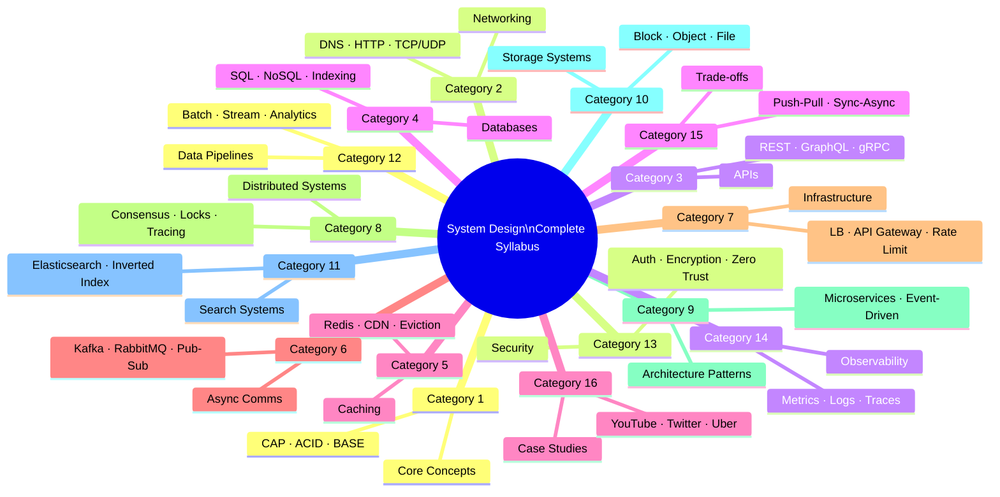

---

## Learning Path Overview

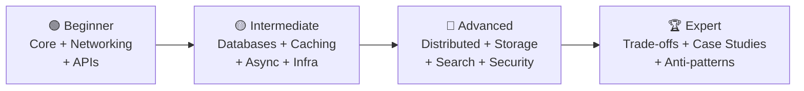

---

---

# 🟢 BEGINNER LEVEL

---

## Category 1 — Core Concepts (Start Here)

> Foundation of everything. Every interview question builds on these.

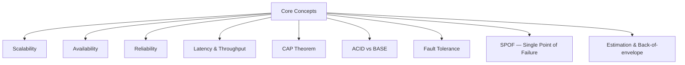

### Topics

| # | Topic | What to Learn | Priority |
|---|---|---|---|
| 1.1 | **Scalability** | Vertical vs Horizontal; scale-up vs scale-out tradeoffs | ⭐⭐⭐⭐⭐ |
| 1.2 | **Availability** | 9s (99.9%, 99.99%, 99.999%); downtime math; redundancy | ⭐⭐⭐⭐⭐ |
| 1.3 | **Reliability** | Failure modes; redundancy vs fault tolerance | ⭐⭐⭐⭐⭐ |
| 1.4 | **Latency vs Throughput vs Bandwidth** | p50/p95/p99; Little's Law; bottleneck identification | ⭐⭐⭐⭐⭐ |
| 1.5 | **CAP Theorem** | CP vs AP tradeoffs; when to sacrifice what; PACELC extension | ⭐⭐⭐⭐⭐ |
| 1.6 | **ACID vs BASE** | Atomicity, Consistency, Isolation, Durability; eventually consistent systems | ⭐⭐⭐⭐⭐ |
| 1.7 | **Fault Tolerance** | Failover, retry logic, circuit breakers, graceful degradation | ⭐⭐⭐⭐ |
| 1.8 | **SPOF** | Identifying and eliminating single points of failure in architecture | ⭐⭐⭐⭐ |
| 1.9 | **Back-of-envelope Estimation** | QPS, storage, bandwidth calculations; order-of-magnitude thinking | ⭐⭐⭐⭐⭐ |
| 1.10 | **SLA / SLO / SLI** | Error budgets; defining service objectives vs agreements | ⭐⭐⭐⭐ |

### 📌 Missing from both sources — ADD THESE:
- **PACELC Theorem** — extends CAP for latency tradeoffs (more realistic than CAP alone)
- **Failure modes taxonomy** — Byzantine faults, network partition, crash-stop, crash-recovery
- **Back-of-envelope estimation** — both sources mention it in interview prep, but it needs dedicated practice

---

## Category 2 — Networking Fundamentals

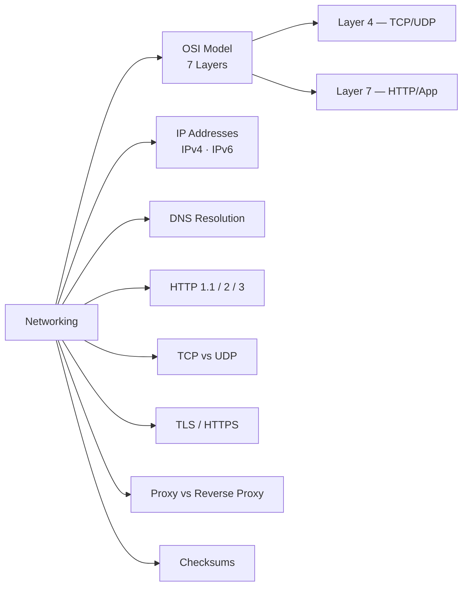

| # | Topic | What to Learn | Priority |
|---|---|---|---|
| 2.1 | **OSI Model** | 7 layers, where each protocol lives, L4 vs L7 load balancing | ⭐⭐⭐⭐ |
| 2.2 | **IP Addresses** | IPv4 vs IPv6, CIDR, private vs public IPs, NAT | ⭐⭐⭐ |
| 2.3 | **DNS** | Resolution flow, recursive vs authoritative, DNS caching, TTL | ⭐⭐⭐⭐⭐ |
| 2.4 | **HTTP/HTTPS** | Request/response lifecycle, status codes, headers, keep-alive | ⭐⭐⭐⭐⭐ |
| 2.5 | **HTTP/2 vs HTTP/3** | Multiplexing, QUIC, header compression, when to use which | ⭐⭐⭐⭐ |
| 2.6 | **TCP vs UDP** | Connection handshake, reliability, ordering; when UDP wins (video, DNS) | ⭐⭐⭐⭐⭐ |
| 2.7 | **TLS/SSL** | Handshake, certificate chain, mTLS for microservices | ⭐⭐⭐⭐ |
| 2.8 | **Proxy vs Reverse Proxy** | Forward proxy, reverse proxy, when to use Nginx/HAProxy | ⭐⭐⭐⭐ |
| 2.9 | **Checksums** | Data integrity in distributed systems, hashing for verification | ⭐⭐⭐ |

### 📌 Missing from both sources — ADD THESE:
- **TCP congestion control** — slow start, backoff; important for video streaming design
- **Long polling vs SSE vs WebSockets comparison** (GFG covers polling but not SSE)
- **QUIC protocol** — the backbone of HTTP/3 and modern CDNs
- **Network partitions in practice** — how they happen and what systems do about it

---

## Category 3 — API Fundamentals

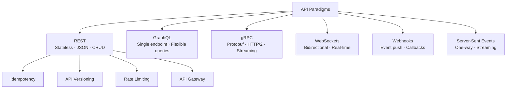

| # | Topic | What to Learn | Priority |
|---|---|---|---|
| 3.1 | **REST** | Statelessness, verbs, status codes, resource modeling, HATEOAS | ⭐⭐⭐⭐⭐ |
| 3.2 | **GraphQL** | Schema, resolvers, N+1 problem, DataLoader, subscriptions | ⭐⭐⭐⭐ |
| 3.3 | **gRPC** | Protobuf, streaming (unary, server, client, bidirectional), use cases | ⭐⭐⭐⭐ |
| 3.4 | **WebSockets** | Connection lifecycle, heartbeats, reconnection, fan-out | ⭐⭐⭐⭐⭐ |
| 3.5 | **Webhooks** | Delivery guarantees, retry logic, signature verification | ⭐⭐⭐ |
| 3.6 | **Server-Sent Events (SSE)** | One-way push, reconnection, vs WebSockets | ⭐⭐⭐ |
| 3.7 | **Idempotency** | Idempotency keys, safe vs unsafe methods, retry safety | ⭐⭐⭐⭐⭐ |
| 3.8 | **Rate Limiting** | Token bucket, leaky bucket, sliding window, fixed window | ⭐⭐⭐⭐⭐ |
| 3.9 | **API Gateway** | Auth, routing, rate limiting, request transformation, aggregation | ⭐⭐⭐⭐⭐ |
| 3.10 | **API Design Best Practices** | Versioning, pagination, error formats, backward compatibility | ⭐⭐⭐⭐ |

### 📌 Missing from both sources — ADD THESE:
- **API versioning strategies** — URI versioning vs header versioning, deprecation policies
- **Backward compatibility** — how to evolve APIs without breaking clients
- **GraphQL N+1 problem & DataLoader** — critical for any GraphQL system design
- **Long Polling vs SSE vs WebSockets** — need a dedicated comparison (GFG touches but incomplete)

---

---

# 🟡 INTERMEDIATE LEVEL

---

## Category 4 — Databases

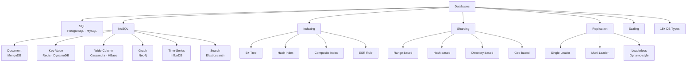

| # | Topic | What to Learn | Priority |
|---|---|---|---|
| 4.1 | **SQL vs NoSQL** | When to use which, tradeoffs, schema vs schemaless | ⭐⭐⭐⭐⭐ |
| 4.2 | **ACID Transactions** | Atomicity, isolation levels (Read Uncommitted → Serializable) | ⭐⭐⭐⭐⭐ |
| 4.3 | **Database Indexing** | B+ tree, hash index, composite index, covering index, ESR rule | ⭐⭐⭐⭐⭐ |
| 4.4 | **Database Sharding** | Range, hash, directory, geo-based; resharding challenges | ⭐⭐⭐⭐⭐ |
| 4.5 | **Data Replication** | Single-leader, multi-leader, leaderless; sync vs async | ⭐⭐⭐⭐⭐ |
| 4.6 | **Database Scaling** | Read replicas, connection pooling, CQRS, vertical/horizontal | ⭐⭐⭐⭐ |
| 4.7 | **15 Types of Databases** | Relational, document, KV, wide-column, graph, time-series, search, vector | ⭐⭐⭐⭐ |
| 4.8 | **Normalization & Denormalization** | When to normalize vs denormalize for performance | ⭐⭐⭐⭐ |
| 4.9 | **Bloom Filters** | Space-efficient membership testing; used in Cassandra, HBase | ⭐⭐⭐ |
| 4.10 | **Consistent Hashing** | Virtual nodes, ring topology, why it solves resharding | ⭐⭐⭐⭐⭐ |
| 4.11 | **Database Architectures** | Active-active, active-passive, multi-region | ⭐⭐⭐⭐ |
| 4.12 | **SQL Query Optimization** | EXPLAIN/ANALYZE, query plans, N+1, pagination strategies | ⭐⭐⭐⭐ |

### 📌 Missing from both sources — ADD THESE:
- **Isolation levels in depth** — dirty reads, phantom reads, lost updates; critical for interviews
- **MVCC (Multi-Version Concurrency Control)** — how PostgreSQL, MySQL handle concurrent writes
- **LSM Trees vs B+ Trees** — write-optimized vs read-optimized storage engines (RocksDB, LevelDB)
- **Write-Ahead Log (WAL)** — how databases achieve durability; used in PostgreSQL, Kafka
- **Two-Phase Locking (2PL)** — pessimistic vs optimistic concurrency
- **Vector databases** — for AI/recommendation system designs (Pinecone, Weaviate, pgvector)

---

## Category 5 — Caching

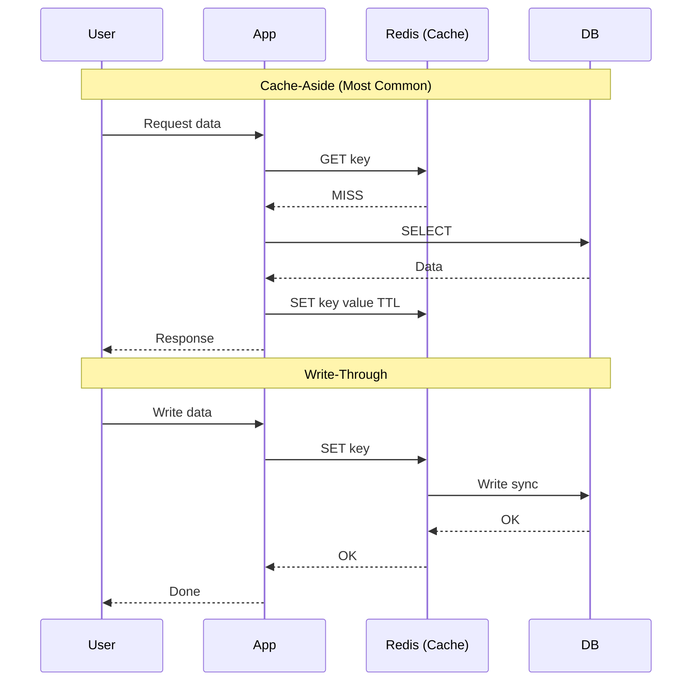

| # | Topic | What to Learn | Priority |
|---|---|---|---|
| 5.1 | **Caching 101** | Why cache, cache hit/miss ratio, cache as a layer | ⭐⭐⭐⭐⭐ |
| 5.2 | **Caching Strategies** | Cache-aside, write-through, write-back, write-around | ⭐⭐⭐⭐⭐ |
| 5.3 | **Cache Eviction Policies** | LRU, LFU, FIFO, MRU, TLRU, ARC; when to use which | ⭐⭐⭐⭐⭐ |
| 5.4 | **Distributed Caching** | Redis Cluster, Memcached, consistent hashing in cache layer | ⭐⭐⭐⭐⭐ |
| 5.5 | **CDN** | Edge caching, origin pull vs push, cache invalidation, geo-routing | ⭐⭐⭐⭐⭐ |
| 5.6 | **Cache Invalidation** | TTL, event-driven invalidation, stale-while-revalidate | ⭐⭐⭐⭐⭐ |
| 5.7 | **Cold vs Warm Cache** | Cache warming strategies, thundering herd on startup | ⭐⭐⭐⭐ |
| 5.8 | **Edge Caching** | CDN at the edge, difference from origin cache | ⭐⭐⭐ |

### 📌 Missing from both sources — ADD THESE:
- **Cache stampede / Thundering Herd** — what happens when cache expires on popular data; mutex lock, probabilistic early expiry solutions
- **Cache penetration** — requests for non-existent keys hammering the DB; bloom filter fix
- **Cache avalanche** — mass cache expiry at the same time; randomized TTL fix
- **Redis internals** — single-threaded event loop, data structures (sorted sets, streams, HyperLogLog), persistence (RDB vs AOF)
- **Read-Through vs Write-Through vs Write-Back** as distinct strategies with code-level understanding

---

## Category 6 — Asynchronous Communication

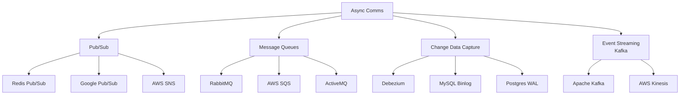

| # | Topic | What to Learn | Priority |
|---|---|---|---|
| 6.1 | **Message Queues** | FIFO, delivery guarantees (at-most, at-least, exactly-once), DLQ | ⭐⭐⭐⭐⭐ |
| 6.2 | **Pub/Sub Pattern** | Topics vs queues, fan-out, decoupling producers/consumers | ⭐⭐⭐⭐⭐ |
| 6.3 | **Apache Kafka** | Topics, partitions, consumer groups, offsets, retention, compaction | ⭐⭐⭐⭐⭐ |
| 6.4 | **RabbitMQ** | Exchanges, routing keys, bindings, AMQP; vs Kafka | ⭐⭐⭐⭐ |
| 6.5 | **Change Data Capture (CDC)** | Debezium, WAL tailing, binlog streaming; outbox pattern | ⭐⭐⭐⭐ |
| 6.6 | **Exactly-once delivery** | Idempotent consumers, transactional outbox, saga | ⭐⭐⭐⭐ |
| 6.7 | **Batch vs Stream Processing** | When to batch vs stream; micro-batching (Spark Streaming) | ⭐⭐⭐⭐ |

### 📌 Missing from both sources — ADD THESE:
- **Outbox Pattern** — transactional messaging without 2PC; critical for microservices
- **Dead Letter Queue (DLQ)** — handling poison pill messages
- **Kafka internals** — segment files, page cache, zero-copy, ISR (in-sync replicas)
- **Ordering guarantees** — Kafka partition-level ordering vs global ordering
- **Backpressure** — what happens when consumers are slower than producers

---

## Category 7 — Infrastructure & Load Balancing

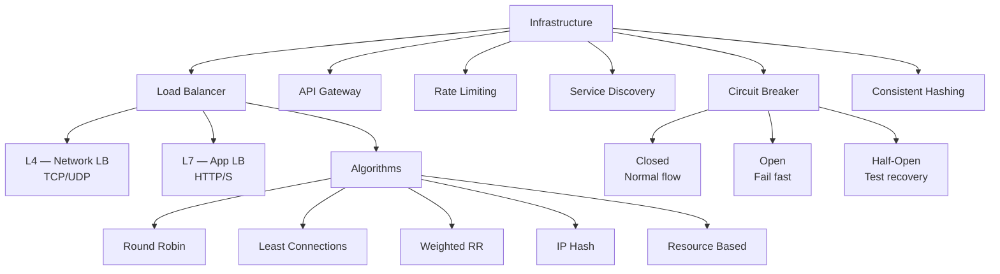

| # | Topic | What to Learn | Priority |
|---|---|---|---|
| 7.1 | **Load Balancer** | L4 vs L7, hardware vs software, sticky sessions | ⭐⭐⭐⭐⭐ |
| 7.2 | **Load Balancing Algorithms** | Round robin, least connections, weighted, IP hash, resource-based | ⭐⭐⭐⭐⭐ |
| 7.3 | **API Gateway** | Auth, SSL termination, routing, transformation, aggregation, tracing | ⭐⭐⭐⭐⭐ |
| 7.4 | **Rate Limiting** | Token bucket, leaky bucket, fixed window, sliding window log | ⭐⭐⭐⭐⭐ |
| 7.5 | **Service Discovery** | Client-side (Eureka), server-side (Consul), DNS-based | ⭐⭐⭐⭐ |
| 7.6 | **Circuit Breaker** | Closed/Open/Half-open states, Hystrix, Resilience4j | ⭐⭐⭐⭐⭐ |
| 7.7 | **Consistent Hashing** | Ring hashing, virtual nodes, why it minimizes remapping | ⭐⭐⭐⭐⭐ |
| 7.8 | **Stateless vs Stateful LB** | Session affinity, cookie-based stickiness | ⭐⭐⭐⭐ |
| 7.9 | **LB vs Failover** | Active-passive vs active-active failover | ⭐⭐⭐⭐ |

---

---

# 🔴 ADVANCED LEVEL

---

## Category 8 — Distributed Systems

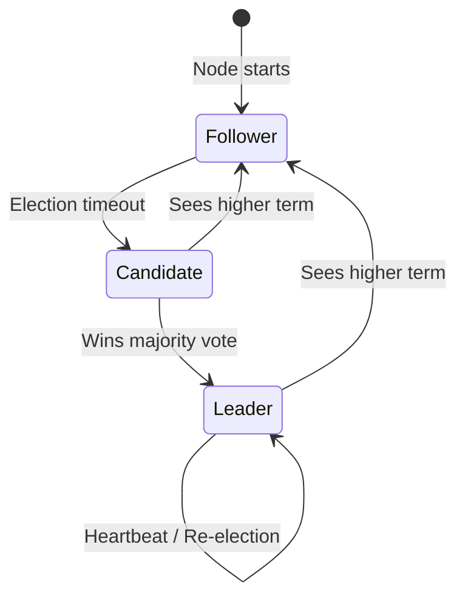

| # | Topic | What to Learn | Priority |
|---|---|---|---|
| 8.1 | **Consensus Algorithms** | Paxos (concept), Raft (detailed — leader election, log replication) | ⭐⭐⭐⭐⭐ |
| 8.2 | **Distributed Locking** | Redis Redlock, ZooKeeper, fencing tokens; when locks fail | ⭐⭐⭐⭐ |
| 8.3 | **Gossip Protocol** | Epidemic broadcast, failure detection, used in Cassandra, DynamoDB | ⭐⭐⭐⭐ |
| 8.4 | **Heartbeats** | Health detection, timeout tuning, split-brain prevention | ⭐⭐⭐⭐ |
| 8.5 | **Distributed Tracing** | Trace IDs, spans, Jaeger, Zipkin, OpenTelemetry | ⭐⭐⭐⭐ |
| 8.6 | **Distributed Transactions** | 2PC (Two-Phase Commit), 3PC; why they're problematic | ⭐⭐⭐⭐⭐ |
| 8.7 | **Saga Pattern** | Choreography vs orchestration; compensating transactions | ⭐⭐⭐⭐⭐ |
| 8.8 | **Disaster Recovery** | RTO vs RPO, backup strategies, multi-region failover | ⭐⭐⭐⭐ |
| 8.9 | **Vector Clocks & Lamport Timestamps** | Ordering events without a global clock | ⭐⭐⭐ |
| 8.10 | **Conflict Resolution** | Last-write-wins, CRDTs, version vectors (DynamoDB, Riak) | ⭐⭐⭐⭐ |

### 📌 Missing from both sources — ADD THESE:
- **CRDTs (Conflict-free Replicated Data Types)** — real-time collaborative editing (Google Docs), used in distributed systems
- **Fencing tokens** — preventing split-brain when distributed locks expire
- **Clock skew & NTP** — why global timestamps are unreliable; Google TrueTime, HLC
- **Split-brain problem** — what happens when a network partition heals

---

## Category 9 — Architectural Patterns

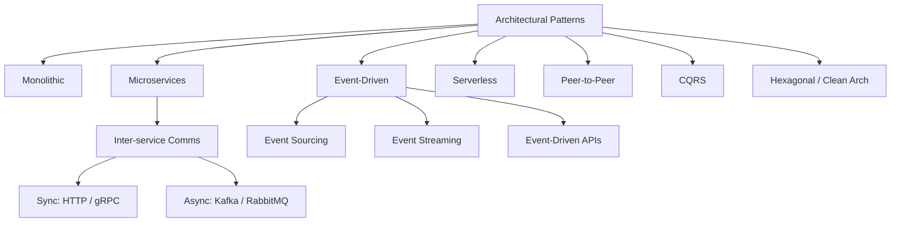

| # | Topic | What to Learn | Priority |
|---|---|---|---|
| 9.1 | **Monolithic Architecture** | When it works, limitations, strangler fig migration | ⭐⭐⭐⭐ |
| 9.2 | **Microservices** | Decomposition strategies, DDD, bounded contexts, API contracts | ⭐⭐⭐⭐⭐ |
| 9.3 | **Event-Driven Architecture** | Events vs commands vs queries; CQRS + event sourcing combo | ⭐⭐⭐⭐⭐ |
| 9.4 | **Event Sourcing** | Append-only event log, replay, projections; vs CRUD | ⭐⭐⭐⭐ |
| 9.5 | **Serverless** | FaaS (Lambda), cold starts, stateless design, use cases | ⭐⭐⭐ |
| 9.6 | **CQRS** | Separating read and write models; event sourcing integration | ⭐⭐⭐⭐ |
| 9.7 | **Pub/Sub Architecture** | Fan-out patterns, topic modeling | ⭐⭐⭐⭐ |
| 9.8 | **Stateful vs Stateless Architecture** | Session handling, JWT, sticky sessions | ⭐⭐⭐⭐ |
| 9.9 | **P2P Architecture** | BitTorrent, WebRTC, DHT; decentralized design | ⭐⭐⭐ |

### 📌 Missing from both sources — ADD THESE:
- **Strangler Fig Pattern** — migrating monolith to microservices incrementally
- **BFF (Backend for Frontend)** — separate backends per client type (mobile, web)
- **Service Mesh** — Istio, Linkerd; sidecar proxy, mTLS between services
- **API Composition** — aggregating data across microservices without a single DB join

---

## Category 10 — Storage Systems ⚠️ (Mostly Missing from Both Sources)

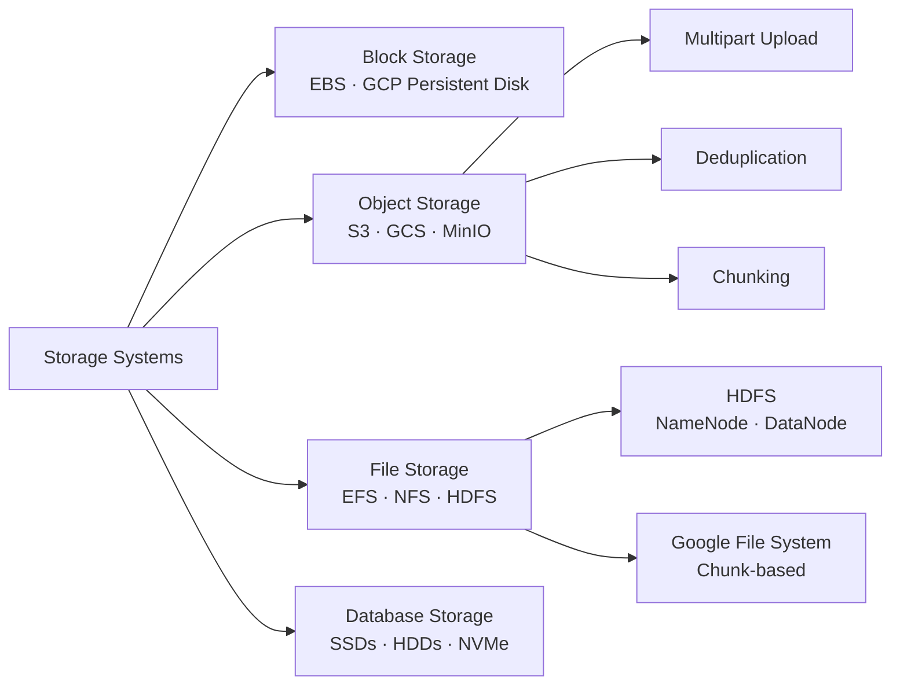

| # | Topic | What to Learn | Priority |
|---|---|---|---|
| 10.1 | **Block Storage** | EBS, volumes, snapshots; used for databases | ⭐⭐⭐⭐ |
| 10.2 | **Object Storage** | S3, GCS; blobs, metadata, versioning, multipart upload | ⭐⭐⭐⭐⭐ |
| 10.3 | **File Storage** | NFS, EFS; shared filesystem use cases | ⭐⭐⭐ |
| 10.4 | **HDFS** | NameNode, DataNode, rack awareness, replication factor 3 | ⭐⭐⭐⭐ |
| 10.5 | **Chunking & Deduplication** | How Dropbox/Drive splits files; hash-based dedup | ⭐⭐⭐⭐⭐ |
| 10.6 | **Content Addressing** | CAS (content-addressed storage), SHA hashes as file identifiers | ⭐⭐⭐ |

> **Why this matters:** You cannot design Google Drive, Dropbox, YouTube, or any file-heavy system without understanding storage internals.

---

## Category 11 — Search Systems ⚠️ (Missing from Both Sources)

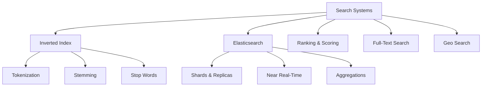

| # | Topic | What to Learn | Priority |
|---|---|---|---|
| 11.1 | **Inverted Index** | How search engines index text; term → document mapping | ⭐⭐⭐⭐⭐ |
| 11.2 | **Elasticsearch** | Shards, replicas, mapping, query DSL, near-real-time indexing | ⭐⭐⭐⭐⭐ |
| 11.3 | **Full-Text Search** | Tokenization, stemming, stop words, TF-IDF, BM25 | ⭐⭐⭐⭐ |
| 11.4 | **Search Ranking** | TF-IDF, BM25, learning to rank; relevance tuning | ⭐⭐⭐⭐ |
| 11.5 | **Geo-spatial Search** | Geohash, QuadTree, R-Tree; used in Uber, food delivery | ⭐⭐⭐⭐⭐ |
| 11.6 | **Type-ahead / Autocomplete** | Trie data structure, prefix search, fuzzy matching | ⭐⭐⭐⭐⭐ |

> **Why this matters:** Twitter search, Yelp, Uber driver matching, YouTube search, Amazon product search all need these.

---

## Category 12 — Data Pipelines & Analytics ⚠️ (Missing from Both Sources)

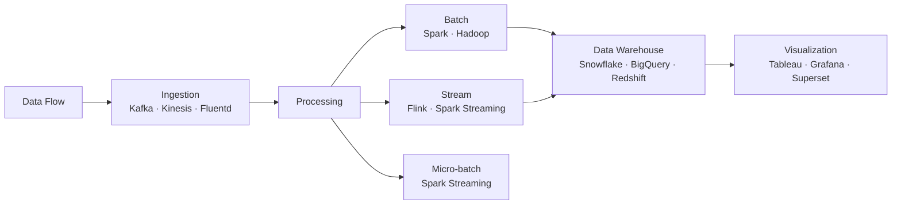

| # | Topic | What to Learn | Priority |
|---|---|---|---|
| 12.1 | **Batch vs Stream Processing** | MapReduce, when to batch vs stream | ⭐⭐⭐⭐ |
| 12.2 | **Apache Spark** | RDDs, DataFrames, batch jobs, in-memory processing | ⭐⭐⭐ |
| 12.3 | **Apache Flink** | True streaming, event time vs processing time, watermarks | ⭐⭐⭐ |
| 12.4 | **Data Warehouse** | OLAP vs OLTP; star schema, fact/dimension tables; BigQuery | ⭐⭐⭐⭐ |
| 12.5 | **Lambda Architecture** | Batch layer + speed layer + serving layer | ⭐⭐⭐⭐ |
| 12.6 | **Kappa Architecture** | Stream-only approach; simplification of Lambda | ⭐⭐⭐ |
| 12.7 | **ETL vs ELT** | Extract-Transform-Load vs load-then-transform; data lakes | ⭐⭐⭐ |

> **Why this matters:** YouTube analytics, Instagram insights, Uber trip data, Netflix recommendations all need data pipelines.

---

## Category 13 — Security ⚠️ (Partially Missing)

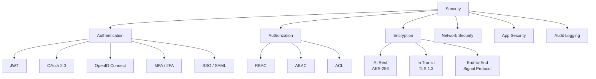

| # | Topic | What to Learn | Priority |
|---|---|---|---|
| 13.1 | **Authentication** | JWT, OAuth 2.0, OpenID Connect, session vs token | ⭐⭐⭐⭐⭐ |
| 13.2 | **Authorization** | RBAC, ABAC, ACL; policy engines (OPA) | ⭐⭐⭐⭐⭐ |
| 13.3 | **OAuth 2.0 Flows** | Auth code, implicit, client credentials, PKCE | ⭐⭐⭐⭐⭐ |
| 13.4 | **Encryption at Rest** | AES-256, envelope encryption, KMS | ⭐⭐⭐⭐ |
| 13.5 | **Encryption in Transit** | TLS 1.3, mTLS between microservices, certificate pinning | ⭐⭐⭐⭐ |
| 13.6 | **End-to-End Encryption** | Signal protocol, key exchange; used in WhatsApp, iMessage | ⭐⭐⭐⭐ |
| 13.7 | **API Security** | OWASP Top 10, injection, CSRF, XSS, CORS, API key vs JWT | ⭐⭐⭐⭐⭐ |
| 13.8 | **Zero Trust Architecture** | Never trust, always verify; used in modern enterprise systems | ⭐⭐⭐ |
| 13.9 | **Secret Management** | Vault, AWS Secrets Manager; never hardcode secrets | ⭐⭐⭐⭐ |
| 13.10 | **SSDLC** | Shift-left security, threat modeling, pen testing | ⭐⭐⭐ |
| 13.11 | **Data Backup & Disaster Recovery** | RTO vs RPO, backup strategies, multi-region replication | ⭐⭐⭐⭐ |

---

## Category 14 — Observability & Reliability

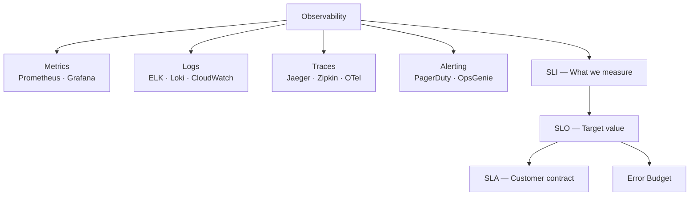

| # | Topic | What to Learn | Priority |
|---|---|---|---|
| 14.1 | **Metrics** | Counter, gauge, histogram; Prometheus + Grafana; RED method | ⭐⭐⭐⭐⭐ |
| 14.2 | **Logging** | Structured logging, log aggregation (ELK), log levels | ⭐⭐⭐⭐ |
| 14.3 | **Distributed Tracing** | Trace + span, context propagation, OpenTelemetry | ⭐⭐⭐⭐ |
| 14.4 | **SLI / SLO / SLA** | Defining objectives, error budgets, alerting thresholds | ⭐⭐⭐⭐⭐ |
| 14.5 | **Alerting** | Alert fatigue, severity levels, on-call runbooks | ⭐⭐⭐⭐ |
| 14.6 | **Health Checks** | Liveness vs readiness probes (Kubernetes), deep vs shallow checks | ⭐⭐⭐⭐ |

---

## Category 15 — System Design Trade-offs

```mermaid
quadrantChart
    title System Design Trade-off Map
    x-axis Low Consistency --> High Consistency
    y-axis Low Availability --> High Availability
    quadrant-1 CP Systems
    quadrant-2 Ideal (Impossible)
    quadrant-3 Neither
    quadrant-4 AP Systems
    PostgreSQL: [0.8, 0.4]
    Cassandra: [0.3, 0.9]
    DynamoDB: [0.4, 0.85]
    ZooKeeper: [0.9, 0.3]
    Redis: [0.6, 0.7]
```

| # | Trade-off | Option A | Option B | When to choose |
|---|---|---|---|---|
| 15.1 | **Vertical vs Horizontal Scaling** | More RAM/CPU | More servers | Horizontal for stateless services |
| 15.2 | **SQL vs NoSQL** | Strong consistency | High scale/flexibility | SQL for relational; NoSQL for scale |
| 15.3 | **Sync vs Async** | Immediate response | Higher throughput | Async for write-heavy, decoupled systems |
| 15.4 | **Push vs Pull** | Server pushes to client | Client polls server | Push for real-time; Pull for periodic |
| 15.5 | **Strong vs Eventual Consistency** | Always correct data | Higher availability | Eventual for most social apps |
| 15.6 | **Normalization vs Denormalization** | Less data redundancy | Faster reads | Denormalize for read-heavy |
| 15.7 | **Monolith vs Microservices** | Simpler ops | Independent scaling | Start monolith; split when needed |
| 15.8 | **REST vs gRPC** | Universal clients | Speed / streaming | gRPC for internal; REST for public APIs |
| 15.9 | **Long Polling vs WebSockets vs SSE** | Simple | Real-time duplex | WS for chat; SSE for one-way feeds |
| 15.10 | **Batch vs Stream Processing** | High throughput | Low latency | Stream for real-time dashboards |
| 15.11 | **Read-Through vs Write-Through Cache** | Lazy load | Always fresh | Write-through for financial data |
| 15.12 | **Concurrency vs Parallelism** | Interleaving tasks | Truly simultaneous | Parallelism for CPU-bound |

---

---

# 🏆 EXPERT LEVEL — Case Studies

---

## Category 16 — Real System Design Case Studies

```mermaid
graph TD
    CASE[Case Studies] --> SOCIAL[Social / Media]
    CASE --> COMM[Communication]
    CASE --> TRANS[Transport / Maps]
    CASE --> STORE[Storage / Files]
    CASE --> ECOMM[E-commerce]
    CASE --> INFRA_CS[Infrastructure Tools]
    CASE --> STREAM_CS[Video Streaming]

    SOCIAL --> TWITTER[Twitter / X\nFeed, Follow, Search]
    SOCIAL --> INSTA[Instagram\nFeed, Stories, Reels]
    SOCIAL --> FB[Facebook\nNews Feed, Groups]

    COMM --> WA[WhatsApp\nChat, E2E Encryption]
    COMM --> SLACK[Slack\nWorkspace Messaging]
    COMM --> ZOOM[Zoom\nVideo Conferencing]

    TRANS --> UBER[Uber\nMatching, Geo, Pricing]
    TRANS --> GMAPS[Google Maps\nRouting, ETA]

    STORE --> GDRIVE[Google Drive\nFile Storage, Sync]
    STORE --> DROPBOX[Dropbox\nChunking, Dedup]
    STORE --> S3[Amazon S3\nObject Storage]

    ECOMM --> AMAZON[Amazon\nSearch, Cart, Orders]
    ECOMM --> FLASH[Flash Sale System\nInventory, Queuing]

    INFRA_CS --> RL[Rate Limiter]
    INFRA_CS --> NOTIF[Notification System]
    INFRA_CS --> URLS[URL Shortener]
    INFRA_CS --> TSDB[Time-Series DB]
    INFRA_CS --> WC[Web Crawler]
    INFRA_CS --> SC[Search Autocomplete]

    STREAM_CS --> YT[YouTube / Netflix\nUpload, Transcode, CDN]
    STREAM_CS --> TWITCH[Twitch\nLive Streaming]
```

### Case Study Checklist

| System | Key Concepts Tested | Difficulty |
|---|---|---|
| **URL Shortener** | Hashing, redirection, analytics | 🟢 Beginner |
| **Rate Limiter** | Token bucket, sliding window, distributed | 🟢 Beginner |
| **Notification System** | Fan-out, push/pull, deduplication, retries | 🟡 Medium |
| **Web Crawler** | BFS, politeness, deduplication, distributed | 🟡 Medium |
| **Twitter / X** | Feed generation (fan-out), search, celebrity problem | 🔴 Hard |
| **Instagram** | Feed, stories, reels, CDN, media upload | 🔴 Hard |
| **YouTube** | Upload pipeline, transcoding, adaptive bitrate, CDN | 🔴 Hard |
| **WhatsApp** | WebSockets at scale, E2E encryption, presence | 🔴 Hard |
| **Google Drive** | Chunking, dedup, sync, conflict resolution | 🔴 Hard |
| **Uber** | Geo-indexing, driver matching, surge pricing, ETA | 🔴 Hard |
| **Google Maps** | Graph routing (Dijkstra/A*), tile system, ETA | 🔴 Hard |
| **Amazon Search** | Inverted index, ranking, faceted search, A/B testing | 🔴 Hard |
| **Ticketmaster** | Distributed locking, inventory, queue for flash sales | 🔴 Hard |
| **Zoom / Video Call** | WebRTC, SFU vs MCU, codec, packet loss recovery | ⚫ Expert |

---

## Category 17 — Anti-Patterns ⚠️ (Missing from Both Sources)

> Knowing what NOT to do is as important as knowing what to do.

| Anti-Pattern | Why It's Bad | What to Do Instead |
|---|---|---|
| **N+1 Query Problem** | 1 query per row → DB overload | Batch queries, DataLoader, JOINs |
| **Synchronous everything** | One slow service blocks all | Async messaging, circuit breakers |
| **Single DB for everything** | Bottleneck + SPOF | Read replicas, CQRS, polyglot persistence |
| **No idempotency** | Duplicate operations on retry | Idempotency keys, deduplication layer |
| **No pagination** | Returning entire datasets | Cursor-based or offset pagination |
| **Direct DB calls from all services** | Coupling + no abstraction | Repository pattern, data access layer |
| **Cascading failures** | One service down → all down | Circuit breakers, bulkheads, timeouts |
| **No schema evolution plan** | Breaking changes on deploy | Versioned APIs, backward-compatible schema changes |
| **Premature microservices** | Distributed monolith | Start monolith, extract when pain is real |
| **No distributed tracing** | Impossible to debug in prod | OpenTelemetry from day one |
| **Global cache invalidation** | Cache stampede / avalanche | TTL jitter, event-driven invalidation |

---

## Category 18 — Multi-Region & Geo-Distributed Design ⚠️ (Missing)

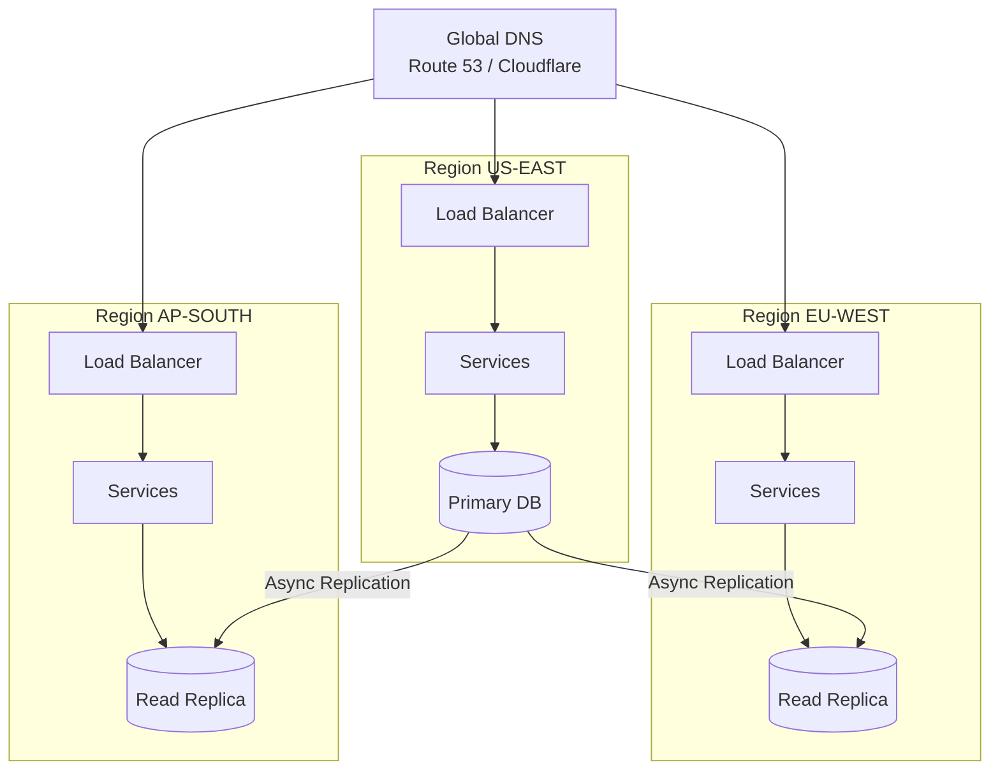

| # | Topic | What to Learn |
|---|---|---|
| 18.1 | **Multi-region architecture** | Active-active vs active-passive, region failover |
| 18.2 | **Global load balancing** | GeoDNS, Anycast routing, latency-based routing |
| 18.3 | **Data sovereignty** | GDPR, data residency requirements |
| 18.4 | **Conflict resolution at scale** | Last-write-wins, CRDTs, user-region pinning |
| 18.5 | **Global CDN strategy** | Push vs pull CDN, cache invalidation across regions |

---

---

# 📁 Recommended GitHub Folder Structure

```
system-design/
├── README.md                          ← This syllabus
│
├── 01-core-concepts/
│   ├── scalability.md
│   ├── availability-reliability.md
│   ├── cap-theorem.md
│   ├── pacelc-theorem.md              ← ⚠️ Missing from both sources
│   ├── acid-vs-base.md
│   ├── fault-tolerance-spof.md
│   ├── sla-slo-sli-error-budget.md
│   └── estimation-cheatsheet.md
│
├── 02-networking/
│   ├── osi-model.md
│   ├── ip-dns.md
│   ├── http-https-http2-http3.md
│   ├── tcp-vs-udp.md
│   ├── tls-ssl-mtls.md
│   ├── proxy-reverse-proxy.md
│   └── long-polling-sse-websockets.md ← ⚠️ Comparison missing
│
├── 03-apis/
│   ├── rest-design.md
│   ├── graphql.md
│   ├── grpc.md
│   ├── websockets.md
│   ├── webhooks-sse.md
│   ├── idempotency.md
│   ├── rate-limiting.md
│   ├── api-gateway.md
│   └── api-versioning.md              ← ⚠️ Missing from both sources
│
├── 04-databases/
│   ├── sql-vs-nosql.md
│   ├── acid-isolation-levels.md       ← ⚠️ Isolation levels missing
│   ├── mvcc.md                        ← ⚠️ Missing
│   ├── indexing-deep-dive.md
│   ├── sharding.md
│   ├── replication.md
│   ├── consistent-hashing.md
│   ├── bloom-filters.md
│   ├── lsm-tree-vs-btree.md           ← ⚠️ Missing
│   ├── write-ahead-log.md             ← ⚠️ Missing
│   └── vector-databases.md            ← ⚠️ Missing (AI era)
│
├── 05-caching/
│   ├── caching-strategies.md
│   ├── eviction-policies.md
│   ├── redis-internals.md             ← ⚠️ Missing
│   ├── cache-stampede-penetration-avalanche.md  ← ⚠️ Missing
│   ├── distributed-caching.md
│   └── cdn.md
│
├── 06-async-messaging/
│   ├── kafka-architecture.md
│   ├── rabbitmq.md
│   ├── pub-sub.md
│   ├── cdc-outbox-pattern.md          ← ⚠️ Outbox missing
│   ├── exactly-once-delivery.md
│   └── backpressure.md                ← ⚠️ Missing
│
├── 07-infrastructure/
│   ├── load-balancing.md
│   ├── api-gateway.md
│   ├── rate-limiting-algorithms.md
│   ├── service-discovery.md
│   ├── circuit-breaker.md
│   └── service-mesh.md                ← ⚠️ Missing
│
├── 08-distributed-systems/
│   ├── consensus-raft-paxos.md
│   ├── distributed-locking.md
│   ├── gossip-protocol.md
│   ├── distributed-tracing.md
│   ├── saga-pattern.md
│   ├── two-phase-commit.md
│   ├── crdts.md                       ← ⚠️ Missing
│   ├── vector-clocks.md               ← ⚠️ Missing
│   └── disaster-recovery.md
│
├── 09-architecture-patterns/
│   ├── monolith-vs-microservices.md
│   ├── event-driven-architecture.md
│   ├── event-sourcing.md
│   ├── cqrs.md
│   ├── serverless.md
│   ├── bff-pattern.md                 ← ⚠️ Missing
│   └── strangler-fig.md               ← ⚠️ Missing
│
├── 10-storage-systems/
│   ├── block-vs-object-vs-file.md     ← ⚠️ Mostly missing
│   ├── hdfs.md
│   ├── object-storage-s3.md
│   └── chunking-deduplication.md
│
├── 11-search-systems/
│   ├── inverted-index.md              ← ⚠️ Fully missing
│   ├── elasticsearch.md
│   ├── full-text-search.md
│   ├── geospatial-search.md
│   └── autocomplete-typeahead.md
│
├── 12-data-pipelines/
│   ├── batch-vs-stream.md
│   ├── lambda-kappa-architecture.md   ← ⚠️ Missing
│   ├── data-warehouse-olap.md
│   └── etl-vs-elt.md
│
├── 13-security/
│   ├── authentication-jwt-oauth.md
│   ├── authorization-rbac-abac.md
│   ├── encryption-at-rest-transit.md
│   ├── e2e-encryption.md
│   ├── api-security-owasp.md
│   ├── zero-trust.md                  ← ⚠️ Missing
│   └── secret-management.md           ← ⚠️ Missing
│
├── 14-observability/
│   ├── metrics-prometheus-grafana.md
│   ├── logging-elk.md
│   ├── distributed-tracing-otel.md
│   └── sla-slo-sli.md
│
├── 15-tradeoffs/
│   ├── top-15-tradeoffs.md
│   ├── scaling-tradeoffs.md
│   ├── consistency-tradeoffs.md
│   └── sync-vs-async-tradeoffs.md
│
├── 16-anti-patterns/
│   └── system-design-anti-patterns.md ← ⚠️ Fully missing
│
├── 17-multi-region/
│   └── geo-distributed-design.md      ← ⚠️ Fully missing
│
└── 18-case-studies/
    ├── url-shortener.md
    ├── rate-limiter.md
    ├── notification-system.md
    ├── web-crawler.md
    ├── twitter-x.md
    ├── instagram.md
    ├── youtube-netflix.md
    ├── whatsapp.md
    ├── google-drive-dropbox.md
    ├── uber-lyft.md
    ├── google-maps.md
    ├── amazon-search.md
    ├── ticketmaster.md
    └── zoom-video-call.md
```

---

# 📊 Coverage Analysis — GFG + AlgoMaster

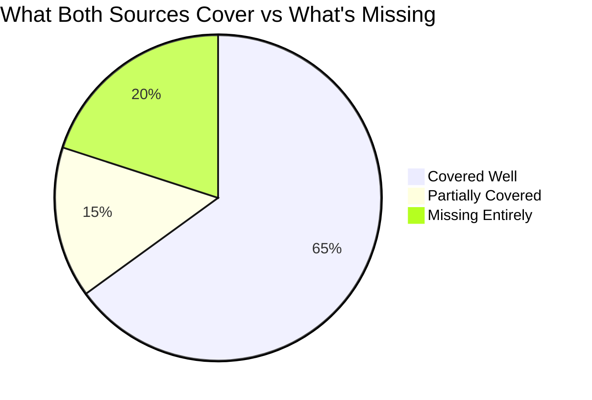

| Area | GFG | AlgoMaster | Gap |
|---|---|---|---|
| Core Concepts | ✅ Good | ✅ Good | PACELC, failure taxonomy |
| Networking | ✅ Good | ✅ Good | QUIC, TCP congestion |
| APIs | ✅ Good | ✅ Good | API versioning, N+1/DataLoader |
| Databases | ✅ Good | ✅ Good | Isolation levels, MVCC, LSM trees |
| Caching | ✅ Good | ✅ Good | Cache stampede, Redis internals |
| Async / Messaging | ✅ Good | ✅ Good | Outbox pattern, backpressure |
| Infrastructure | ✅ Good | ✅ Good | Service mesh |
| Distributed Systems | ✅ Partial | ✅ Good | CRDTs, vector clocks |
| Architecture Patterns | ✅ Good | ✅ Good | BFF, strangler fig |
| **Storage Systems** | ⚠️ Partial | ❌ Missing | Chunking, HDFS, object storage |
| **Search Systems** | ❌ Missing | ❌ Missing | Full category missing |
| **Data Pipelines** | ❌ Missing | ❌ Missing | Lambda/Kappa arch missing |
| Security | ✅ Partial | ❌ Missing | Zero trust, E2E enc, secret mgmt |
| Observability | ✅ Good | ✅ Partial | OpenTelemetry |
| Trade-offs | ✅ Good | ✅ Good | Covered well |
| **Anti-patterns** | ❌ Missing | ❌ Missing | Full category missing |
| **Multi-region Design** | ❌ Missing | ❌ Missing | Full category missing |
| Case Studies | ✅ Good | ✅ Good | Need Ticketmaster, Zoom |

---

# ✅ Final Answer: Can You Build YouTube/Instagram After This?

```mermaid
flowchart TD
    A{Learn all\n18 categories?} -->|Yes| B[Can you design\nYouTube?]
    B -->|Core upload pipeline| C[✅ Object Storage + Chunking]
    B -->|Video transcoding| D[✅ Async Queue + Worker Fleet]
    B -->|CDN delivery| E[✅ CDN + Adaptive Bitrate]
    B -->|Search| F[✅ Inverted Index + Elasticsearch]
    B -->|Recommendations| G[✅ Data Pipeline + ML Pipeline]
    B -->|Comments + Likes| H[✅ SQL + Caching + Redis]
    B -->|Live streaming| I[✅ WebRTC + SFU + Kafka]
    B -->|Analytics| J[✅ Kafka + Flink + BigQuery]

    C & D & E & F & G & H & I & J --> RESULT[🏆 Yes — You Can Design It]
```

**Yes — if you complete all 18 categories, you will be able to:**

- Design any system asked in a FAANG/startup interview
- Identify bottlenecks, propose trade-offs, and justify decisions
- Build YouTube, Instagram, WhatsApp, Uber, Google Drive from scratch on a whiteboard
- Understand why each architectural decision was made in real production systems

The two sources (GFG + AlgoMaster) give you ~80%. The missing 20% — storage internals, search systems, data pipelines, anti-patterns, multi-region design — is what elevates you from "knows the concepts" to "thinks like a systems architect."

---

*Total topics: 180+ | Estimated study time: 10–14 weeks at 2 hrs/day | Priority: ⭐⭐⭐⭐⭐ topics first*
