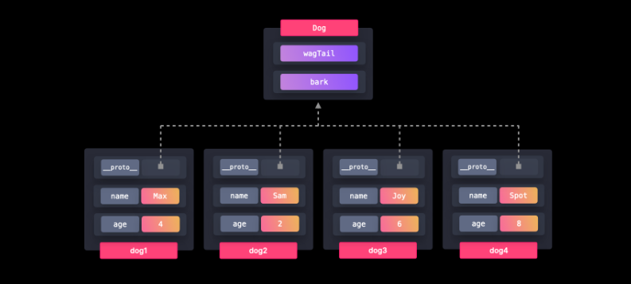

## Prototype Design Pattern

- If we want to share properties among many objects of the same type, we can use the Prototype pattern.



- PDP nothing but, it's used to create objects based on the (Copying) existing object(the protorype) as blueprint instead of building them fro scratch
- in JS, evey object can inherit from other object(prototype) and we can use this feature to create new objects with same proeprties and behaviour as the prototype.

```js
const animal = {
  speak() {
    console.log(`${this.name} makes a sound.`);
  },
};

// Create a new object based on the prototype
const dog = Object.create(animal);
dog.name = "Dog";
dog.speak(); // Dog makes a sound.
```

- Here, dog is created from the animal prototype, and it inherits the speak method. This is the essence of the Prototype Design Pattern.

- Example 2

- You want to create multiple Person objects with similar properties and methods, but you don't want to define those properties and methods repeatedly.

```js
// Step 1: Create a Prototype Object
const personPrototype = {
  greet() {
    return `Hi, my name is ${this.name} and I am ${this.age} years old.`;
  },
};

// Step 2: Create New Objects Based on the Prototype
const person1 = Object.create(personPrototype);
person1.name = "John";
person1.age = 30;
console.log(person1.greet()); // Output: "Hi, my name is John and I am 30 years old."

const person2 = Object.create(personPrototype);
person2.name = "Jane";
person2.age = 25;
console.log(person2.greet()); // Output: "Hi, my name is Jane and I am 25 years old."
```

1.Prototype Creation:

- The personPrototype object acts as the template. It contains a greet method.

2. Object Cloning:

- New objects (person1 and person2) are created using Object.create(personPrototype). They inherit the greet method.

3. Customization:

- Specific properties like name and age are added directly to the new objects.

4. Usage:

- Each object can use the greet method inherited from the prototype and customize its behavior with its own properties.

**Example: Using Classes to Implement the Prototype Pattern**

Scenario:

- You want to create multiple Animal objects with shared behavior (speak method), while each instance has unique properties like name and type.

```js
// Step 1: Define a Class
class Animal {
  constructor(name, type) {
    this.name = name;
    this.type = type;
  }

  // Method shared via the prototype
  speak() {
    return `${this.name} says: I am a ${this.type}.`;
  }
}

// Step 2: Create Instances
const dog = new Animal("Buddy", "Dog");
console.log(dog.speak()); // Output: "Buddy says: I am a Dog."

const cat = new Animal("Whiskers", "Cat");
console.log(cat.speak()); // Output: "Whiskers says: I am a Cat."
```

**Example: Creating a Prototype Object with Constructor Functions**
Scenario:

- We will create multiple Book objects, where each object has its own title and author, but all instances share a getDetails method.

```js
// Step 1: Define a Constructor Function
function Book(title, author) {
  this.title = title;
  this.author = author;
}

// Step 2: Add Methods to the Prototype
Book.prototype.getDetails = function () {
  return `${this.title} by ${this.author}`;
};

// Step 3: Create Instances Using the Constructor
const book1 = new Book("The Alchemist", "Paulo Coelho");
console.log(book1.getDetails()); // Output: "The Alchemist by Paulo Coelho"

const book2 = new Book("1984", "George Orwell");
console.log(book2.getDetails()); // Output: "1984 by George Orwell"
```
