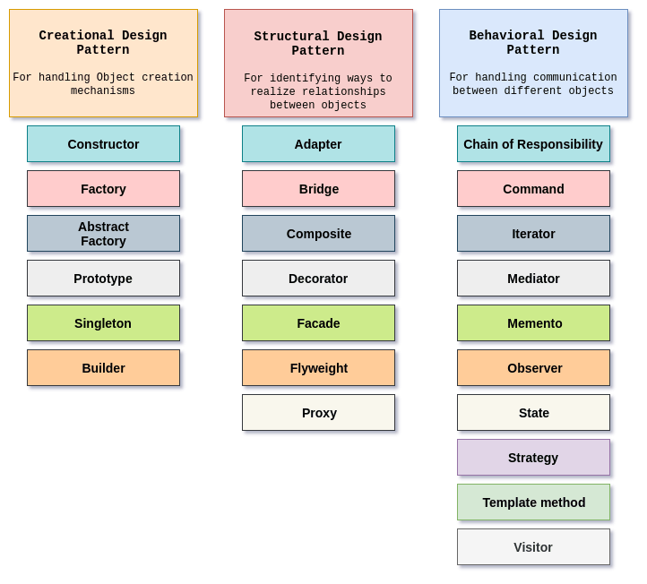

## Design patterns

- **Abstract Class or Interface:** A blueprint that defines the structure or contract but doesn't provide implementation.

- Design patterns are typical solutions to common problems in software design. Each pattern is like a blueprint that you can customize to solve a particular
  design problem in your code.

- A design pattern is a generic repeatable solution to a frequently occurring problem in software design that is used in software engineering.

- There are total 3 types of design patterns

1. Creational
2. Structural
3. Behavioural

