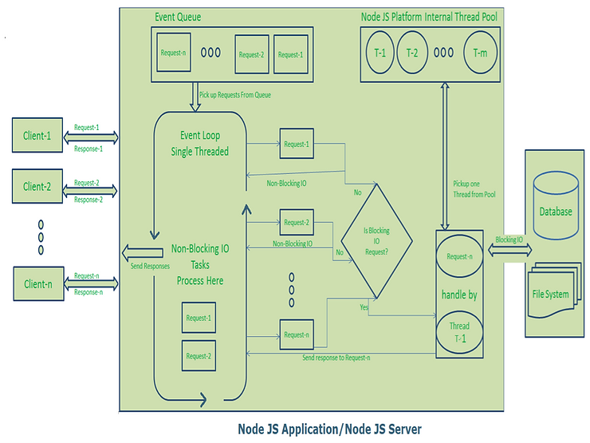

## Node js


```js
const path = require('path')

console.log(__dirname);
console.log(__filename);

console.log(`the path name is ${path.basename(__filename)}`);
```


**Understanding core modules**


----------------------


**If node js single threaded then, how it handles the multiple requests or concurrent requests?**



- From above image, follow the points.

## Single Threaded Event Loop Model Processing Steps

1. **Clients Send Requests to Web Server**
   - Clients send their requests to the Node.js web server.

2. **Thread Pool Maintenance**
   - The Node.js web server internally maintains a limited thread pool to handle specific operations, particularly those involving blocking I/O.

3. **Requests Added to Event Queue**
   - The Node.js web server receives incoming requests and places them into a queue called the "Event Queue."

4. **Event Loop Overview**
   - Node.js contains an internal component known as the "Event Loop," which processes requests in the Event Queue.
   - The Event Loop operates as an indefinite loop, continuously checking for and processing incoming requests.

5. **Event Loop Process**
   - The Event Loop runs on a single thread and is the core mechanism of the Node.js platform's processing model.

6. **Checking Event Queue**
   - The Event Loop checks if there are any client requests in the Event Queue:
     - If no requests are present, it waits indefinitely for incoming requests.
     - If requests are present, it picks one client request from the Event Queue.

7. **Processing Client Requests**
   - If the client request does not involve any blocking I/O operations:
     - The Event Loop processes the request entirely on its single thread.
     - It prepares the response and sends it back to the client.
   - If the client request involves blocking I/O operations (e.g., interacting with a database, file system, or external services):
     - The Event Loop checks the availability of threads in the internal thread pool.
     - It assigns the request to one of the available threads in the thread pool.

8. **Handling Blocking I/O Operations**
   - The assigned thread:
     - Takes the request and performs the required blocking I/O operations.
     - Prepares the response.
     - Sends the response back to the Event Loop.

9. **Sending Response to Client**
   - Once the response is ready, the Event Loop sends it back to the respective client.

---
### Example of Event Loop in Action

Below is a pseudo-code representation to understand the Event Loop:

```java
while (true) {
    if (EventQueue.hasRequests()) {
        Request request = EventQueue.getRequest();

        if (!request.requiresBlockingIO()) {
            Response response = processRequest(request);
            sendResponseToClient(response);
        } else {
            Thread thread = ThreadPool.getAvailableThread();
            thread.processBlockingRequest(request, (response) -> {
                EventQueue.addResponse(response);
            });
        }
    }
}
```

---
This single-threaded model ensures high scalability by handling non-blocking operations directly within the Event Loop and delegating blocking operations to the thread pool.


------

Here “n” number of Clients Send request to Web Server. Let us assume they are accessing our Web Application concurrently.

Let us assume, our Clients are Client-1, Client-2… and Client-n.

Web Server internally maintains a Limited Thread pool. Let us assume “m” number of Threads in Thread pool.

Node JS Web Server receives Client-1, Client-2… and Client-n Requests and places them in the Event Queue.

Node JS Even Loop Picks up those requests one by one.

1. Even Loop pickups Client-1 Request-1

   Checks whether Client-1 Request-1 does require any Blocking IO Operations or takes more time for complex computation tasks.

   As this request is simple computation and Non-Blocking IO task, it does not require separate Thread to process it.

   Event Loop process all steps provided in that Client-1 Request-1 Operation (Here Operations means Java Script’s functions) and prepares Response-1

   Event Loop sends Response-1 to Client-1

2. Even Loop pickups Client-2 Request-2

   Checks whether Client-2 Request-2does require any Blocking IO Operations or takes more time for complex computation tasks.

   As this request is simple computation and Non-Blocking IO task, it does not require separate Thread to process it.

   Event Loop process all steps provided in that Client-2 Request-2 Operation and prepares Response-2

   Event Loop sends Response-2 to Client-2

3. Even Loop pickups Client-n Request-n

   Checks whether Client-n Request-n does require any Blocking IO Operations or takes more time for complex computation tasks.

   As this request is very complex computation or Blocking IO task, Even Loop does not process this request.

   Event Loop picks up Thread T-1 from Internal Thread pool and assigns this Client-n Request-n to Thread T-1

   Thread T-1 reads and process Request-n, perform necessary Blocking IO or Computation task, and finally prepares Response-n

   Thread T-1 sends this Response-n to Event Loop

   Event Loop in turn, sends this Response-n to Client-n
__________________________


**I've doubt on this. as you said it's single thread, why thread pool, if there are multiple blocking requests**


-  While Node.js is single-threaded in its execution of JavaScript code, it uses a Thread Pool (provided by the libuv library) to handle specific tasks that cannot be performed asynchronously within the main event loop.
- The single thread in Node.js is responsible for running JavaScript code and managing the event loop. However, some operations are inherently blocking and need to be offloaded to a separate thread to avoid freezing the main thread.

- Examples of Blocking Operations:
File system operations (fs.readFile, fs.writeFile, etc.)
Database queries (e.g., via native drivers for databases like MySQL or MongoDB).
Compression tasks (e.g., zlib for gzip).
DNS lookups.
Crypto operations (crypto.pbkdf2, etc.).
- Since the main thread must remain responsive to other requests, these blocking tasks are handed off to a Thread Pool managed by the libuv library.
**What Happens with Multiple Blocking Requests?**

- When the Node.js event loop encounters a blocking operation, it delegates the task to the Thread Pool.
- The Thread Pool has a limited number of threads (default is 4, but configurable via the UV_THREADPOOL_SIZE environment variable).
- Each thread in the pool picks up one task at a time and processes it independently.
- Once a thread finishes its task, it sends the result back to the event loop, which then resumes processing and sends the response to the client.

**Scenario: Multiple Blocking Requests**

 - If there are more blocking requests than threads in the pool:
- The additional requests are queued until a thread becomes available.
- This can lead to delays if the Thread Pool is saturated.

- Imagine 10 blocking tasks are sent to a Node.js server.
- If the Thread Pool has 4 threads:
- The first 4 tasks are executed in parallel.
- The remaining 6 tasks are queued and executed as threads become free.

---------------


# Node.js Event Loop and Thread Pool

## 1. Operations Executed by the Event Loop

The event loop handles tasks that are non-blocking and can be executed directly without requiring additional threads. These tasks include:

### I/O Operations (Non-blocking APIs)
- **HTTP requests**:
  - Receiving and responding to HTTP requests via `http` or `https` modules.
  - Example: A basic web server in Node.js.
- **Network I/O**:
  - Asynchronous socket communication (e.g., `net` and `dgram` modules for TCP/UDP).
  - Example: Handling WebSocket connections.

### Timers
- **setTimeout**, **setInterval**, and **setImmediate** scheduling.

### Event Emitters
- Listening for and reacting to custom events using the `EventEmitter` class.

### Non-blocking Tasks
- **Reading/Writing Streams**:
  - Node.js streams, such as HTTP streams, file streams, or `process.stdin`/`stdout`.
- **Callbacks/Promises**:
  - Executing callbacks for asynchronous tasks.
  - Resolving/rejecting Promises and handling `.then`/`.catch`.

---

## 2. Operations Assigned to the Thread Pool

The thread pool, managed by `libuv`, is used for blocking tasks that cannot be efficiently handled by the single-threaded event loop. These operations include:

### File System Operations
- File reading, writing, copying, or other operations via the `fs` module.
  - Example: `fs.readFile`, `fs.writeFile`.

### Crypto Operations
- Expensive cryptographic functions via the `crypto` module.
  - Example: `crypto.pbkdf2`, `crypto.randomBytes`.

### Compression
- Using the `zlib` module for tasks like gzip compression.
  - Example: `zlib.gzip`.

### DNS Lookups
- Domain Name System (DNS) lookups via the `dns` module.
  - Example: `dns.lookup` (uses the thread pool for performing DNS resolution).

### Database Drivers
- Some database drivers that rely on native bindings (e.g., MySQL, MongoDB).
  - These bindings may use the thread pool to execute blocking queries.

### Other Blocking Native Code
- Operations performed via native Node.js bindings, such as C++ Addons.
-------------

# Summary of Threads in Node.js

| **Type**             | **Number of Threads**                               | **Purpose**                                                                |
|----------------------|-----------------------------------------------------|----------------------------------------------------------------------------|
| **Main Thread**      | 1                                                   | Executes JavaScript code and runs the event loop.                          |
| **libuv Thread Pool**| 4 by default (configurable with `UV_THREADPOOL_SIZE`) | Handles I/O operations, DNS lookups, crypto, etc.                          |
| **Worker Threads**   | As many as you create (developer-controlled)        | For CPU-intensive tasks or parallel processing.                            |
| **C++ Add-on Threads** | Depends on the module                              | Custom threads created by native add-ons.                                  |
