# 🟢 Node.js Advanced Concepts — Interview Reference Guide

> 📌 **Topics Covered:** Thread Pool Starvation · AbortController · process.env Best Practices · Environment-Specific Config · Error Handling · Middleware (Deep Dive) · Request Validation

---

## 51. Thread Pool Starvation

### 🧠 What Is It?

Node.js is **single-threaded** for JavaScript, but delegates certain operations to a **background thread pool** via **libuv**:

| Operation | Uses Thread Pool? |
|---|---|
| `fs.readFile()` | ✅ Yes |
| `crypto.pbkdf2()` | ✅ Yes |
| `dns.lookup()` | ✅ Yes |
| `zlib` compression | ✅ Yes |
| `setTimeout` | ❌ No (event loop) |
| HTTP requests | ❌ No (OS handles) |

> ⚠️ **Default thread pool size = 4 threads**

**Starvation** = all 4 threads are busy → new tasks queue up → delays, even though the event loop is free.

---

### 📊 How It Happens

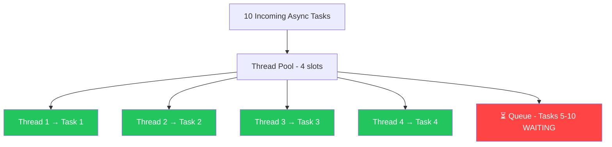

---

### 🔄 Real-World Impact Flow

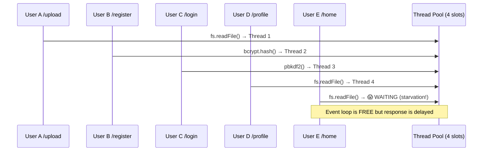

---

### 💻 Code Example

```js
const crypto = require('crypto');

for (let i = 0; i < 10; i++) {
  crypto.pbkdf2('password', 'salt', 1_000_000, 64, 'sha512', () => {
    console.log(`Task ${i + 1} done`);
  });
}

// Tasks 1-4 → run immediately (4 threads)
// Tasks 5-10 → queued → STARVATION
```

---

### 🛠️ How to Fix It

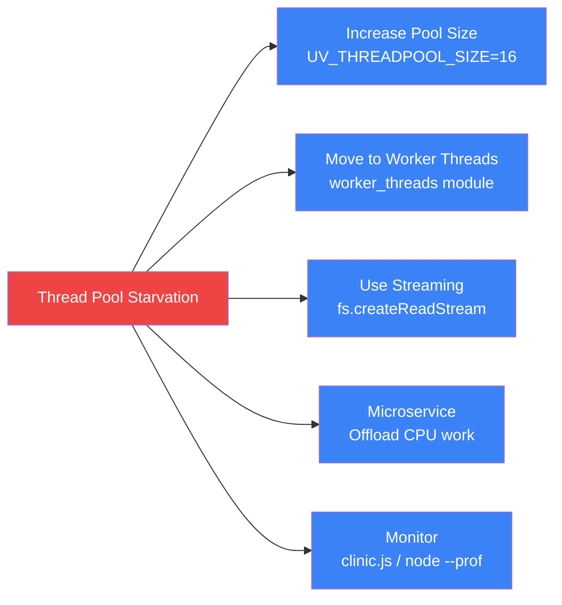

```bash
# Increase before starting the process
UV_THREADPOOL_SIZE=16 node server.js
```

---

### 🎙️ Explain to Interviewer

> *"Thread pool starvation in Node.js happens when all threads in the libuv thread pool — which defaults to 4 — are occupied by long-running operations like crypto or file I/O. New tasks then queue up, causing latency even though the event loop itself is free. The fix involves increasing the pool size with UV_THREADPOOL_SIZE, offloading CPU-heavy work to Worker Threads, or switching to streaming APIs like createReadStream instead of readFile."*

---

## 52. AbortController in Node.js

### 🧠 What Is It?

`AbortController` lets you **cancel ongoing async operations** — HTTP requests, streams, timers, or any custom async task.

---

### 🏗️ Architecture

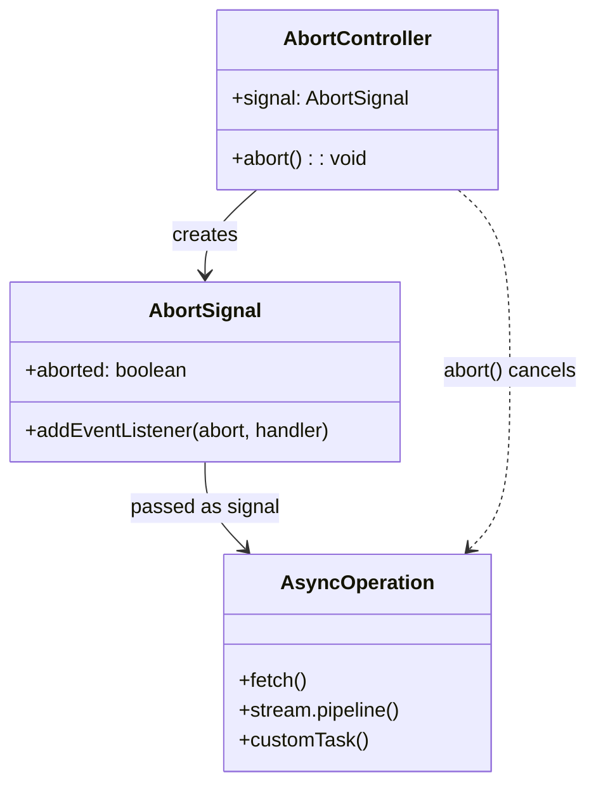

---

### 🔄 How Abort Works

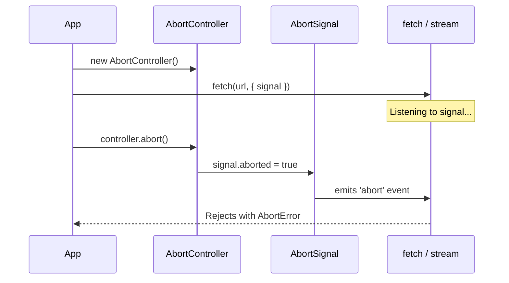

---

### 💻 Basic Example

```js
const controller = new AbortController();
const { signal } = controller;

// Cancel after 2 seconds
setTimeout(() => controller.abort(), 2000);

fetch('https://api.example.com/data', { signal })
  .then(res => res.json())
  .then(console.log)
  .catch(err => {
    if (err.name === 'AbortError') {
      console.log('✅ Request was cancelled cleanly');
    }
  });
```

---

### ⏱️ Real-World: Request Timeout Pattern

```js
async function fetchWithTimeout(url, ms = 3000) {
  const controller = new AbortController();
  const timer = setTimeout(() => controller.abort(), ms);

  try {
    const res = await fetch(url, { signal: controller.signal });
    return await res.json();
  } catch (err) {
    if (err.name === 'AbortError') {
      throw new Error(`Request timed out after ${ms}ms`);
    }
    throw err;
  } finally {
    clearTimeout(timer); // Always clean up!
  }
}
```

---

### 🧩 Custom Async Function with Abort Support

```js
function myTask({ signal }) {
  return new Promise((resolve, reject) => {
    if (signal.aborted) return reject(new Error('Already aborted'));

    signal.addEventListener('abort', () => {
      reject(new Error('Task aborted'));
    });

    setTimeout(() => resolve('Task complete'), 5000);
  });
}
```

---

### ⚠️ Rules

| Rule | Detail |
|---|---|
| One-time only | `abort()` cannot be reset |
| Always handle `AbortError` | Wrap in try-catch |
| Clean up resources | Clear timers, close streams |
| Check `signal.aborted` | Before starting expensive work |

---

### 🎙️ Explain to Interviewer

> *"AbortController gives us a standardized way to cancel async operations. You create a controller, pass its signal to APIs like fetch, and call abort() when you want to cancel. The signal emits an abort event, which causes the operation to reject with an AbortError. It's especially useful for request timeouts and handling early client disconnections in Express."*

---

## 54 & 58. process.env — Best Practices & Multi-Environment Config

### 🚫 The Wrong Way

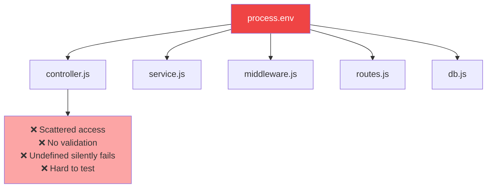

---

### ✅ The Correct Architecture

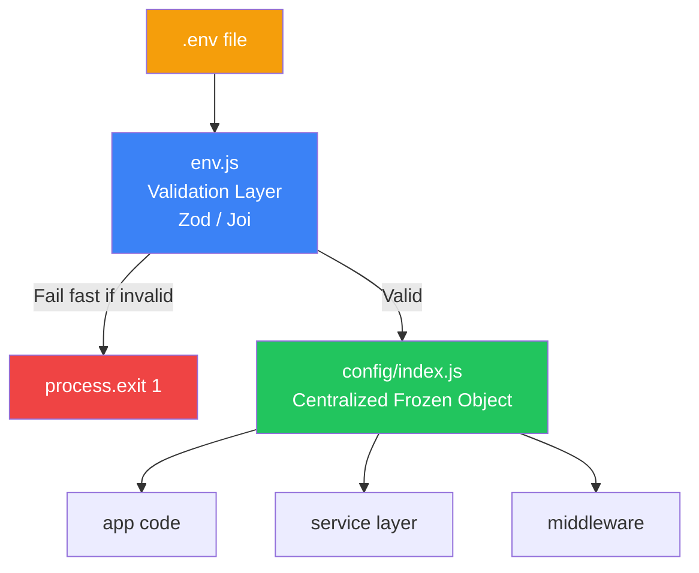

---

### 📁 Project Structure

```
src/
├── config/
│   ├── env.js          ← Validate + parse using Zod
│   └── index.js        ← Final centralized config export
├── server.js
.env                    ← local only (gitignored)
.env.development
.env.staging
.env.production
.gitignore              ← all .env files listed here
```

---

### 💻 Complete Setup

#### `.env` (local only — never commit)

```env
PORT=4000
NODE_ENV=development
DB_URL=mongodb://localhost:27017/myapp
JWT_SECRET=my_super_secret_key_here
API_TIMEOUT_MS=5000
```

#### `src/config/env.js` — Validation Layer

```js
import { z } from 'zod';
import 'dotenv/config';

const envSchema = z.object({
  NODE_ENV: z.enum(['development', 'staging', 'production']),
  PORT: z.string().default('3000'),
  DB_URL: z.string().url(),
  JWT_SECRET: z.string().min(10),
  API_TIMEOUT_MS: z.string().transform(Number),
});

const parsed = envSchema.safeParse(process.env);

if (!parsed.success) {
  console.error('❌ Invalid env vars:', parsed.error.format());
  process.exit(1); // Fail fast!
}

export const env = parsed.data;
```

#### `src/config/index.js` — Centralized Config

```js
import { env } from './env.js';

export const config = Object.freeze({
  app: {
    port: Number(env.PORT),
    env: env.NODE_ENV,
    isDev: env.NODE_ENV === 'development',
  },
  db:   { url: env.DB_URL },
  auth: { jwtSecret: env.JWT_SECRET },
  api:  { timeout: env.API_TIMEOUT_MS },
});
```

#### `src/server.js` — Usage

```js
import express from 'express';
import { config } from './config/index.js';

const app = express();

app.listen(config.app.port, () => {
  console.log(`✅ Server running on port ${config.app.port}`);
});
```

---

### 🌍 Multi-Environment Strategy

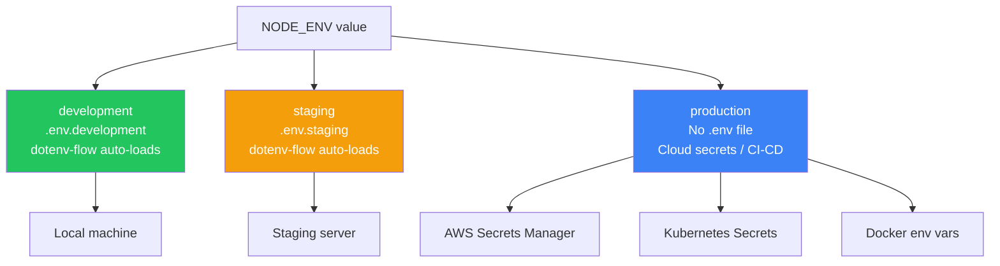

---

### 🔀 Environment Override Pattern

```js
const baseConfig = {
  logging: true,
  rateLimitRequests: 100,
};

const envOverrides = {
  development: { debug: true,  rateLimitRequests: 9999 },
  staging:     { debug: true,  rateLimitRequests: 200  },
  production:  { debug: false, rateLimitRequests: 100  },
};

export const finalConfig = {
  ...baseConfig,
  ...envOverrides[env.NODE_ENV],
};
```

---

### 🎙️ Explain to Interviewer

> *"Best practice for process.env is to never access it directly throughout the codebase. Instead, create a validation layer using Zod that reads all environment variables at startup — if anything is missing or invalid, the app crashes immediately with a clear error. That validated data feeds into a centralized frozen config object that everything else imports. For multiple environments, I use dotenv-flow with separate .env files for dev and staging, but in production I rely on actual environment variables injected by Docker, Kubernetes, or a cloud secrets manager."*

---

## 55. Error Handling in Node.js — End to End

### 🧠 Types of Errors

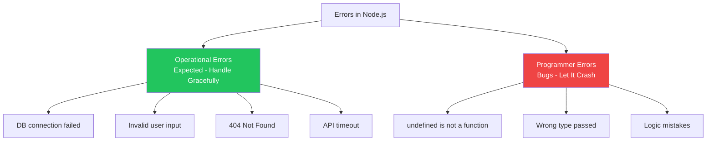

---

### 🔄 Complete Error Flow in Express

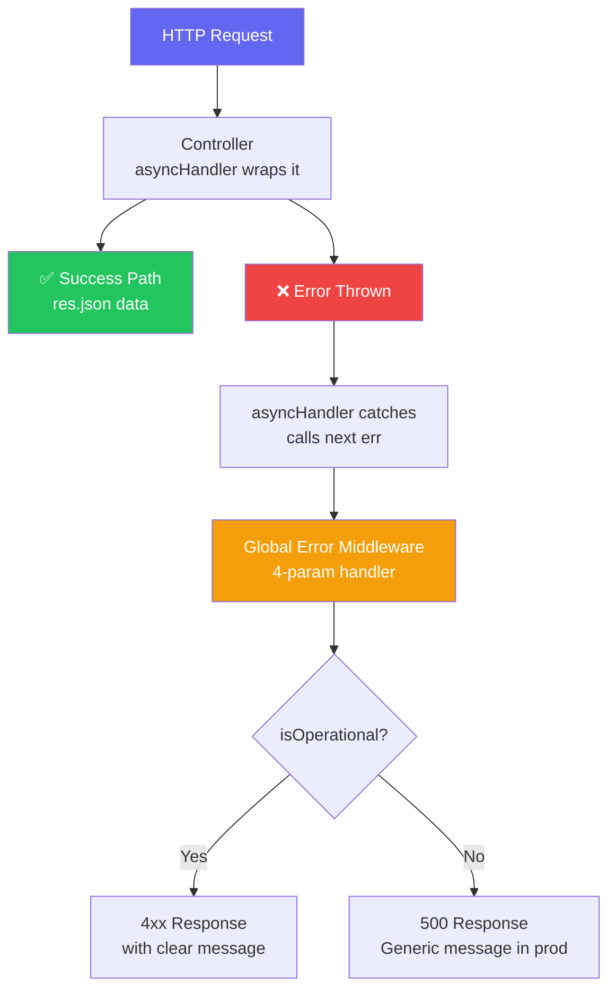

---

### 💻 All Ways to Handle Errors

#### 1. Try-Catch (sync + async/await)

```js
// Sync
try {
  const data = JSON.parse('{ bad json }');
} catch (err) {
  console.error('Parse error:', err.message);
}

// Async
try {
  const user = await getUserById(id);
} catch (err) {
  console.error('DB error:', err);
}
```

#### 2. Global Process Handlers

```js
process.on('uncaughtException', (err) => {
  console.error('Uncaught Exception:', err);
  process.exit(1); // Restart with PM2/K8s
});

process.on('unhandledRejection', (reason) => {
  console.error('Unhandled Rejection:', reason);
  process.exit(1);
});
```

---

### 🏗️ Production Express Error Setup

#### Step 1: Custom Error Class

```js
class AppError extends Error {
  constructor(message, statusCode) {
    super(message);
    this.statusCode = statusCode;
    this.isOperational = true;
    Error.captureStackTrace(this, this.constructor);
  }
}
```

#### Step 2: Async Wrapper

```js
// Eliminates try-catch in every controller
const asyncHandler = (fn) => (req, res, next) =>
  Promise.resolve(fn(req, res, next)).catch(next);
```

#### Step 3: Controller (clean — no try-catch)

```js
app.get('/user/:id', asyncHandler(async (req, res) => {
  const user = await getUserById(req.params.id);
  if (!user) throw new AppError('User not found', 404);
  res.json({ status: 'success', data: user });
}));
```

#### Step 4: Global Error Middleware

```js
app.use((err, req, res, next) => {
  const statusCode = err.statusCode || 500;
  const isProd = process.env.NODE_ENV === 'production';

  res.status(statusCode).json({
    status: 'error',
    message: err.isOperational ? err.message : 'Something went wrong',
    ...(isProd ? {} : { stack: err.stack }),
  });
});
```

---

### 📦 next(err) Special Behavior

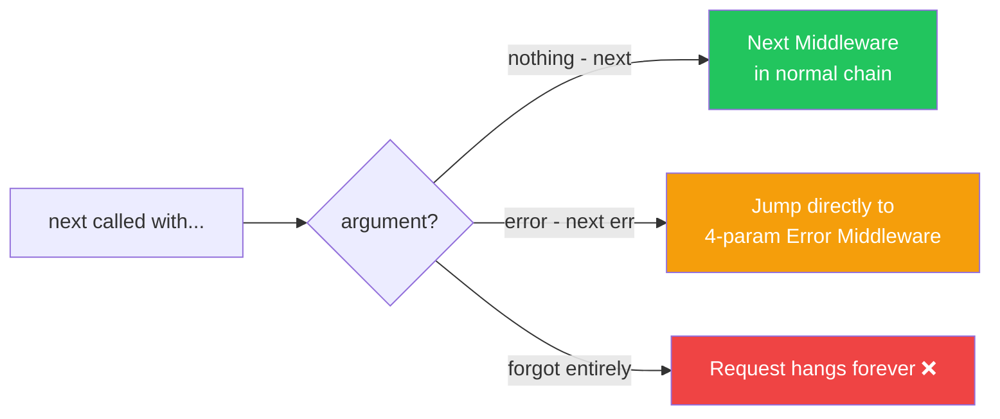

---

### 🎙️ Explain to Interviewer

> *"Error handling in Node.js has multiple layers. For Express APIs, the cleanest pattern is a custom AppError class, an asyncHandler wrapper that auto-catches promise rejections and passes them to next(err), and a centralized 4-parameter error middleware. The key principle is separating operational errors — 404, validation failures — which you handle gracefully, from programmer errors — like undefined is not a function — which should crash and let the process manager restart the app."*

---

## 59. Middleware — The Complete Deep Dive

### 🧠 What Is Middleware?

A function that sits **between the incoming request and final response**:

```js
(req, res, next) => { ... }
```

---

### 🔄 How Express Manages the Middleware Stack

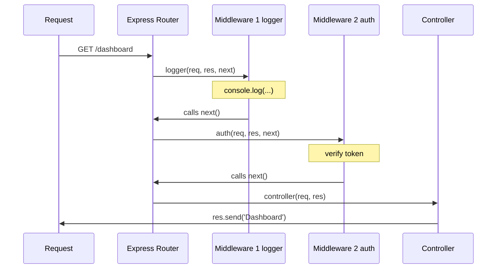

---

### 🏗️ The Internal Stack Mental Model

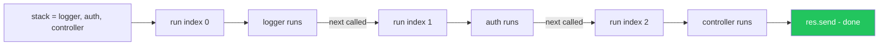

> **`next()` = tell Express to call `stack[currentIndex + 1]`**
> It's Express's internal routing system — not Node.js or the event loop.

---

### 🗂️ Types of Middleware

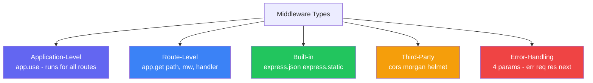

---

### 💻 Full Working Example

```js
import express from 'express';
const app = express();

// Middleware 1
const logger = (req, res, next) => {
  console.log('1️⃣ Logger ran');
  next(); // → Express calls auth next
};

// Middleware 2
const auth = (req, res, next) => {
  console.log('2️⃣ Auth ran');
  next(); // → Express calls controller next
};

// Final Handler
app.get('/', logger, auth, (req, res) => {
  console.log('3️⃣ Controller ran');
  res.send('Hello World');
});

app.listen(3000);

// Output:
// 1️⃣ Logger ran
// 2️⃣ Auth ran
// 3️⃣ Controller ran
```

---

### ⚠️ What Happens With and Without next()

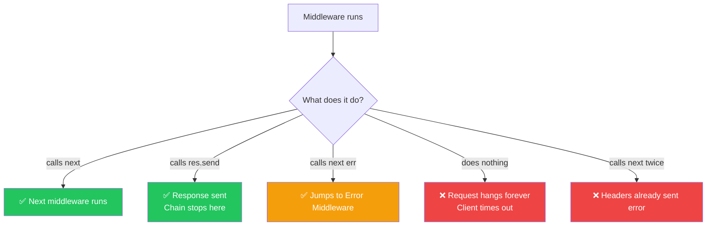

---

### 🏭 Reusable Middleware — Factory Pattern

```js
// ❌ Hardcoded — not reusable
const checkAdmin = (req, res, next) => {
  if (req.user.role !== 'admin') return res.status(403).send('Forbidden');
  next();
};

// ✅ Factory — fully reusable
const authorize = (role) => (req, res, next) => {
  if (req.user.role !== role) return res.status(403).send('Forbidden');
  next();
};

// Usage
app.get('/admin',  authorize('admin'),  handler);
app.get('/editor', authorize('editor'), handler);
app.get('/viewer', authorize('viewer'), handler);
```

---

### 🔁 Async Middleware

```js
const authMiddleware = async (req, res, next) => {
  try {
    const user = await verifyToken(req.headers.authorization);
    req.user = user;
    next();
  } catch (err) {
    next(err); // passes to global error handler
  }
};
```

---

### 🏭 Real-World Middleware Stack Order

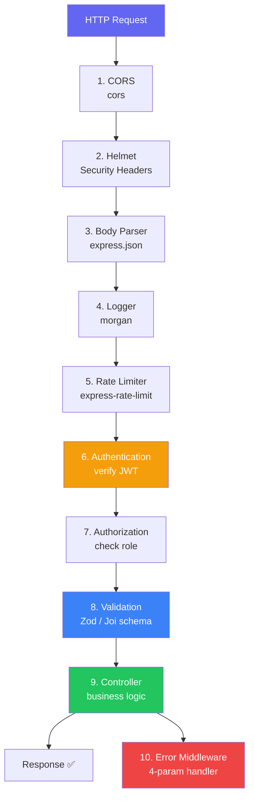

---

### next() vs return next()

```js
// ⚠️ Without return — code below STILL runs after next()
const middleware = (req, res, next) => {
  next();
  console.log('This runs AFTER next!'); // potential bug
};

// ✅ With return — clean exit
const middleware = (req, res, next) => {
  return next(); // nothing runs after this
};
```

---

### Express vs Koa

| Feature | Express | Koa |
|---|---|---|
| Pattern | Callback (`next()`) | `async/await` (`await next()`) |
| Error handling | try-catch per middleware | Single try-catch wraps whole chain |
| Flow direction | One-directional | Bi-directional (onion model) |
| Maturity | Very mature | Smaller, modern |

---

### 🎙️ Explain to Interviewer

> *"Middleware in Express is a function with req, res, and next. Express maintains an internal array — the middleware stack — for each route. When a request arrives, Express executes each middleware in sequence. Calling next() triggers Express to invoke the next function in that stack — it's Express's internal routing mechanism, completely separate from Node.js's event loop. If you don't call next() and don't send a response, the request hangs. Calling next(err) skips all normal middleware and jumps straight to a 4-parameter error handler. Best practice is single responsibility per middleware, using higher-order factory functions to keep them reusable."*

---

## 60. Request Validation Best Practices

### 🧠 Why Validation Is Critical

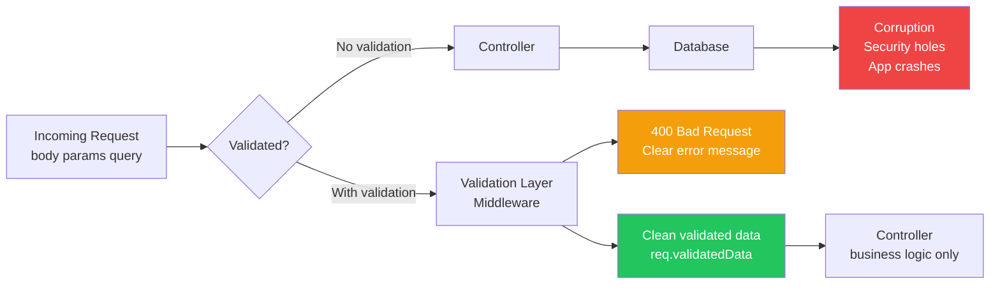

---

### 📦 What Must Be Validated

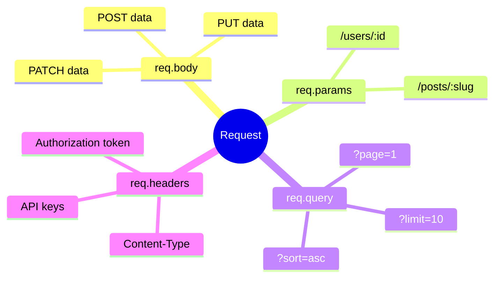

---

### 🔄 Validation Flow

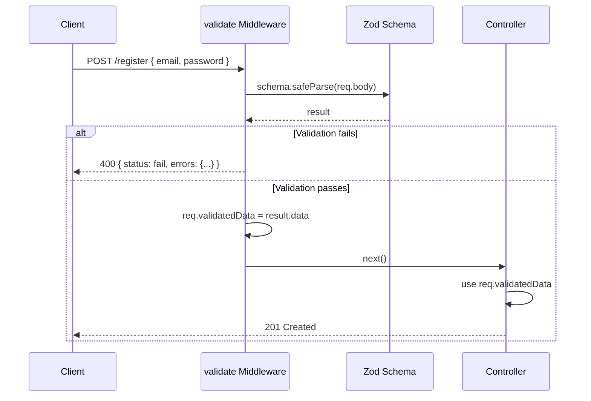

---

### 💻 Complete Setup (Express + Zod)

#### Schema Definitions

```js
// schemas/user.schema.js
import { z } from 'zod';

export const createUserSchema = z.object({
  email:    z.string().email('Invalid email format'),
  password: z.string().min(8, 'Min 8 characters'),
  name:     z.string().min(2).max(50),
  age:      z.number().int().min(18).optional(),
});

export const updateUserSchema = createUserSchema.partial(); // all optional for PATCH

export const getUserSchema = z.object({
  params: z.object({
    id: z.string().uuid('Invalid user ID'),
  }),
  query: z.object({
    page:  z.string().optional().transform(Number),
    limit: z.string().optional().transform(Number),
  }),
});
```

#### Reusable Validation Middleware

```js
// middleware/validate.js
export const validate = (schema) => (req, res, next) => {
  const result = schema.safeParse(req.body);

  if (!result.success) {
    return res.status(400).json({
      status:  'fail',
      message: 'Validation failed',
      errors:  result.error.format(),
    });
  }

  req.validatedData = result.data; // clean, safe data
  next();
};
```

#### Route — Clean and Minimal

```js
app.post(
  '/register',
  validate(createUserSchema),
  asyncHandler(async (req, res) => {
    const data = req.validatedData; // ✅ already clean
    const user = await createUser(data);
    res.status(201).json({ status: 'success', data: user });
  })
);
```

---

### 🗂️ Schema Reuse Pattern

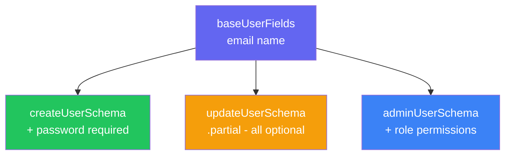

```js
const baseUserFields = {
  email: z.string().email(),
  name:  z.string().min(2),
};

export const createUserSchema = z.object({ ...baseUserFields, password: z.string().min(8) });
export const updateUserSchema = z.object({ ...baseUserFields }).partial();
export const adminUserSchema  = z.object({ ...baseUserFields, role: z.enum(['admin', 'editor']) });
```

---

### 📋 Best Practices Summary

| ✅ Do | ❌ Don't |
|---|---|
| Validate in middleware layer | Validate inside controller |
| Use Zod / Joi schemas | Write manual `if (!req.body.x)` checks |
| Validate body + params + query | Only validate body |
| Return consistent error format | Return random error strings |
| Use `req.validatedData` in controller | Use raw `req.body` in controller |
| Reuse base schemas | Duplicate schema definitions |
| Never trust frontend validation | Skip backend validation |

---

### 🎙️ Explain to Interviewer

> *"Request validation should be a dedicated middleware layer, not logic scattered in controllers. I define schemas using Zod, which also gives TypeScript type inference for free. A generic validate middleware wraps any schema, calls safeParse, and either returns a 400 with structured field-level errors or attaches the cleaned data to req.validatedData and calls next. Controllers then only deal with business logic using pre-validated data. I validate body, params, and query independently, and I never trust frontend validation since any HTTP client can bypass it."*

---

## 🗺️ Master Overview — All Concepts

```mermaid
mindmap
  root((Node.js Advanced))
    Thread Pool Starvation
      libuv 4 threads default
      Fix with UV_THREADPOOL_SIZE
      Use Worker Threads
      Use streaming APIs
    AbortController
      controller.abort
      signal passed to APIs
      AbortError on cancel
      Use for timeouts
    process.env
      Validate with Zod at startup
      Centralize in config object
      Object.freeze the config
      Never commit .env
    Multi-Env Config
      .env.development
      .env.production
      dotenv-flow auto-loads
      Cloud secrets in production
    Error Handling
      Operational vs Programmer
      AppError class
      asyncHandler wrapper
      Global 4-param middleware
      uncaughtException handler
    Middleware
      next calls Express stack
      Types - app route builtin error
      Factory pattern for reuse
      Order matters
      return next is best practice
    Request Validation
      Schema middleware layer
      Zod Joi schemas
      Validate body params query
      req.validatedData pattern
      Consistent error format
```

---

*📚 Generated for Senior / Lead Node.js Interview Preparation*
