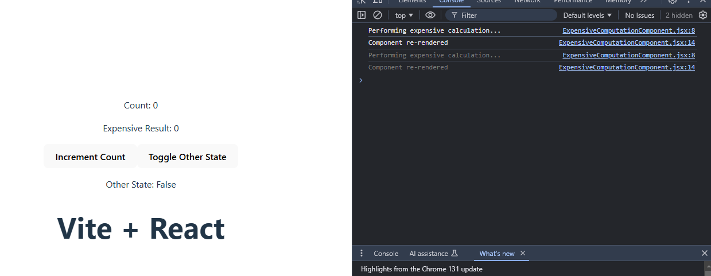

## Top interview questions based on react memoization and which scenarios we can use them

## 1. **React.Memo**

- "React.memo is a higher order component (HOC) in React for memoizing functional components. It serves to optimize performance by preventing unnecessary re-renders of components when their props do not change."

- React.Memo is a Higher Order Component in React which gives a memoized version of the Component. React will then not re-render the memoized component unless its props have changed, even if its parent is being re-rendered.

**How it Works**

- "React.memo wraps a functional component. When a component is wrapped in React.memo, React renders the component and memorizes the result.
- Before the next render, if the new props are the same as the previous props, React reuses the memorized result, skipping the next rendering.
- This comparison is shallow, meaning that it only checks one level deep. If you use complex objects as props, you should ensure they are the same object, or use a custom comparison function if deeper comparison is needed."

**Syntax**

`const MemoizedComponent = memo(SomeComponent, arePropsEqual?);`

- Pure components are the components which render the same output for the same state and props. In function components, you can achieve these pure components through memoized React.memo() API wrapping around the component. This API prevents unnecessary re-renders by comparing the previous props and new props using shallow comparison. So it will be helpful for performance optimizations.
- But at the same time, it won't compare the previous state with the current state because function component itself prevents the unnecessary rendering by default when you set the same state again.

**Example**

- Below is the example of how child component(i.e., ReactMemo) prevents re-renders for the same props passed by parent component(i.e.,App).

```js
//Child Component to prevent re-renders for same props using react.memo

import React from "react";
import { memo } from "react";
const ReactMemo = memo(function ReactMemo({ name, email }) {
  console.log("Rendering CountDisplay, name:", name);

  return (
    <div>
      <h1>react.memo</h1>
      <p>Name:{name}</p>
      <p>Email: {email}</p>
    </div>
  );
});

export default ReactMemo;
```

```js
import React from "react";
import ReactMemo from "./components/ReactMemo";
import "./App.css";
import { useState } from "react";
function App() {
  const [name, setName] = useState("");
  const [email, setEmail] = useState("");
  return (
    <div>
      <h1>App Component</h1>
      <label>
        Name: <input value={name} onChange={(e) => setName(e.target.value)} />
      </label>
      <br />
      <br />
      <br />
      <label>
        Email:{" "}
        <input value={email} onChange={(e) => setEmail(e.target.value)} />
      </label>

      <ReactMemo name={name} />
    </div>
  );
}

export default App;
```


**Custom comparision second argument(arePropsEqual)**

```js
(prevProps, nextProps) => {
  return (
    prevProps.name === nextProps.name && prevProps.email === nextProps.email
  );
};

//OR

const isNameSame = prevProps.name === nextProps.name;
const isEmailSame = prevProps.email === nextProps.email;

console.log(`Name same: ${isNameSame}, Email same: ${isEmailSame}`);

return isNameSame && isEmailSame;
```

- Custom Comparison Function: If you need more control over the re-rendering process, you can provide a custom comparison function as the second argument to React.memo. This function takes the previous and next props as arguments and returns true if the props are equal (to prevent a re-render) or false if they are not equal (to allow a re-render).

---

```js
import React from "react";
import ReactMemo from "./components/ReactMemo";
import "./App.css";
import { useState } from "react";
function App() {
  const [name, setName] = useState("");
  const [email, setEmail] = useState("");
  const [counter, setCounter] = useState(0);
  return (
    <div>
      <h1>App Component</h1>
      <label>
        Name: <input value={name} onChange={(e) => setName(e.target.value)} />
      </label>
      <br />
      <br />
      <br />
      <label>
        Email:{" "}
        <input value={email} onChange={(e) => setEmail(e.target.value)} />
      </label>

      <ReactMemo name={name} />
      <h2>Counter:{counter}</h2>
      <button onClick={() => setCounter(counter + 1)}>Increment</button>
    </div>
  );
}

export default App;
```

```js
import React from "react";
import { memo } from "react";
const ReactMemo = memo(function ReactMemo({ name, email }) {
  console.log("Rendering Display , name:", name);

  return (
    <div>
      <h1>react.memo</h1>
      <p>Name:{name}</p>
      <p>Email: {email}</p>
    </div>
  );
});

export default ReactMemo;
```

- From this code we can observe that, Click the "Increment Counter" button without changing name or email. Since ReactMemo does not depend on counter, there should be no console log from ReactMemo if everything is working correctly. This confirms that React.memo is preventing re-renders effectively when the props it cares about (name and email) do not change.

## 2. useCallback

- useCallback is a hook that is part of React's API. It returns a memoized callback function. This means that the function passed to useCallback will not be recreated unless one of its dependencies has changed.

- Without useCallback it was

- When you define a function inside a component, it is recreated on every render, even if the component’s state or props have not changed. This can lead to unnecessary re-renders, which can slow down your application’s performance. The useCallback hook helps you avoid this problem by memoizing the function and only recreating it when necessary.

`useCallback(function, dependencies)`

- This hook follows a very simple pattern for utilization. It takes two arguments: the function you want to memoize, and the dependencies array.
- The first argument is the function you want to memoize.
  The second argument is an array of dependencies. The elements in this array are the values on which the function to be memoized depends. - If any of these values change, the function will be recreated.
- **Note, if you omit the dependencies array, the function will be re-defined on every render.**
-

```js
import React, { memo, useCallback, useState } from "react";

const UseCallback = memo(
  ({ label, onClick }) => {
    console.log(`${label} button renders`);
    return (
      <div>
        <h1>..</h1>
        <button onClick={onClick}>{label}</button>
      </div>
    );
  },
  (prevProps, nextProps) => {
    // Log the previous and next props to understand what is being compared
    console.log("Comparing props:", prevProps, nextProps);

    // Check if 'label' props are the same
    const isLabelEqual = prevProps.label === nextProps.label;
    console.log(
      `Label comparison: ${prevProps.label} === ${nextProps.label} => ${isLabelEqual}`
    );

    // Check if 'onClick' function references are the same
    const isOnClickEqual = prevProps.onClick === nextProps.onClick;
    console.log(
      `onClick comparison: prevProps.onClick === nextProps.onClick => ${isOnClickEqual}`
    );

    // Return true if both 'label' and 'onClick' are equal (no re-render needed)
    return isLabelEqual && isOnClickEqual;
  }
);

export default UseCallback;
```

```js
import React, { useCallback } from "react";
import "./App.css";
import { useState } from "react";
import UseCallback from "./hooks/UseCallback";
function App() {
  const [count, setCount] = useState(0);

  const incrementCount = useCallback(() => {
    setCount((c) => c + 1);
  }, []);
  const decrementCount = useCallback(() => {
    setCount((c) => c - 1);
  }, []);
  return (
    <div>
      <p>useCallback Example</p>
      <h1>Count: {count}</h1>
      <UseCallback label="increment" onClick={incrementCount} />
      <UseCallback label="decrement" onClick={decrementCount} />
    </div>
  );
}

export default App;
```

---

- **To demonstrate how useCallback memoizes a function and only updates the function when its dependencies change, I'll create a simple example. In this example, we will use a button to increment a counter and log how the callback function changes based on its dependencies.**

```js
import React, { useCallback } from "react";
import "./App.css";
import { useState } from "react";
import UseCallback from "./hooks/UseCallback";
function App() {
  const [count, setCount] = useState(0);
  const [dependency, setDependency] = useState(0);

  // Memoized incrementCount function that depends on 'count'
  const incrementCount = useCallback(() => {
    setCount((c) => c + 1);
    console.log("Function called with count:", count);
    console.log("Current dependency value:", dependency);
  }, [count]); // Depends on 'count', so it doesn't update when 'dependency' changes

  // Function to increment dependency
  const incrementDependency = () => {
    setDependency((d) => d + 1);
    console.log("Dependency incremented to:", dependency + 1);
  };

  return (
    <div>
      <p>Count: {count}</p>
      <p>Dependency: {dependency}</p>
      <button onClick={incrementCount}>Increment Count</button>
      <button onClick={incrementDependency}>Increment Dependency</button>
    </div>
  );
}

export default App;
```


---

## 3. useMemo

- useMemo is a React Hook that is used to optimize the performance of your application by memoizing the result of a computation. It helps to avoid re-computing expensive calculations on every render, which can improve performance in certain scenarios.

```js
import React, { useMemo, useState } from "react";

function ExpensiveComputationComponent() {
  const [count, setCount] = useState(0);
  const [otherState, setOtherState] = useState(false);

  const expensiveCalculation = (num) => {
    console.log("Performing expensive calculation...");
    return num * 2;
  };

  const memoizedResult = useMemo(() => expensiveCalculation(count), [count]);

  console.log("Component re-rendered");
  return (
    <div>
      <p>Count: {count}</p>
      <p>Expensive Result: {memoizedResult}</p>
      <button onClick={() => setCount(count + 1)}>Increment Count</button>
      <button onClick={() => setOtherState(!otherState)}>
        Toggle Other State
      </button>
      <p>Other State: {otherState ? "True" : "False"}</p>
    </div>
  );
}

export default ExpensiveComputationComponent;
```

- On Intial Render



- On subsequent renders, when i click increment count button it changes into the Expensive result and, when you observe console on every Increment Count we observe that **Performing expensive calculation**


-----------------------------------
- When you click on Toggle Other State button ot only renders the **Component re-rendered**


