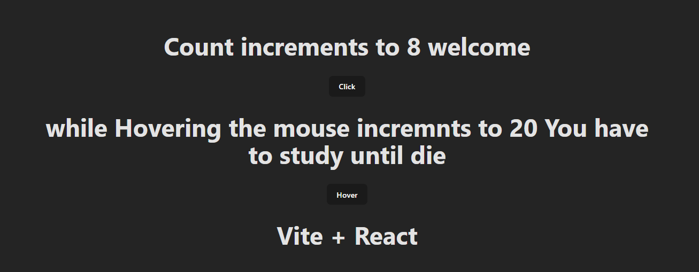

## Higher Order Component

- An HOC is a function or component that takes a component as argument and return a new component.
- The syntax as follows.

```js
const WithHoC = (OriginalComponent) => {
  const NewComponent = (props) => {
    //logic over here
    return <OriginalComponent {...props} />;
  };
  return NewComponent;
};

export default WithHoc;
```

OR

```js
const WithHoC = (OriginalComponent) => {
  return function NewComponent(props) {
    // logic over here
    return <OriginalComponent {...props} />;
  };
};

export default WithHoC;
```

- According to React’s documentation, a typical React HOC has the following definition:

- A higher-order component is a function that takes in a component and returns a new component.
- Essentially, HOCs are used to share common functionality between components without repeating code. They can be used for a variety of tasks such as data fetching, manipulating props, and state abstraction.

---

- When to Use HOCs in your React Code

  1.Authentication:

- Suppose you have an application with various routes, some of which require the user to be authenticated before accessing them.

- Instead of duplicating the authentication logic in each component or route, you can create an HOC called withAuth that checks if the user is authenticated and redirects them to the login page if not.

2. Logging

- Imagine you want to log some data every time a specific set of components mount or update. Rather than adding the logging logic to each component, you can create an HOC called withLogger that handles the logging functionality.

- By wrapping the relevant components with withLogger, you can achieve consistent logging across those components.

3. Styling and Theming

- You might have a design system with reusable styles and themes. You can create an HOC named withTheme that provides the necessary theme-related props to a component.

- This way, the wrapped component can easily access and apply the appropriate styles based on the provided theme.

---

## Let's write the counter and MouseHover Example to understand the HOC

- Counter example

```js
import { useState } from "react";
import HocCounter from "./HocCounter";
const Counter = () => {
  const [count, setCount] = useState(0);

  const incrementCount = () => {
    setCount(count + 1);
  };
  return (
    <div>
      <h1>Count increments to {count}</h1>
      <button onClick={incrementCount}>Click</button>
    </div>
  );
};

export default HocCounter;
```

- Hover to incrment the count

```js
import React, { useState } from "react";
import HocCounter from "./HocCounter";
const ONMouseHoverIncrement = () => {
  const [countMouseHover, setCountMouseHover] = useState(0);
  const incrementHoverCount = () => {
    setCountMouseHover(countMouseHover + 1);
  };
  return (
    <div>
      <h1>while Hovering the mouse incremnts to {countMouseHover}</h1>
      <button onMouseEnter={incrementHoverCount}>Hover</button>
    </div>
  );
};

export default HocCounter(ONMouseHoverIncrement);
```

- From the two code snippets above, both share the same functionality, resulting in duplicate code. To avoid duplication, we can create a Higher-Order Component (HOC) to share the common functionality between components

- Now will create the HOC

- HocCounter.jsx is the Higher Order Component

```js
import { useState } from "react";

const HocCounter = (OriginalComponent) => {
  const NewComponent = (props) => {
    console.log("props", props);

    const [count, setCount] = useState(0);

    const incrementCount = () => {
      setCount(count + 1);
    };

    return (
      <OriginalComponent
        count={count}
        incrementCount={incrementCount}
        {...props}
      />
    );
  };
  return NewComponent;
};

export default HocCounter;
```

- App.jsx

```js
import "./App.css";
import Counter from "./counterComponents/Counter";
import ONMouseHoverIncrement from "./counterComponents/ONMouseHoverIncrement";
function App() {
  return (
    <>
      <Counter title="welcome" />
      <ONMouseHoverIncrement study="You have to study until die" />
      <h1>Vite + React</h1>
    </>
  );
}

export default App;
```

- We passed the props as in HOC, in future any props received by the Counter or ONMouseHoverIncrement , it will get the data.

- Without {...props}, any additional props (title in this case) passed to the wrapped component would be lost and unavailable in the Counter component. Using {...props} ensures that all props are passed through, maintaining the component's flexibility and functionality.

- Final Output

## 

// HOC Component

```js
import { useState } from "react";

const Hoc = (Component) => {
  return function (props) {
    const [name, setName] = useState("Manas");

    const ResultFunc = (e) => {
      setName(e.target.value);
    };
    return (
      <div>
        <Component name={name} onChange={ResultFunc} {...props} />
      </div>
    );
  };
};

export default Hoc;
```

// Utilizing this HOC in App.js

```js
import "./App.css";
import Hoc from "./components/Hoc";
function App({ name, onChange }) {
  return (
    <div>
      <h1>Name:{name}</h1>
      <input value={name} onChange={onChange} />
    </div>
  );
}

export default Hoc(App);
```

**Same example we can modify into an authentication**

```js
import { useState } from "react";

const Hoc = (Component) => {
  return function (props) {
    const [login, setIslogin] = useState(true);
    return (
      <div>{login ? <Component name="Hey Joe" /> : <h1>Logged Out</h1>}</div>
    );
  };
};

export default Hoc;
```

```js
import "./App.css";
import Hoc from "./components/Hoc";
function App({ name }) {
  return (
    <div>
      <h1>Welcome to the User {name}</h1>
    </div>
  );
}

export default Hoc(App);
```

- If login is false ; will get
  

- else will get result


